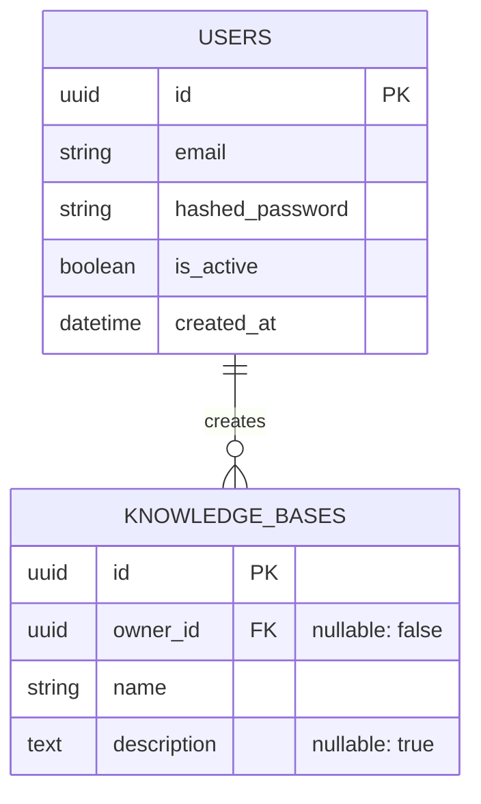

# 🗄️ 数据库设计与建表核心规范 (Database Design Standards)

本文档定义了 HiveMind RAG 项目中关于关系型数据库 (PostgreSQL / SQLite via SQLModel) 的设计、命名、约束及迁移规范。所有涉及数据模型的变更**必须**遵循此规范。

---

## 1. 命名规范 (Naming Conventions)

### 1.1 表与字段命名
- **表名 (Table Name)**: 使用复数形式的 `snake_case`。例如：`users`, `documents`, `knowledge_bases`, `chat_sessions`。
- **关联表名 (Association Table)**: 使用连接的两个表名，按字母顺序排序，例如：`document_tag_link`。
- **字段名 (Column Name)**: 使用 `snake_case`。例如：`first_name`, `is_active`, `max_tokens`。
- **布尔值字段**: 必须以 `is_`, `has_`, `can_` 开头。例如：`is_deleted`, `has_attachments`。

### 1.2 索引与约束命名 (Index & Constraint Naming)
为了防止通过 Alembic 迁移时出现命名冲突或不可控的匿名约束，必须遵守以下命名约定，并通过 SQLAlchemy 的 `naming_convention` 统一收口：
- **主键 (PK)**: `pk_<table>`
- **外键 (FK)**: `fk_<table>_<column>_<referred_table>`
- **唯一约束 (UQ)**: `uq_<table>_<column>`
- **普通索引 (IX)**: `ix_<table>_<column>`

> *注：项目中后端的 `db/session.py` 中已经配置了全局的 MetaData naming_convention。*

---

## 2. 核心字段要求 (Mandatory Columns)

所有的业务实体表，都**必须**继承自基础模型（如果项目中有 `BaseModel`）或包含以下 4 个标准审计字段：

1. `id`: 首选 `uuid.UUID`（如果是分布式高并发）或带自增语义的字符串/整数。推荐项目统一定义一种 ID 生成策略。
2. `created_at`: `datetime`，默认值为服务器当前 UTC 时间 (`SERVER_DEFAULT = func.now()`)。
3. `updated_at`: `datetime`，默认值为当前时间，并在 `onupdate` 时触发 (`onupdate=func.now()`)。
4. `is_deleted` (可选): `bool`。如需使用**软删除**，务必添加此字段。核心数据（如用户知识库）禁止硬关联删除。

---

## 3. 数据类型选择指南 (Data Type Selection)

不要滥用 `String`。SQLModel 底层包装了 SQLAlchemy，遵循以下选型：

| 场景 | SQLAlchemy/SQLModel 类型 | 数据库实际类型 (PG) | 备注 |
|---|---|---|---|
| 短文本 (名字、邮箱、标题) | `String(255)` | `VARCHAR(255)` | 必加长度限制。 |
| 长文本 (文章内容、详细描述) | `Text` | `TEXT` | 无长度限制。 |
| 布尔开关 | `Boolean` | `BOOLEAN` | 必须设置 default 值，不可为 null。 |
| 货币/精度数值 | `Numeric(10, 2)` | `NUMERIC` | 坚决禁止用 Float 存钱。 |
| JSON 结构化数据 | `JSON` / `JSONB` | `JSONB` | 用于无需建立强关系但需要查询的扩展字段 (如 `metadata`)。 |
| 数组 (如果 DB 支持) | `ARRAY(String)` | `VARCHAR[]` | 对于简单的 tag，可考虑用数组替代关联表。 |

---

## 4. 关联关系设计原则 (Relationship Principles)

- **外键级联 (Cascade)**: 
  - 弱实体（如从属于知识库的分割块 `chunks`）：推荐使用 `ondelete="CASCADE"`，知识库删除时，块一同被物理删除引擎清空。
  - 重要关联（如用户和其创建的资源）：推荐软删除或不允许直接级联删除。
- **冗余字段 (Denormalization)**:
  - 尽量避免冗余，遵守三范式。
  - **例外**: 如果跨表 Join 严重影响高频接口性能，考虑在业务写入时冗余计算结果字段（例如 `document_count`，并在变更时加悲观锁/事件钩子同步更新）。

---

## 5. ER 图强制模板 (Mermaid ER Diagram)

在编写任何有关数据库变更的 `设计文档 (DES-NNN.md)` 或 `ADR` 时，**必须使用以下 Mermaid ER 图模板**，清楚标明主外键、一对多关系以及是否允许 Null：

*(注意：在 `{}` 内部，格式为 `[类型] [字段名] [备注(如 PK/FK/nullable)]`)*

---

## 6. Alembic 迁移规范 (Alembic Migration Guidelines)

1. **绝对禁止直接修改生产库表结构**，所有修改必须通过 Alembic Revision 产生。
2. 每次自动生成 Revision 后，**必须人工/AI复审**脚本：
   - Alembic 无法自动探测列名重命名（它会当作 Drop Column + Add Column）。如果重命名列，修改生成的脚本，使用 `op.alter_column`。
   - 确认 Enum 类型在 PostgreSQL 中是否被正确创建。
3. `revision` message 参数必须包含所关联的 Issue ID，例如：`alembic revision --autogenerate -m "feat(rag): add chunk table for Issue #12"`。
