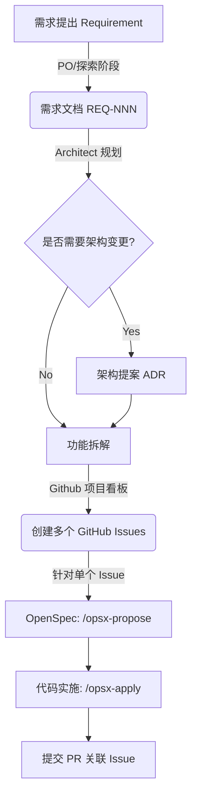

# 🌀 多角色研发协同工作流 (Workflow & Collaboration)

为了确保 HiveMind RAG 项目在复杂需求下不失控，我们建立了一套基于 **OpenSpec + GitHub Issues + 多角色协作** 的交付流水线。

## 1. 角色定义 (Roles)

在 AI 辅助开发的语境下，一人可以分饰多角，也可以由人类与多个 AI Agent 共同完成：

| 角色 (Role) | 职责描述 | 在本项目的体现 |
|------------|---------|--------------|
| **👑 需求方 (PO)** | 提出业务目标，把控验收标准。 | 人类开发者 (USER) 提出高层次 Prompt |
| **🏗️ 架构师 (Architect)** | 负责技术选型、模块划分，产出 ADR。 | 人类 / 高阶 AI Agent (负责 `/opsx-explore`) |
| **🧑‍💻 开发者 (Dev)** | 编写代码，执行具体任务，编写单测。 | AI Agent 执行 `/opsx-apply` |
| **🧐 审查者 (Reviewer)** | 验证代码规范、覆盖率，批准 PR。 | 人类 / CI 自动化流水线 |

---

## 2. 需求到任务的降维打击 (Decomposition Flow)

一个宏大的需求绝对不能直接进入编码阶段。必须严格遵循以下降维流程：



### 步骤详解

#### Step 1: 需求定调 (Requirement)
- **触发点:** 用户提出类似 "加上多租户支持" 或 "集成外部数据源"。
- **产出:** 在 `docs/requirements/` 生成一份 `REQ-NNN.md`。

#### Step 2: 任务分解与 GitHub 联动 (Issue Tracking)
- **核心原则:** OpenSpec 里的 `tasks` 是小时级别的**实施清单**，而 GitHub Issue 是天级别的**业务单元**。
- **动作:** 
  1. 将大需求拆分为多个可独立交付的 GitHub Issues。
  2. 使用 GitHub Project (Kanban) 管理这些 Issues：`Todo`, `In Progress`, `Review`, `Done`。
  3. 各个 Issue 必须被打上合适的 Label (如 `backend`, `frontend`, `enhancement`)。

#### Step 3: OpenSpec 认领 (Propose & Apply)
- **动作:** 针对每一个进入 `In Progress` 的 Issue，新建 OpenSpec 变更。
  ```bash
  npx @fission-ai/openspec new change "feature-xxx"
  ```
- **关联:** 在 OpenSpec 的 `proposal.md` 中说明 `Resolves #IssueID`。

#### Step 4: PR 与闭环 (PR & Review)
- 开发完成后提交 PR，PR 标题和内容必须标记 `Closes #IssueID`，并附带 OpenSpec 的变更记录。
- Reviewer 按清单进行审查，通过后 Merge 进 Main 分支。

---

## 3. GitHub 联动机制 (GitHub Integration)

### 3.1 Issue 与 OpenSpec 的关系
- **Issue = “要做什么” (What & Why)**
- **OpenSpec Design = “要在代码里怎么做” (How)**
- **OpenSpec Tasks = “具体改哪几行代码” (Checklist)**

### 3.2 标签体系 (Label System)
在 GitHub 中强制使用以下标签体系流转：
- **优先级 (Priority):** `p0-critical`, `p1-high`, `p2-medium`, `p3-low`
- **规模 (Size):** `size:S` (< 1天), `size:M` (1-3天), `size:L` (需要拆分)
- **领域 (Domain):** `frontend`, `backend`, `rag-engine`, `agent-swarm`, `infra`
- **工作流 (Status):** `needs-architecture-review`, `needs-design`

### 3.3 自动化流转
当你在 PR 描述中写下 `Resolves #42` 时，合并 PR 的瞬间，Issue 会自动关闭，同时将当前特性关联至最新的 Release Notes 中。

---

## 4. 多角色协同实战演练 (Example Scenario)

**场景:** "系统需要支持解析 PDF 表格数据。" 

1. **PO (人类):** 提出需求。AI 根据对话在 `docs/requirements/` 创建 `REQ-005-pdf-table.md`。
2. **Architect (AI + 人类确认):** 分析发现需要引入 `pdfplumber` 库，并修改核心解析流水线。提示用户需要发起 ADR。通过 ADR-0005 决定技术方案。
3. **PO (人类):** 在 GitHub 建 3 个 Issues：
   - `#10: [Backend] 集成 pdfplumber 解析器`
   - `#11: [Backend] 知识库切分流水线支持表格类型 Chunk`
   - `#12: [Frontend] 检索结果高亮展示 Markdown 表格`
4. **Dev (AI):** 接单 `#10`，使用 `/opsx-propose` 针对解析器实现进行代码设计和任务生成。然后用 `/opsx-apply` 飙代码。
5. **Dev (AI):** 提交 PR 并关联 `#10`。触发 CI 单元测试与代码格式检查。
6. **Reviewer (人类):** 在 GitHub 上看代码，发现正则表达式可以优化，留下 Comment。
7. **Dev (AI):** 获取 Comment，修改代码，再 Push。CI 全绿。
8. **Reviewer (人类):** Approve 并 Merge。Issue `#10` 自动闭环。
