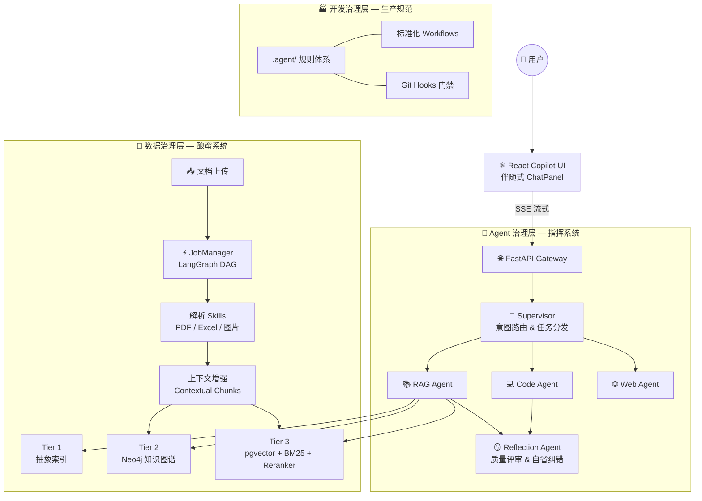

<p align="center">
  
  
  
  
  
  
</p>

# 🐝 HiveMind — Agentic RAG Platform

> *蜂群不是靠一只蜜蜂来运转的。*
> *每一滴蜂蜜，都是千万次分工协作的结晶。*

---

## 这个项目在做什么？

**蜜蜂酿蜜，从来不是一道简单的工序。**

采集、过滤、转化、沉淀——每个环节都需要高度协作。HiveMind 正是用同样的逻辑来处理"知识"：

- 原始文档就像花粉，散落在各个角落
- Agent Swarm 像蜂群一样飞出去，采集、解析、理解它们
- 知识经过提炼，沉淀为可检索的结构——图谱、向量、摘要——就像蜂蜜被酿成、封存在蜂巢里
- 当用户提问，Supervisor Agent 像蜂后发出指令，调动合适的工蜂精准取出所需的那一格蜜

这不是传统的"文档搜索"。这是一个**以 Agent 为核心的知识生命周期管理系统**。

---

## 蜂群的三种分工

HiveMind 的设计围绕三个相互支撑的治理体系展开：

### 🧭 Agent 治理 — 蜂群的指挥系统

Supervisor Agent 是整个系统的大脑。它解析用户意图、分配任务给专属 Worker、通过 Reflection Agent 对结果进行质量把关，不合格则打回重做。这套 Agent Swarm 基于 **LangGraph StateGraph** 构建，支持状态持久化与多步骤推理。

→ 详见 [Agent 治理文档](docs/AGENT_GOVERNANCE.md)

### 🍯 数据治理 — 知识的酿造过程

数据入库不是简单的切块+向量化。每一份文档经过 Agent 调度的多 Skill Pipeline 处理：解析原始内容、为每个分块注入上下文背景（Contextual Retrieval）、抽取实体和关系写入知识图谱。最终形成**三层可检索的记忆结构**——抽象索引、Neo4j 图谱、pgvector 向量库。

→ 详见 [数据治理文档](docs/DATA_GOVERNANCE.md)

### 🏭 开发治理 — 蜂巢的生产规范

凡是蜂巢，必有规则。`.agent/` 目录是 HiveMind 的研发治理体系，约束人类开发者与 AI Agent 的每一次代码提交：标准化工作流 SOP、Git Hooks 门禁、AI 编码规范、质量检查脚本。**这套体系本身也是 Agent 可读、可执行的**。

→ 详见 [开发治理文档](docs/DEV_GOVERNANCE.md)

---

## 系统全局图



---

## 快速开始

### 环境要求

| 依赖 | 版本 | 备注 |
|:---|:---|:---|
| Python | 3.10+ | 后端运行时 |
| Node.js | 18+ | 前端构建 |
| PostgreSQL | 14+ | 需启用 pgvector 扩展 |
| Redis | 6+ | 队列与缓存 |
| Neo4j | 任意 | 可选，图谱层 |

### 启动

```bash
# 后端
cd backend
pip install -r requirements.txt
python -m scripts.init_db
uvicorn app.main:app --reload

# 前端
cd frontend
npm install
npm run dev
```

### 常用命令

```bash
python -m backend.scripts.create_superuser <user> <pass>   # 创建管理员
alembic revision --autogenerate -m "description"            # 数据库迁移
./.agent/checks/run_checks.ps1                              # 质量检查
```

---

## 文档地图

| 文档 | 一句话说明 |
|:---|:---|
| [🧭 Agent 治理](docs/AGENT_GOVERNANCE.md) | Supervisor 架构、Agent DAG、Reflection 机制 |
| [🍯 数据治理](docs/DATA_GOVERNANCE.md) | 知识酿造全流程：解析→增强→图谱→向量→检索 |
| [🏭 开发治理](docs/DEV_GOVERNANCE.md) | `.agent/` 规范体系、SOP 工作流、Git 门禁 |
| [系统概览](docs/SYSTEM_OVERVIEW.md) | 全局设计哲学与技术选型 |
| [路线图](docs/ROADMAP.md) | 开发里程碑与规划 |
| [模块注册表](REGISTRY.md) | 全局模块与 Skill 注册表 |
| [贡献指南](CONTRIBUTING.md) | 提交规范、工作流、协作约定 |

---

## License

Private — All Rights Reserved
