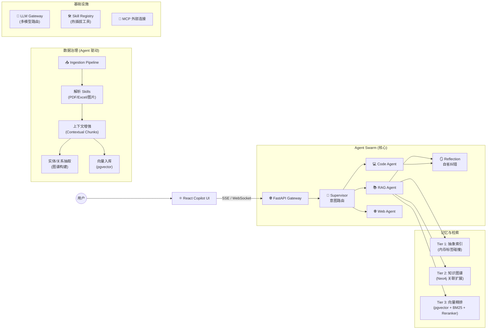

<p align="center">
  
  
  
  
  
  
</p>

# 🐝 HiveMind — Agentic RAG Platform

> **一个以 Agent 为核心驱动力的 RAG 系统。**
> 数据的入库、检索、治理、生成，全部由 Agent Swarm 协作完成。

---

## 这是什么？

HiveMind 是一套 **Agentic RAG** 平台。与传统 RAG 的区别在于：

| | 传统 RAG | HiveMind (Agentic RAG) |
| :--- | :--- | :--- |
| **入库** | 固定 Pipeline 切块 → 向量化 | Agent 调度多 Skill 解析 → **上下文增强 (Contextual Chunks)** → 向量化 + 图谱抽取 |
| **检索** | 单一向量相似度 | **三层渐进式检索**：抽象索引扫描 → 图谱关联扩展 → 向量精排 |
| **生成** | 拼接 Prompt 一次生成 | Worker Agent 起草 → Critic Agent **自省纠错** → 输出终稿 |
| **治理** | 人工维护 | Agent 自动打标签、抽实体、建图谱、**版本化追踪** |

一句话：**Agent 不只回答问题，它管理整个知识生命周期。**

---

## 系统架构



### 数据流：Agent 如何驱动数据治理

```
文档上传 → JobManager (LangGraph 状态机) 调度
         → Parser Skill 解析原始内容
         → Agent 生成 Contextual Chunks (每个分块注入文档背景)
         → Agent 抽取实体/关系 → 写入 Neo4j 图谱
         → 向量化 → 写入 pgvector
         → Agent 自动打标签、生成摘要
```

```
用户提问 → Supervisor 意图识别 + 路由
         → RAG Agent 启动三层检索
            ├─ Tier 1: 抽象索引快速定位方向
            ├─ Tier 2: 图谱扩展关联知识
            └─ Tier 3: 向量 + BM25 混合检索 → Cross-Encoder 精排
         → Worker Agent 起草回答
         → Reflection Agent 质量打分
            ├── APPROVE → 输出终稿
            └── REVISE  → 打回重做
```

---

## 核心能力

### 🧠 Agent Swarm 协作

- **Supervisor** 解析意图，路由到专属 Worker (RAG / Code / Web)
- **Reflection** 对 Worker 输出做质量评估，不合格自动打回重做
- **Fast Path** 关键字拦截，直接回答无需 RAG，避免幻觉
- 基于 **LangGraph StateGraph**，支持状态持久化与断点续传

### 📚 三层渐进式记忆检索

| 层级 | 引擎 | 作用 |
| :--- | :--- | :--- |
| Tier 1 | 内存抽象索引 | 标签/实体集合碰撞，极速锁定检索方向 |
| Tier 2 | Neo4j 图谱 | 关联扩展，发现隐式关系 |
| Tier 3 | pgvector + BM25 | 混合召回 → Cross-Encoder 精排 → Top N 注入 LLM |

### 🏭 Agent 驱动的数据治理

- **Contextual Retrieval**：入库时 Agent 为每个分块注入文档级背景信息
- **图谱自动构建**：Agent 从文档中抽取实体和关系，写入 Neo4j
- **异步批处理引擎**：`JobManager` (LangGraph) 调度 DAG 任务，支持断点续传
- **多模态解析**：PDF / Excel / 图片，通过 Skill 插件热插拔

### 🛡️ Agent 驱动的研发治理

在 `.agent/` 目录中建立了完整的数字化研发治理体系，约束人类开发者和 AI Agent：

- **标准化工作流** (`workflows/`)：API 创建、组件开发、需求提取等均通过 SOP 执行
- **Git Hooks 门禁** (`hooks/`)：强制 Conventional Commits + Issue 关联 + 密钥扫描
- **AI 编码规范** (`rules/`)：约束 AI 代码生成的架构一致性
- **质量检查** (`checks/`)：一键 Lint + Type Check + Pytest

### 💬 Copilot 交互前端

- **伴随式 ChatPanel**：独立于页面路由，对话上下文跨页面不中断
- **SSE 流式输出** + **WebSocket 主动推送** (Agent 思考过程、任务进度)
- **上下文感知**：AI 自动感知用户当前页面，预加载相关能力

---

## 项目结构

```
HiveMind_RAG/
├── backend/app/
│   ├── agents/            # 🧠 Agent Swarm (Supervisor / Workers / Memory)
│   ├── services/
│   │   ├── retrieval/     #    三层检索 Pipeline (Steps 链式执行)
│   │   ├── generation/    #    生成与制品输出
│   │   ├── knowledge/     #    知识库管理
│   │   └── memory/        #    记忆层服务
│   ├── batch/             # ⚡ 异步批处理引擎 (LangGraph JobManager)
│   ├── skills/            # 🛠️ 无状态 Skill (解析/生成/图谱抽取)
│   ├── llm/               # 🤖 LLM Gateway (多模型路由)
│   ├── mcp/               # 🔌 MCP 外部连接
│   ├── api/               #    HTTP 路由
│   └── core/              #    基础设施 (Config / DB / Log)
├── frontend/src/
│   ├── components/chat/   # 💬 Copilot ChatPanel
│   ├── pages/             #    业务页面
│   ├── stores/            #    Zustand 状态管理
│   └── hooks/             #    React Query 数据层
├── docs/                  # 📖 架构文档与设计手册
├── .agent/                # 🛡️ 研发治理 (Workflows / Rules / Hooks / Checks)
└── skills/                #    Skill 模板库
```

---

## 快速开始

### 环境要求

- Python 3.10+ / Node.js 18+
- PostgreSQL 14+ (需启用 pgvector 扩展)
- Redis 6+
- Neo4j (可选，图谱层)

### 启动

```bash
# 后端
cd backend
pip install -r requirements.txt
python -m scripts.init_db
uvicorn app.main:app --reload

# 前端
cd frontend
npm install
npm run dev
```

### 常用命令

```bash
python -m backend.scripts.create_superuser <user> <pass>   # 创建管理员
alembic revision --autogenerate -m "description"            # 数据库迁移
./.agent/checks/run_checks.ps1                              # 质量检查
```

---

## 文档索引

| 文档 | 说明 |
| :--- | :--- |
| [架构设计](docs/architecture/) | 分层架构、Agent 模式、记忆系统 |
| [前端架构](docs/design/frontend_architecture.md) | Copilot 交互范式 |
| [系统概览](docs/SYSTEM_OVERVIEW.md) | 全局系统概览 |
| [路线图](docs/ROADMAP.md) | 开发路线与里程碑 |
| [REGISTRY.md](REGISTRY.md) | 全局模块注册表 |
| [CONTRIBUTING.md](CONTRIBUTING.md) | 贡献者指南 |

---

## License

Private — All Rights Reserved
