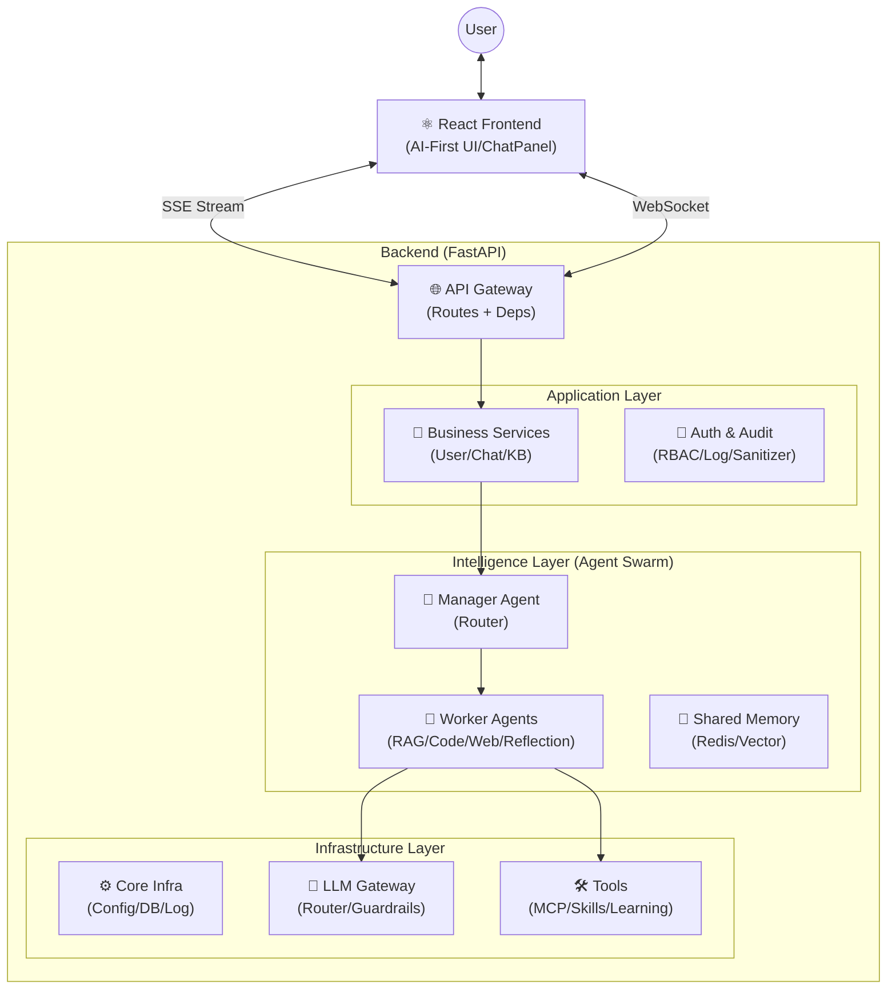
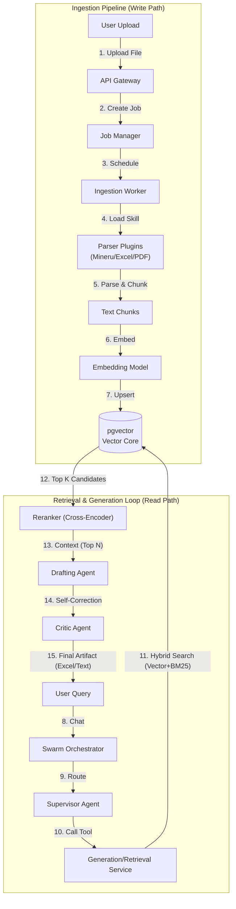

# 🐝 HiveMind RAG Platform

> **AI-First 企业级智能助手平台** — 基于 Agent Swarm 蜂巢架构与自省学习机制。

---

## 🏗️ 架构概览 (Architecture Overview)

本项目采用 **AI-First Modular Monolith (模块化单体)** 架构，以 Agent 为核心驱动业务流转，辅以 RAG 知识增强和 MCP 工具扩展。

### 核心分层设计



---

## 📂 项目结构 (Directory Structure)

本项目采用了 **AI-Native Modular Monolith** 架构。我们不再按单纯的技术层（Controller/Service/Dao）分包，而是按 **"Agent Capability" (能力域)** 进行组织。

### 1. 后端 (Backend) - `backend/app/`

| 核心领域 | 目录 | 职责说明 | 关键组件 |
| :--- | :--- | :--- | :--- |
| **大脑 (Brain)** | **`agents/`** | 决策与编排。负责意图识别、Agent 路由、多 Agent 协作。 | `SwarmOrchestrator`, `Supervisor` |
| **四肢 (Action)** | **`batch/`** | 异步执行引擎。负责长时间运行的任务调度与 DAG 依赖管理。 | `JobManager` (LangGraph), `TaskQueue` |
| **技能 (Skills)** | **`skills/`** | 动态工具箱。存放无状态的、可热插拔的业务逻辑函数。 | `SkillRegistry`, `StandardizedTools` |
| **记忆 (Memory)** | **`rag/`** | 知识检索与增强。管理向量数据库和语义索引。 | `VectorStore`, `RAGPipeline` |
| **连接 (Connect)** | **`mcp/`** | 外部世界接口。通过 Model Context Protocol 连接文件系统或外部 API。 | `MCPClient` |
| **中枢 (Infra)** | `llm/` | 语言模型网关。统一管理 Token、以及安全护栏 (Guardrails)。 | `LLMGateway` |

辅助目录：
*   `api/`: HTTP 接口定义 (Routes)。
*   `core/`: 全局基础设施 (Config, DB, Log)。
*   `common/`: 通用工具 (Utils, Constants)。

### 2. 前端 (Frontend) - `frontend/src/`

前端呈现为 "Copilot OS" 形态，而非传统的 CRUD 页面。

| 层级 | 目录 | 职责说明 |
| :--- | :--- | :--- |
| **UI State** | **`stores/`** | **Zustand**. 管理 "界面状态" (Sidebar 开关) 和 "交互上下文" (当前在哪个页面)。 |
| **Server Data** | **`hooks/queries/`** | **React Query**. 管理 "业务数据" (用户列表、文档库)，处理缓存与同步。 |
| **AI Components** | **`components/chat/`** | **Native UI**. `ChatPanel` 是常驻伴随式组件，`ActionButton` 负责执行 AI 指令。 |
| **Pages** | `pages/` | 业务页面。它们是 AI 的操作对象，通过 Context 告知 AI 当前环境。 |

### 3. 研发治理 (.agent)
位于根目录 `.agent/`，这是我们的数字化研发规范：
*   `workflows/`: 这里的 Markdown 文件定义了标准作业流程 (SOP)。
*   `rules/`: AI 辅助编程的硬性约束 (Lint Rules)。

---

## 🛡️ 研发治理体系 (Engineering Governance)

为了保证代码质量和架构一致性，我们建立了完整的数字化治理体系。

### 1. 代码生成 (Templates)
不从零写代码，使用标准模板快速生成高质量骨架。
- **Backend Service**: `.agent/templates/backend/service.py.j2`
- **Tests**: `.agent/testing/generate_test.py`

### 2. 质量门禁 (Quality Gates)
提交代码前必须通过的自动化检查。
```bash
# 一键运行所有检查 (Lint + Type Check)
./.agent/checks/run_checks.ps1
```

### 3. Prompt 资产化管理 (Prompt Engineering)
Prompt 不写死在代码里，而是作为资产统一管理。
- **位置**: `backend/app/prompts/`
- **格式**: YAML (配置) + Jinja2 (动态模板)
- **加载**: 使用 `prompts.loader.PromptLoader`

### 4. 数据库演进 (Database Evolution)
严禁手动改表，所有变更必须通过 Alembic 迁移脚本。
```bash
# 生成迁移脚本 (开发环境)
alembic revision --autogenerate -m "add_user_table"

# 执行迁移 (生产环境)
alembic upgrade head
```

---

## 🧠 AI-First 核心特性

### 1. 蜂巢与自省 (Swarm & Reflection)
不仅仅是简单的 Chain，而是拥有路由 (Supervisor) 和自省 (Reflection) 能力的 Agent 集群。
- **Supervisor**: 分析意图，分发给 RagAgent / CodeAgent / WebAgent。
- **Reflection**: 检查 Worker 的输出质量，不合格打回重做。

### 2. 混合通信架构 (Hybrid Communication)
- **SSE (Server-Sent Events)**: 用于 AI 回复的打字机流式输出。
- **WebSocket**: 用于后端主动推送状态变更 (Agent 思考过程、任务进度、通知)。

### 3. 多层渐进式记忆架构 (Multi-Tier Memory Architecture)
独创的三层混合记忆检索机制，彻底解决传统 RAG 的“大海捞针”和“缺乏上下文全局视野”问题：
- **Tier 1 - 索引雷达层 (Hot Radar)**: 纯内存抽象索引 (`InMemoryAbstractIndex`)，利用标签与实体做极速集合碰撞，在检索底层海量文本前率先明确意图和方向。
- **Tier 2 - 知识图谱层 (Overview Graph)**: 基于 **Neo4j** 构建实体关系网。当命中线索时，系统顺藤摸瓜拉取图谱邻居，赋予 Agent 类似人类大脑的关联能力，洞悉隐式关系。
- **Tier 3 - 向量细节层 (Deep Detail)**: 基于 Vector/Elastic 本地数据库执行深层匹配。在明确目标后精准捞取原始长文本与代码切块兜底，交由 LLM 生成精确答案。

---

## 🧠 批处理与调度引擎 (Batch & Scheduling Engine)

本项目引入了基于 **LangGraph** 的下一代批处理引擎 (`JobManager`)，用于替代传统的轮询控制器。

### 1. 核心架构 (Core Architecture)
*   **JobManager (Graph Orchestrator)**: 一个持久化的 LangGraph 状态机。它负责管理整个 Job 的生命周期。
*   **双节点循环 (Scheduler-Worker Loop)**:
    *   **Scheduler Node**: **纯决策者**。它重建依赖图，检查哪些任务 (TaskUnit) 的前置依赖已满足，并分配任务给 Worker。它使用 **状态重放 (State Replay)** 机制来确保 TaskQueue 的状态与 Job 的持久化状态一致。
    *   **Worker Node**: **执行者**。它并行执行被分配的任务，将结果写回 Job 状态。
*   **Skill System (Skills)**: Worker 通过动态加载 **无状态技能 (Stateless Skills)** 来执行具体业务逻辑。

### 2. 状态管理 (State Management)
*   **Persistence**: Job 的状态 (Running/Completed/Failed) 持久化在数据库中。即便服务重启，LangGraph 也能从断点恢复调度。
*   **Dependency Resolution**: 支持复杂的 DAG (有向无环图) 依赖。任务 B 只有在 任务 A 成功后才会进入 `QUEUED` 状态。

---

## 📚 RAG 知识引擎流程 (Knowledge Engine Flow)

我们的 RAG 系统分为 **异步入库 (Write Path)** 和 **实时检索 (Read Path)** 两条独立链路。



### 关键特性 (Key Features)
1.  **Agentic RAG Pipeline**: 不止于检索。支持 **Active Creating (自主生成)** 和 **Self-Correction (自我修正)**，可直接生成 Excel/Word 制品。
2.  **Hybrid Search**: 结合 **Vector (Semantic)** 和 **BM25 (Keyword)**，并引入 **Reranker (精排)**，显著提升专业领域的召回率。
3.  **Multimodal Ingestion**: 支持 PDF、Excel、图片等多模态文档解析与其他 Agent 技能的无缝集成。
4.  **Async Processing**: 入库过程完全异步，由 `JobManager` 调度，支持断点续传。

---

## 💻 AI-First 交互体系 (Interactive Copilot System)

前端不仅仅是展示层，而是 AI 的"感知手足"。我们实现了 **Copilot OS** 交互范式。
详见: [Frontend Architecture](docs/design/frontend_architecture.md)

### 1. 伴随式架构 (Persistent Presence)
*   **设计**: `ChatPanel` 独立于页面路由之外 (在 `AppLayout` 层级)。
*   **体验**: 无论用户跳转到哪个页面，与 AI 的对话上下文（包括正在生成的流式回答）**永不中断**。

### 2. 双向上下文感知 (Bidirectional Context)
*   **Read (AI 读环境)**:
    *   前端维护 `PAGE_CONTEXT_MAP`。当用户进入 `/knowledge` 页面，AI 自动感知："用户正在管理知识库"，并预加载相关 Skills。
*   **Write (AI 写操作)**:
    *   AI 不仅仅回答文本，还能下发 **UI Action**。
    *   例如：用户说"添加一个订阅"，AI 返回 `{ type: 'open_modal', target: 'add_subscription' }`，前端自动打开弹窗。

### 3. 主动智能 (Proactive Intelligence)
*   结合 `WebSocket`，系统能在后台任务完成时主动推送："刚才的文档分析完了，发现 3 个风险点，要查看吗？"
*   打破了 "用户问 -> AI 答" 的被动模式。

---

## 🤖 AI 开发指南 (AI Development Guide)

**Attention AI Agents & Copilots**: 在生成或修改代码时，请严格遵守以下架构规范。

### 1. 状态与副作用 (State & Side Effects)
*   **Skills MUST be Stateless**: `app/skills/` 下的工具函数必须是纯函数或只依赖传入的 `config`。严禁在 Skill 实例中保存跨请求的状态。
*   **Agents MUST be Stateful**: `SwarmOrchestrator` 和 LangGraph Nodes 可以维护 `state` (Conversation History, Job Context)。
*   **Logic Separation**: 
    *   **Decision**: 在 `Scheduler` 或 `Supervisor` 中进行 (逻辑判断)。
    *   **Execution**: 在 `Worker` 或 `Tool` 中进行 (副作用操作)。

### 2. 代码规范 (Coding Standards)
*   **Type Safety**: 前后端交互必须严格遵守 `shared/types.ts` 和 `app/batch/models.py` 的定义。确保 `BatchJob` 和 `TaskUnit` 字段一致。
*   **Async First**: 所有 I/O 操作 (DB, LLM, File) 必须使用 `async/await`。
*   **Pydantic V2**: 数据模型统一使用 Pydantic V2 (`model_dump`, `model_validate`)。

---

## 🚀 快速开始 (Quick Start)

### 环境要求
- Python 3.10+
- Node.js 18+
- PostgreSQL 14+ (矢量插件需启用)
- Redis 6+

### 1. 后端启动
```bash
cd backend
# 安装依赖
pip install -e ".[dev]"  # 推荐（基于 pyproject.toml）
# 或兼容方式：pip install -r requirements.txt

# 初始化数据库
python -m scripts.init_db

# 启动服务
uvicorn app.main:app --reload
```

### 2. 前端启动
```bash
cd frontend
# 安装依赖
npm install

# 启动开发服务器
npm run dev
```

### 3. 运维命令
```bash
# 创建超级管理员
python -m backend.scripts.create_superuser <user> <pass>

# 运行代码规范检查
./.agent/checks/run_checks.ps1
```

---

## 📄 License
Private - All Rights Reserved
