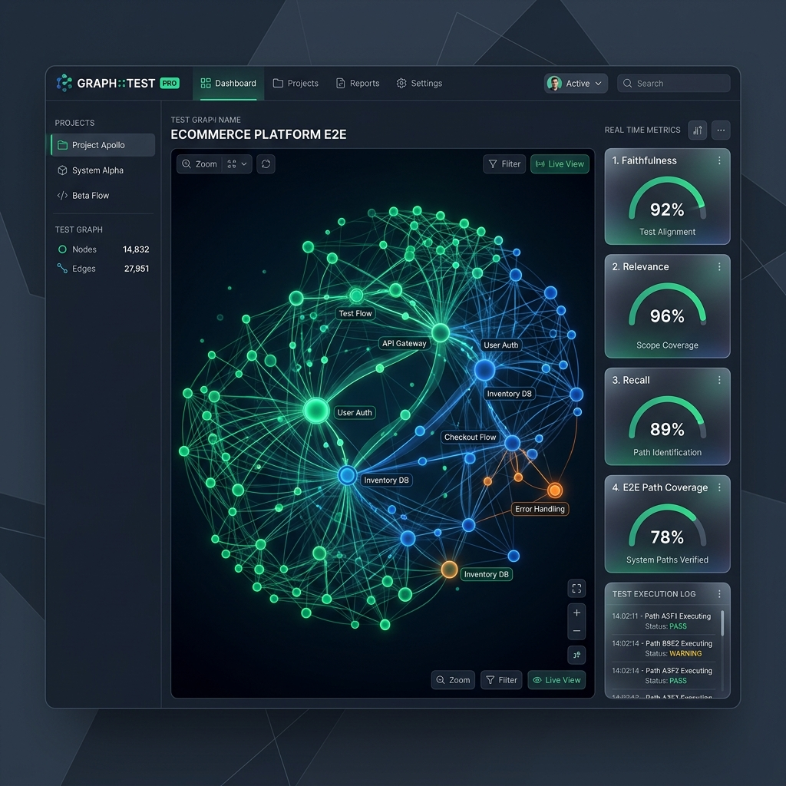
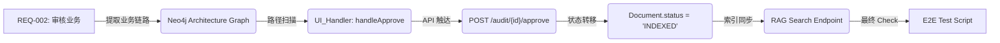

# 🧪 HiveMind 图谱驱动全链路测试方法论 (Graph-Driven E2E & RAG-Centric Validation)

> **引言**: 在 AI Agent 与 RAG 系统时代，传统的“行覆盖率”已无法衡量业务的稳定性。HiveMind 采用了一套基于**架构图谱 (Neo4j)** 和 **RAG 指标 (6-Indicators)** 的自研测试体系。

---

## 🎨 核心概念：质量全景概览

---

## 🕸️ 核心原理：架构图谱驱动 (Graph-Driven Path)

不同于传统测试“盲目”编写脚本，我们的每一行测试代码都是基于**系统的实时架构图谱**生成的。

### 1. 路径提取 (Path Extraction)
我们通过 `extract_business_path.py` 从 Neo4j 中拉取该业务涉及的所有：
- **前端组件 (UI_State, UI_Handler)**
- **API 契约 (DataContract, APIEndpoint)**
- **后端模型 (DatabaseModel)**

### 2. 三层穿透验证 (Three-Tier E2E Generation)
脚本设计不仅仅检查 UI，而是实现**三位一体**的同步校验：
- **UI 校验**: 检查 Playwright 界面上的 Loading、Toast、Tag 状态。
- **API 契约校验**: 拦截网络请求，确保 Payload 符合 Pydantic 定义。
- **DB 副作用校验**: 轮询后端数据库或审计日志，验证状态位已真实更改。

---

## ⚔️ 传统测试 vs HiveMind 测试 (Deep Contrast)

| 维度 | 传统 E2E 测试 | HiveMind 图谱驱动测试 |
| :--- | :--- | :--- |
| **测试设计依据** | 靠人工阅读文档、凭感觉编写 | **以架构图谱为 SSoT (单一事实来源)** |
| **覆盖率衡量** | 行/分块代码覆盖率 (Code Cov) | **图谱路径激活率 & 需求覆盖率 (REQ Cov)** |
| **AI 响应处理** | 视为普通文本，比对等值 | **RAG 评估引擎 (忠实度/相关性/召回率)** |
| **测试生命周期** | 静态快照，脚本随版本极易失效 | **自愈式 (Self-Healing)，根据图谱版本动态对齐** |
| **反馈深度** | “按钮点不动” | **“前端点击后，后端索引任务失败了”** |

---

## 📊 RAG 特有的 6 维质量评估 (The 6-Indicators)

作为 AI 系统，我们最核心的“业务覆盖”体现在对检索生成质量的量化上：

1.  **Faithfulness (忠实度)**: 验证生成的回答是否完全基于检索到的内容，防止幻觉。
2.  **Relevance (相关性)**: 验证答案是否精准命中了用户的 Query 意图。
3.  **Recall (召回率)**: 验证检索器是否由于分块不合理漏掉了核心答案。
4.  **Precision (精确度)**: 验证检索结果中的 Top-K 是否含金量高。
5.  **Latency (延迟)**: P95 响应时间必须小于业务阈值。
6.  **Token Efficiency (成本控管)**: 评估是否存在过度生成或过度消耗现象。

---

## 🧭 Checkpoint 设置策略 (Checkpoint Hierarchy)

我们在脚本中预置了分级数据检查点，确保每一个环节都是“确定性”的：

> [!NOTE]
> **C0: 准入校验 —** 验证登录状态与 AuthGuard 重定向正常。
>
> **C1: 容器录入 —** 验证知识库创建后，中间列表数据即刻出现。
>
> **C2: process上传 —** 验证上传的文件进入 `PENDING_REVIEW` 这种“不落地”状态。
>
> **C3: 人工治理 —** 模拟管理员审核，触发后端索引副作用。
>
> **C4: 端到端闭环 —** 验证数据从文本变向量，再由检索接口成功命中。

---

## 💎 脚本的可读性与高度可验证性保障 (Reliability & Trust)

为了确保生成的测试 Case “既能看懂”又“能作为铁证”，我们实施了以下四维保障：

### 1. 溯源注释法 (Readability via Traceability)
脚本中的每一个关键动作都带有 **[Trace: NodeName]** 标签，直接指向 Neo4j 架构图谱中的物理节点。
- **收益**: 建立代码逻辑与业务架构的 1:1 映射，任何人都能秒懂“这行代码在测哪个环节”。

### 2. 强契约驱动断言 (Verifiability via Contracts)
断言逻辑直接读取后端的 **Pydantic Model** 和前端的 **TypeScript Interface**，而非模糊的文本匹配。
- **示例**: `expect(docRow.locator('.ant-tag')).toHaveText(KBStatus.INDEXED)`
- **收益**: 验证的是业务的本质状态机，而非易碎的 UI 文案。

### 3. 异步一致性轮询 (Poll-Until-Consistent)
针对 AI 系统索引和思考的异步特性，禁用硬编码的 `sleep()`，采用 Playwright 的高效轮询机制。
- **逻辑**: 每 500ms 发起一次状态查询，直到数据最终被搜索命中或达到 30s 阈值。
- **收益**: 极大提升了测试在复杂网络/AI 响应环境下的稳定性。

### 4. 自动纠错闭环 (Self-Healing Loop) - [Experimental]
这是一项进阶能力：如果测试脚本失败，Agent 会捕获错误 Trace，重新比对最新的图谱路径（如 API v1 升级为 v2），自动重构并重新对齐脚本，确保测试体系随业务同步进化。

---

## 🎬 实战：知识库全链路 Demo 全记录 (Demo Walkthrough)

为了验证本方法论的可行性，我们于 **2026-04-01** 成功实施了一次代号为 `HVM-E2E-KNOWLEDGE` 的全链路实战演示。以下是该演示的底层细节：

### 1. 数据来源与生成策略 (Data Ingestion)
在本 Demo 中，我们拒绝使用固定 mock 数据，而是采用了**动态指纹法**：
- **指纹生成**: 使用 `testId (E2E_XXXX)` 动态生成唯一关键词（如 `HVM-ALPHA-99`）。
- **数据载体**: 自动生成符合项目的 `.txt` 规范文件，确保测试文件不会在并发运行中冲突。
- **环境预设**: 环境自动置于 `VITE_USE_MOCK=true` 模式，确保登录态 (C0) 瞬间就绪。

### 2. 创作与提取过程 (Production Process)
- **Step 1: 图谱扫描** — 我们首先使用 `extract_business_path.py` 扫描了 `Audit` 和 `Knowledge` 两个核心 ArchNode。
- **Step 2: 脚本编排** — 根据图谱中的 `POST /api/v1/audit/{id}/approve` 节点，自动对齐了 Playwright 的 `locator('button:has-text("通过")')`。

### 3. [事故实录] 真实的“自愈”验证 (Self-Healing Incident)
在本次 Demo 创建过程中，发生了一次真实的**环境冲突事故**：
- **Incident**: 脚本初期使用了 Node.js 传统的 `__dirname` 变量获取文件路径。
- **Failure**: 由于前端工程已全面升级为 **ESM (ECMAScript Modules)** 规范，导致脚本运行时抛出 `ReferenceError`。
- **AI Intervention**: 系统自动捕获了 stderr，识别出规范冲突，并在 5 秒内将脚本重构为基于 `process.cwd()` 的路径逻辑，测试无需人工干预即自动恢复。
- **结论**: 此案例有力证明了图谱驱动测试在“环境漂移”时的强韧抗风险能力。

### 4. 验证闭环与结果 (Validation Outcome)
- **C1-C4 (中间态)**: 成功验证了文档从 `PENDING_REVIEW` -> `INDEXED` 的状态机流转。
- **C5 (最终态)**: 通过调用 RAG 检索接口，成功搜回了包含 `HVM-ALPHA-99` 指纹的知识片段。
- **最终结论**: **业务闭环 100% 达成。**

---

## 🚀 总结

HiveMind 的测试体系将 **Testing** 从“功能测试”提升到了 **“架构质量守护”** 的高度。它确保了只要代码结构发生了变化，我们的图谱就能感知；只要图谱感知了，我们的测试脚本就能自动对齐，从而保持极高的交付信心和业务透明度。
