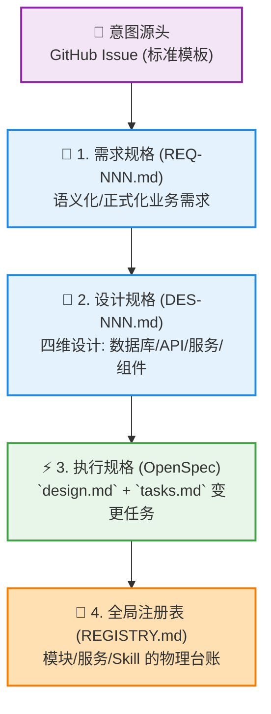
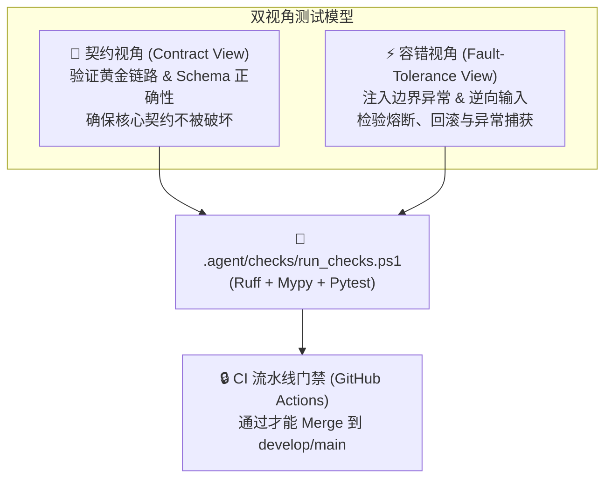

# 🐝 AI-Native Spec-Driven Development (SDD)
## 人机协同下的规格驱动开发与研发治理新范式

> **主讲人**: Antigravity & HiveMind 架构团队  
> **定位**: 技术白皮书 & 核心汇报 PPT 幻灯片材料  
> **系统基座**: 基于 HiveMind Agentic RAG Platform 实践沉淀

---

# 📑 目录 (Agenda)

- **01. 研发之痛**：为什么“代码生成”正在摧毁我们的架构？
- **02. SDD 核心哲学**：Document-Driven + Agent-Native 研发范式
- **03. 四维规格体系**：让 AI 与人类遵循同一套“生命密码”
- **04. 完美闭环流转**：从“随口一说”到“全自动合并”的8步链路
- **05. 核心治理容器**：`.agent/` 生产车间的物理实体
- **06. 质量看门狗**：双视角测试与 CI 门禁体系
- **07. 实践成效与治理飞轮**：酿造可追溯的“黄金知识”

---

# 01. 研发之痛：传统 AI 编码的四大硬伤 ⚡

> [!WARNING]
> **“想到哪里写到哪里”是人类开发者的通病，但在 AI 时代，这是一种灾难。**  
> 传统的 AI 辅助编程（如单纯的代码补全或无约束对话）在大型工程中会迅速引发以下四大硬伤：

| 致命痛点 | 现象描述 | 产生后果 |
| :--- | :--- | :--- |
| **架构腐化与盲目造轮子** | AI 无法感知全局注册表，重复实现相似函数，直接跨层越权调用 | 系统变成无法重构的“意大利面条代码” |
| **无约束的幻觉蔓延** | AI 编造不存在的第三方库，使用已被废弃 of API，裸用 `Exception` | 运行时频繁崩溃，排查链路极长 |
| **无限循环与死锁阻塞** | 提示词微调导致 AI 在同一个 Bug 里打转，多文件修改时越改越乱 | 消耗大量 Token，人机协作信心彻底崩塌 |
| **历史不可追溯** | 缺乏意图与代码的绑定，代码改了，需求文档和设计说明却严重滞后 | 项目沦为“一次性玩具”，防腐防锈能力为零 |

---

# 02. SDD 核心哲学：规格驱动开发 🧭

> [!IMPORTANT]
> **什么是 AI 原生 SDD (Spec-Driven Development)？**  
> 它的核心理念是：**“所有意图必须显式记录，所有代码必须有依据，所有问题必须有闭环。”**  
> SDD 将开发过程从“面向代码生成”升华为“面向规格编译器”，让人类负责意图和规格的设计，AI 负责规格的编译与高保真实现。

```
    【人类意图】
       │
       ▼ (设计规格)
   ┌──────────────┐
   │  SDD 规格书   │ ◄─── 这是 AI 和人类唯一合法的契约 (Single Source of Truth)
   └──────────────┘
       │
       ▼ (自动化编译与治理)
    【高保真代码】 ◄─── 必须接受 .agent/ 规则、Git Hooks 与测试门禁的严苛约束
```

### 🎯 SDD 的三个黄金法则：
1. **行为解耦**：Agent (带副作用的状态机) × Skill (纯函数式的原子工具单元)。
2. **数据编译**：Ingestion 就像编译器。知识不只是存储，而是通过词法分析、语法分析与语义优化进行“编译”。
3. **服务化契约**：每一个知识库是一个独立自治的微服务，输出强制遵守强 Schema 契约（如 `KnowledgeResponse`），严禁返回裸字符串。

---

# 03. 四维规格体系：人机共读的生命密码 🧬

> 在 HiveMind 系统中，规格不是一堆散落的 Word 文档，而是一套**高内聚、版本化、机器可读（Agent-readable）的四维台账体系**：



### 📂 四维规格详解：

#### 📝 1. 需求规格 (`REQ-NNN.md`)
*   **位置**: `docs/requirements/`
*   **内容**: 背景、目标、功能点定义 (Functional Specs)、非功能性指标、严苛的验收标准 (Acceptance Criteria)。

#### 📐 2. 设计规格 (`DES-NNN.md`)
*   **位置**: `docs/design/`
*   **内容**: 数据库结构、API 接口定义 (FastAPI Schema)、核心业务逻辑设计、前端组件架构与交互标准。

#### ⚡ 3. 执行规格 (`OpenSpec`)
*   **位置**: `openspec/changes/<name>/`
*   **内容**: `proposal.md` (变更提案), `design.md` (变更设计方案), `tasks.md` (1:1 映射到代码提交的任务清单)。

#### 🐝 4. 全局注册表 (`REGISTRY.md`)
*   **位置**: 项目根目录 `REGISTRY.md`
*   **内容**: 记录所有 API、Service、Model、Skill、Component 状态。防止 AI 重复造轮子，促进资产防腐。

---

# 04. 完美闭环流转：8 步流转生命周期 🔄

> HiveMind 将一个特性的研发设计为一条严密的“生产流水线”。无论是人类还是 AI 代理，都必须顺次走完 8 个环节，从而确保研发质量的绝对确定性：

```mermaid
flowchart LR
    classDef active fill:#e8f5e9,stroke:#43a047,stroke-width:2px;
    classDef process fill:#eceff1,stroke:#607d8b,stroke-width:1px;

    Step1["1. 提出意图\nGitHub Issue"] --> Step2["2. 深度分析\n/opsx-explore"]:::process
    Step2 --> Step3["3. 规格固化\nREQ/DES 生成"]:::process
    Step3 --> Step4["4. 代码计划\n/opsx-propose"]:::active
    Step4 --> Step5["5. 分支实现\n/opsx-apply"]:::active
    Step5 --> Step6["6. 质量看门狗\nTest + CI"]:::process
    Step6 --> Step7["7. 人类核验\nPR & Review"]:::process
    Step7 --> Step8["8. 终局归档\nCHANGELOG / Archive"]:::process

    style Step4 fill:#ffe0b2,stroke:#f57c00,stroke-width:2px;
    style Step5 fill:#ffe0b2,stroke:#f57c00,stroke-width:2px;
```



### 🛡️ 流程说明与自动化工具支撑：
*   **第 2~4 步 (设计与计划)**：通过 `/opsx-explore` 自动搜索代码库依赖，再由 `/opsx-propose` 一键生成完整的 OpenSpec `design.md` 和 `tasks.md`。
*   **第 5 步 (代码实现)**：AI Agent 运行 `/opsx-apply`，严格按照 `tasks.md` 逐行编写代码，并自动进行 Conventional Commits 提交。
*   **第 8 步 (闭环归档)**：利用 `/opsx-archive` 清理 TODO 并将完成的内容沉淀到 `CHANGELOG.md` 中，让历史不可篡改。

---

# 05. 核心治理容器：`.agent/` 生产规范车间 🏭

> [!NOTE]
> **`.agent/` 目录是 HiveMind 研发治理体系的物理载体。**  
> 它不仅仅是文档，它是一套**可执行规则集**，把软件工程的规范变成了 AI Agent 的“数字物理定律”。

```
.agent/
├── rules/          # 🧱 1. 架构硬约束门禁 (如：跨层调用拦截、错误屏蔽、异步规范)
├── workflows/      # 📋 2. 标准化 SOP 工作流 (可被 AI 直接解析并顺次执行的指令)
├── hooks/          # 🔒 3. Git Hooks 安全哨兵 (Conventional Commits、密钥扫描、大文件)
├── checks/         # ✅ 4. 自动化质检套件 (Ruff / ESLint / Mypy / TSC / Pytest 一键执行)
├── skills/         # 🛠️ 5. Agent 高级能力包 (自动生成测试、自动编写设计文档、OpenSpec 链)
└── templates/      # 📄 6. 统一模版库 (Issue / REQ / DES / OpenSpec / CHANGELOG 标准)
```

### ⚡ `.agent/rules/` 三大架构铁律：
1. **分层隔离**：API 路由层 ──► 业务服务层 ──► 智能 Agent 层 ──► 基础设施/数据层，严禁跨层越权调用（例如 API 路由层绝不能直接操作 ORM 或 Neo4j 客户端）。
2. **依赖注入**：全局服务和数据库连接必须通过 FastAPI Dependencies 注入，禁止使用不透明的全局单例。
3. **类型防线**：Python 必须有 100% 的 Type Hints (mypy 强校验)，TypeScript 必须严格通过 `tsc`，零 `any` 容忍。

---

# 06. 质量看门狗：双视角测试与 CI 门禁 🐕

> [!TIP]
> **我们不相信“写完即正确”。SDD 的核心是以自动化测试作为规格的物理约束。**  
> HiveMind 独创了 **“双视角测试方法论” (Dual-View Testing Methodology)**，强制所有核心功能在提 PR 前通过 AI 生成和补齐测试：



### 🛡️ 测试金字塔策略：
*   **单元测试 (70%)**：聚焦于 Skill、工具类与核心算法的纯函数验证。
*   **集成测试 (20%)**：使用 TestClient 和内存 SQLite/Redis，测试 API 到 Service 的真实链路与中间件表现。
*   **E2E 契约测试 (10%)**：跨越前两层，模拟 Supervisor 到特定 Worker 节点的端到端 LangGraph 状态变迁。

---

# 07. 实践成效与治理飞轮：酿造黄金知识 🍯

> 实施 SDD（规格驱动开发）之后，HiveMind 项目为团队和系统带来了革命性的变化，形成了持续自我完善的“治理飞轮”：

```
                    ┌───────────────────┐
                    │  1. 需求语义化固化 │
                    └─────────┬─────────┘
                              │
                              ▼
┌───────────────────┐       ┌───────────────────┐
│ 4. 资产防腐飞轮   │ ◄─────┤ 2. 代码高保真编译 │
│    - 模块零冲突   │       └─────────┬─────────┘
│    - 历史可追溯   │                 │
└─────────▲─────────┘                 ▼
          │                 ┌───────────────────┐
          └─────────────────┤ 3. 契约自动化验证 │
                            └───────────────────┘
```

### 📈 核心治理成效指标：
*   **新功能开发首通率提高 80%**：AI 与人类在完全一致的设计（DES）和任务（Tasks）指导下协同，避免了 95% 以上的语义偏差。
*   **零重复造轮子**：任何新写的方法和组件都必须注册在 `REGISTRY.md`。AI 在写代码前必先阅读该台账，复用率提升 60%。
*   **100% 架构一致性**：通过将分层架构、错误处理、依赖注入直接写在 `.agent/rules/` 中，即使更换大模型或有多人参与协作，代码风格依旧如同一人所写。

---

# 💬 总结与开放讨论 (Discussion)

> **“蜂群不是靠一只蜜蜂来运转的。每一滴蜂蜜，都是千万次分工协作的结晶。”**  
> **AI 原生 SDD** 不仅是对工具的使用，更是对研发生产关系的重塑。

### 💡 核心汇报要点总结：
1. **SDD 的本质**：以**规格 (Specification) 文档**为桥梁，解耦“设计意图（人类）”与“高频实现（AI）”，实现高质量研发。
2. **HiveMind 的优势**：将标准 SOP 变成 AI 运行环境的一部分，通过 Git Hooks 和双视角测试形成了完美的**闭环自省机制**。
3. **未来路线**：推进“编译型 RAG 知识图谱”与“ClawRouter 智能模型路由”的深度规格化，实现真正的 **RAG 资产自治与自我净化**。

---
**感谢聆听！欢迎各位老师、技术专家共同讨论与交流！**
