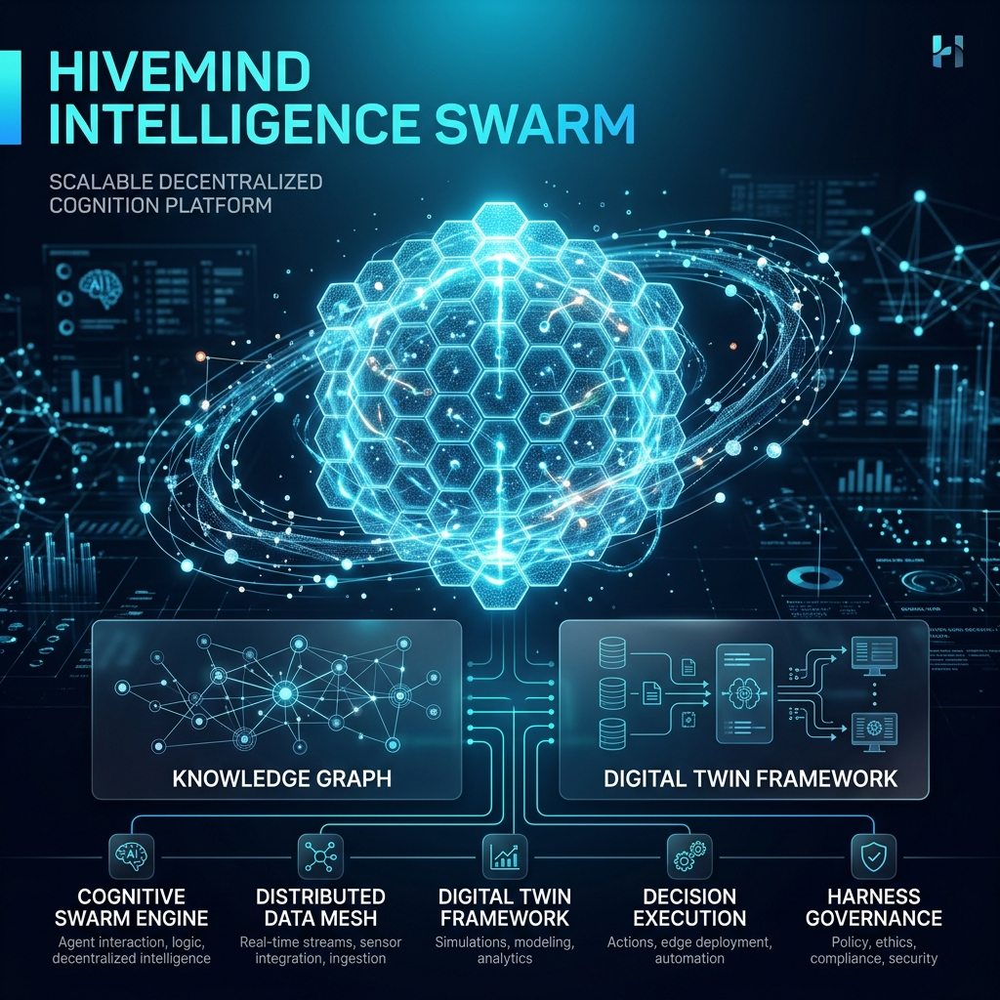
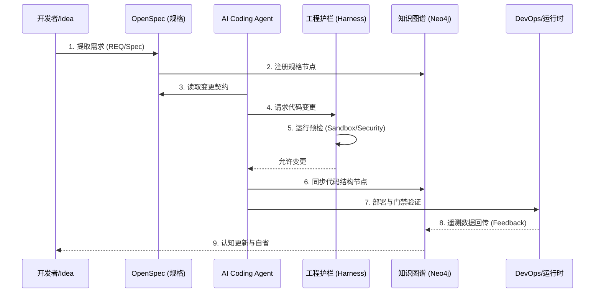
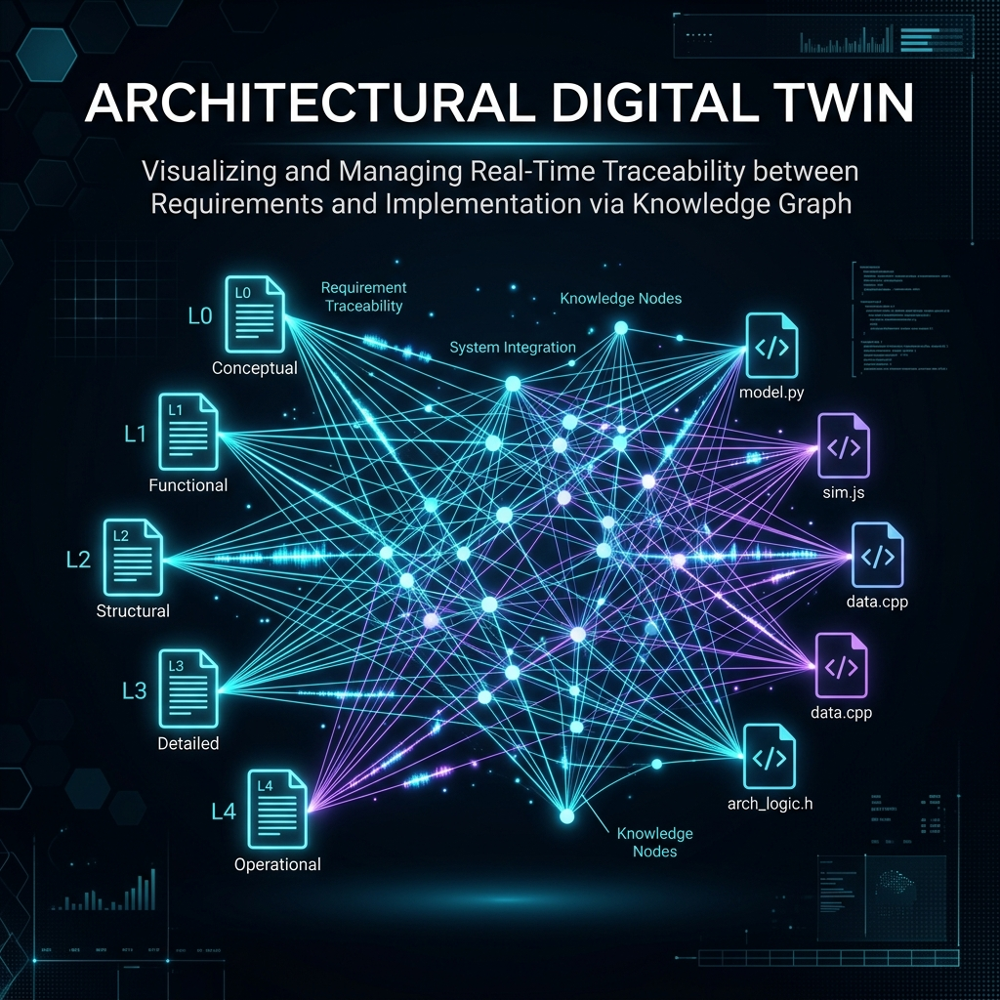
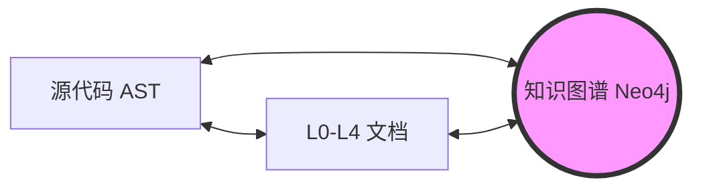
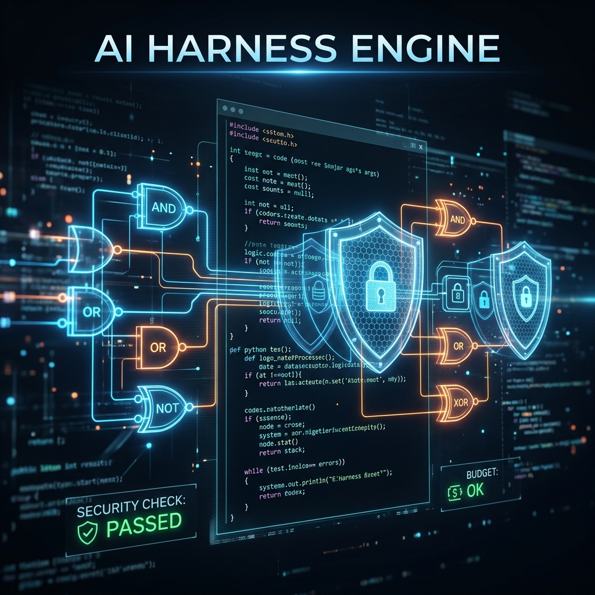
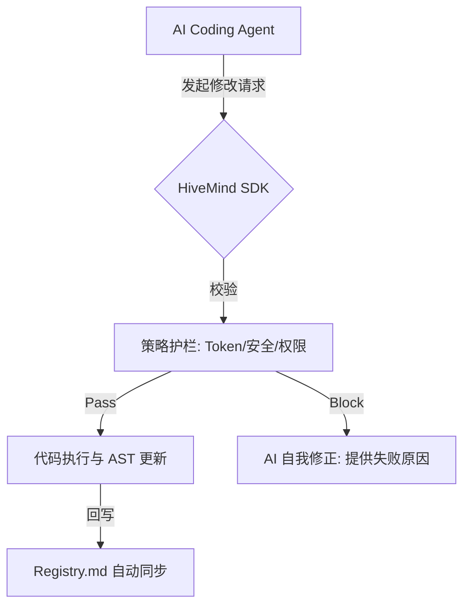
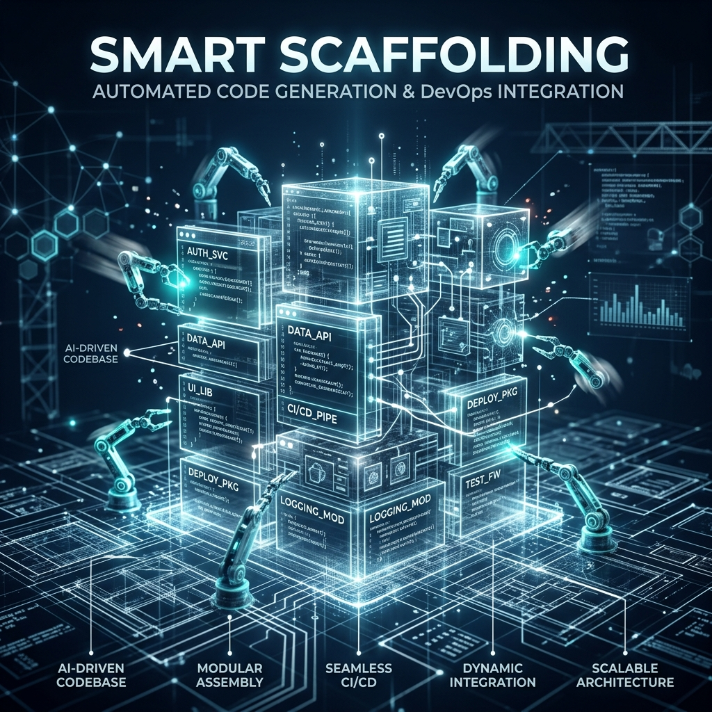

# 🌌 HiveMind Intelligence Swarm: 愿景与核心设计概览

> **定位**: 本文档是 HiveMind 系统的“认知起点”，旨在定义系统的终极演进目标与核心设计哲学。

---

## 1. 核心愿景 (The Vision)

HiveMind 不仅仅是一个 RAG 应用，它是一个 **“自进化、自治理的智体蜂巢研发平台”**。

我们的目标是消除“人类开发者”与“AI 智体”之间的摩擦，创建一个：
- **AI 可读 (AI-Readable)**: 所有的架构、设计、代码和文档都通过知识图谱互相连接。
- **AI 可执行 (AI-Executable)**: 每一项需求（Spec）都能被 AI 自动拆解并安全执行。
- **AI 可治理 (AI-Governable)**: 所有的变更都受控于“工程护栏 (Harness)”，确保安全性与一致性。

---

## 2. 核心设计哲学 (Design Philosophy)

### 2.1 数字孪生 (Digital Twin)
我们坚持“代码即知识，知识即图谱”。系统中的每一个函数、每一个 API、每一份设计文档，在 Neo4j 知识图谱中都有一个对应的节点。修改代码的同时就是在修改系统的“认知地图”。

### 2.2 规格驱动 (Spec-Driven)
我们认为“灵感 (Idea)”应首先转化为“规格 (Spec)”。通过 `OpenSpec` 协议，我们确立了 AI 工作的边界。没有 Spec 的代码是不可信的。

### 2.3 工程护栏 (Harnessing)
AI 的强大需要约束。我们通过 **Harness (护栏)** 机制（包含成本审计、安全性沙箱、逻辑验证），为 AI 智体提供了一套“安全驾驶”框架。

---

## 3. 核心流程与架构图示 (Architecture Visuals)

### 3.1 灵感至运维的全生命周期 (Idea-to-Ops Lifecycle)
该流程展示了每一个需求如何通过规格驱动和护栏校验，最终闭环回到系统认知中。

### 3.2 “三位一体”数字孪生 (The Triple Mirror)

文档、代码与图谱不是孤立的，它们是同一实体的三个映射。通过知识图谱，我们实现了架构资产的“全局可见”与“语义追溯”。

### 3.3 护栏 (Harness) 拦截机制

保障 AI 智体在开发过程中的确定性与安全性。护栏层负责在代码变更写入文件系统前，执行多维度的合规性与安全性检查。

### 3.4 智能脚手架自动化 (Smart Scaffolding)

通过脚手架，我们实现了“原子化”的资产交付。不仅是代码，关联的项目结构、CI/CD 配置与部署元数据均可一次性生成并入库图谱。

---

## 4. 统一架构全景观 (Architecture Panorama)

系统由以下四个维度相互咬合：

1.  **Idea 层 (The Soul)**: 这里的输入是原始需求，通过 `/extract-requirement` 转化为规格化的 `REQ` 与 `Spec`。
2.  **SDK 层 (The Body)**: 统一的 `hivemind-sdk`。它提供了感知（遥测）、记忆（存储）和行动（工具接口）的基础能力。
3.  **Graph 层 (The Brain)**: 基于 Neo4j 的架构图谱。它是系统的 SSoT（单点真理源），连接了需求、代码、测试与运行数据。
4.  **DevOps 层 (The Loop)**: 闭环的反馈回路。运行时的日志和性能数据会回传给图谱，指导下一轮的 Idea 优化。

---

## 5. 开发者体验 (The Developer Experience)

无论是人类还是 AI，都通过统一的 **`hm` CLI (The Commander)** 与系统交互：
-   **创建**: 通过脚手架自动生成符合规范的资产。
-   **验证**: 通过 `hm doctor` 和 `Harness` 确保每一行代码都符合架构治理。
-   **进化**: 通过智体协作（Swarm）实现大规模的功能快速迭代。

---

## 6. 结语

> _“我们不仅在写代码，我们是在编织一个不断进化的智能生命。”_

HiveMind 的终极形态是一个能够理解自身、修复自身、乃至优化自身的智能有机体。这份愿景将指引我们完成从 Phase 1 到 Phase 4 的所有整合工作。

---
> 🔗 **快速导航**:
> - [统一执行计划](./design/unified_system_consolidation_plan.md)
> - [架构详细设计](./design/DES-004-UNIFIED_CONSOLIDATION_DESIGN.md)
