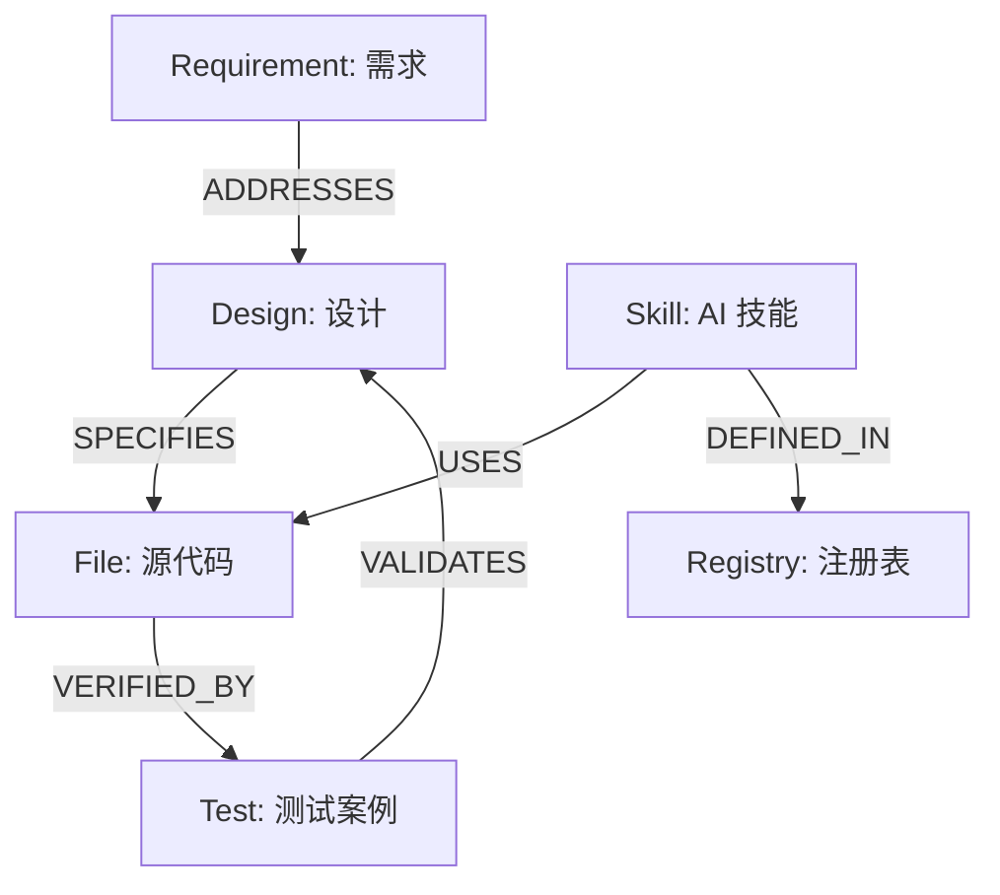

# 🧠 HiveMind 软件大脑：架构资产图谱指南

> **定位**: 将离散的需求、设计、代码和测试连接成一个有生命的知识网络，实现“上帝视角”下的研发决策。

## 1. 核心价值
- **精准导航**: 拒绝暴力全文搜索，通过图谱瞬间定位需求关联的代码文件。
- **影响力分析**: 修改一行代码前，先知道它会“震动”哪些业务功能。
- **Token 极致优化**: 仅为 AI 注入最相关的上下文路径，显著降低 API 成本。

## 2. 图谱实体关系图 (Meta-Schema)



## 3. 如何使用 (How-to)

### A. 开发者/AI 助手：查询路径
如果你不确定从哪里开始实现需求 `REQ-011`：
```powershell
python skills/architectural-mapping/scripts/query_architecture.py --req "REQ-011"
```

如果你想评估修改某个文件的风险：
```powershell
python skills/architectural-mapping/scripts/query_architecture.py --file "backend/app/batch/engine.py"
```

### B. 维护者：更新大脑
当项目结构发生变更（新增文件、新需求等）后，请运行索引器：
```powershell
python skills/architectural-mapping/scripts/index_architecture.py
```

## 4. 最佳实践 (Best Practices)
1.  **提交前自省**: 养成在 Commit 前查询图谱的习惯，确保测试覆盖范围完整。
2.  **显式引用**: 在测试代码中使用 `@covers DES-XXX` 标签，索引器会自动识别并建立强连接。
3.  **图谱驱动开发 (GDD)**: 优先从图谱获取知识，而非盲目读取文件目录。

---
*Generated by Antigravity AI | 2026-03-13*
