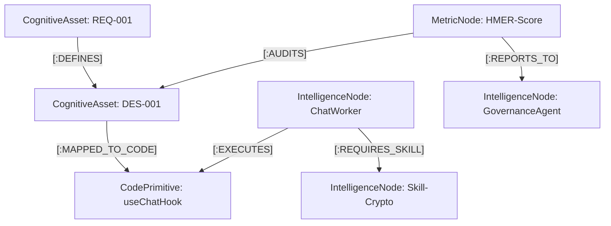

# 🧠 HiveMind Intelligence Swarm: 认知架构图谱 (ARCH-Graph)

> **核心定位**: 从“代码索引”升维为“智体认知中枢”，实现需求 (REQ)、设计 (DES)、代码 (Code) 与度量指标 (Metric) 的四维全量关联。它是 HiveMind Swarm 协作的“数字大脑”，为 Agent 提供超越单文件的全局架构直觉。

---

## 🚀 1. 认知本体论 (The Cognitive Ontology)

为了让 Agent Swarm 具备精准的“架构导航”能力，我们将图谱 Schema 规范化为以下四大核心域：

### 🟢 A. 智体域 (Intelligence Realm)
*   **节点标签**: `IntelligenceNode`
*   **核心内容**: 定义 Swarm 中的角色 (Supervisor, Worker)、具备的技能 (Skill) 以及当前状态。
*   **关键关系**: `[:OWNS]` (资产归属), `[:EXECUTES]` (代码执行), `[:REQUIRES_SKILL]` (能力依赖)。

### 🔵 B. 资源域 (Resource Realm)
*   **节点标签**: `CognitiveAsset`
*   **核心内容**: 存储高维度的业务资产，包括需求 (REQ)、设计说明 (DES)、治理规约 (GOV)。
*   **关键关系**: `[:DEFINES]` (逻辑定义), `[:MAPPED_TO_CODE]` (代码映射), `[:SUPERSEDES]` (版本更替)。

### 📜 C. 代码域 (Code Realm)
*   **节点标签**: `CodePrimitive`
*   **核心内容**: 深度解析后的代码实体，涵盖类、函数、Hook、Store 及配置项。
*   **关键关系**: `[:IMPLEMENTS]` (逻辑实现), `[:DEPENDS_ON]` (依赖追踪), `[:TRIGGERS]` (副作用触发)。

### 📊 D. 度量域 (Metric Realm)
*   **节点标签**: `MetricNode`
*   **核心内容**: 系统的健康度与性能指标，如 HMER 评分、响应延迟、安全漏洞扫描结果。
*   **关键关系**: `[:AUDITS]` (合规审计), `[:REPORTS_TO]` (治理上报)。

---

## 🎨 2. 全景关联拓扑 (Global Linkage)

通过跨域关联，系统能从一个需求节点直接溯源到它影响的所有 UI 组件和后端逻辑：



---

## 🔗 3. 与其他架构模块的协同 (Synergy)

ARCH-Graph 不是孤立存在的，它与其他核心组件构成了 HiveMind 的闭环逻辑：

*   **[动态图谱记忆 (Dynamic Memory)](AGENT_GRAPH_MEMORY.md)**: 
    *   *ARCH-Graph 提供静态的架构拓扑，而 Memory 记录用户的动态偏好。* 当 Agent 在 ARCH-Graph 中定位到某个组件时，会同时提取该组件关联的 `[:FOLLOWS_STYLE]` 记忆。
*   **[业务流全景映射 (Business Flow)](business_flow.md)**: 
    *   *ARCH-Graph 是地图，Business Flow 是路径。* 每一个序列图中的 `participant` 在图谱中都是一个 `IntelligenceNode`。

---

## 💡 4. 核心创新特性 (Intelligence Swarm Features)

### ⚡ Programmatic Execution (编排脚本化)
不同于传统的 Agent 步进式执行，HiveMind 允许 Agent **“生成一段基于图谱拓扑的 Python 编排逻辑”**，将多次 LLM 网络往返压缩为一次本地化的高性能执行。

### 🧊 Tiered Retrieval Matrix (冷热分层检索)
1. **Tier-1 Radar** (Hot): 极速标签路由。
2. **Tier-2 Graph** (Relation): 基于 Neo4j 的架构影响范围与依赖跳跃查询。
3. **Tier-3 Scalar** (Warm): 基于 SmartGrep (BM25) 的精确事实检索。
4. **Tier-4 Vector** (Semantic): 基于 Embedding 的语义模糊匹配。

---

## 🔍 5. 智体自愈：图谱清洗与审计 (Self-Healing)

借助 Cypher 指令，系统能够自动发现并修复架构与代码的不一致性：

### 5.1 孤儿文档清理 (Orphaned Asset Clean)
*识别那些失去了代码支撑或不再被需求定义的失效资产。*
```cypher
MATCH (a:CognitiveAsset) 
WHERE NOT (a)-[:DEFINES|MAPPED_TO_CODE|SUPERSEDES]-()
RETURN a.id, "Pending Archive"
```

### 5.2 影子代码检测 (Shadow Code Detection)
*识别那些在代码库中存在，但未在图谱中注册的“黑户”逻辑，确保 RDD 治理规范的落地。*
```cypher
MATCH (c:CodePrimitive)
WHERE c.status = 'unregistered'
RETURN c.path, "Violation of GOV-001"
```

### 5.3 认知偏航审计 (Alignment Audit)
*识别那些有需求但无设计链接的“认知缺口”。*
```cypher
MATCH (r:CognitiveAsset {type: 'REQ'})
WHERE NOT (r)-[:DEFINES]->(:CognitiveAsset {type: 'DES'})
RETURN r.id, "Missing Design Link"
```

---
*Generated by HiveMind Intelligence Swarm | 2026-04-01 (v3.1 Alignment)*
