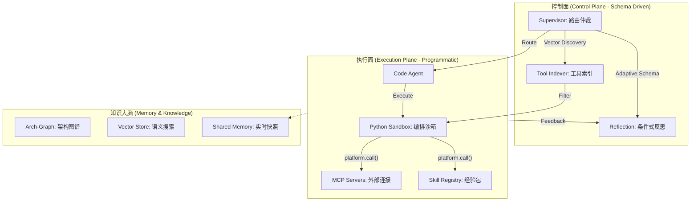

# 🧠 HiveMind 研发大脑：高效能 Agentic OS 架构指南

> **Version**: 2.5 (High-Performance Edition)
> **定位**: 从传统“Chat-based RAG”演进为“Orchestration-as-Code”的自适应智能体操作系统。

---

## 1. 核心技术构想：三层演进模型

我们将 Agent 的能力抽象为三个不断进化的能级，当前系统已全面实现 **Level 2** 并向 **Level 3** 迈进：

| 能级 | 模式 | 核心技术 | 效能表现 | 状态 |
| :--- | :--- | :--- | :--- | :--- |
| **L1** | **Reactive** | 基础 ReAct 循环 (Tool Calling) | 延迟高，容易震荡 | 已超越 |
| **L2** | **Programmatic** | **编排脚本模式 + 动态工具索引** | 批量执行，Token 节省 90% | **当前实现** |
| **L3** | **Autonomous** | 跨会话自进化 Skill + 长期记忆 Grounding | 零干预解决复杂研发任务 | 构想中 |

---

## 2. 系统精密架构 (The "Hive" Core)

---

## 3. 核心创新特性

### ⚡ Programmatic Execution (编排脚本化)
不同于传统的 Agent 步进式执行，HiveMind 允许 Agent **“生成一段 Python 编排逻辑”**。
*   **代码级别实现**：通过 `programmatic_execute` 工具在沙箱中一次性调用多个 MCP/Skill。
*   **价值**：将 10 次 LLM 网络往返压缩为 1 次，实现工业级的低延迟响应。

### 🔍 Adaptive Tool Discovery (自适应工具发现)
拒绝“全量工具挂载”导致的 Token 爆炸。
*   **技术**：基于任务语义的 **Top-K 工具向量筛选**。模型只会看到与当前任务最相关的工具 Schema，确保注意力高度集中。

### 🛡️ Selective Reflection (条件式反思机制)
告别昂贵的“无差别全量检查”。
*   **决策流**：系统根据 `Uncertainty` (不确定度) 和任务领域动态决定是否触发 Reflection 节点。简单任务“直通”输出，高危/复杂任务执行“严苛反思”。

---

## 4. 未来构想：自进化 Skill 循环

在我们的蓝图中，HiveMind 不仅仅是一个工具，它是一个**自学习实体**：
1.  **模式发现**：Agent 在解决复杂问题时，自动识别高频使用的编排逻辑。
2.  **知识固化**：系统将这些逻辑自动封装为新的 `.agent/skills/` 模块，并生成配套的 `SKILL.md`。
3.  **能力溢出**：随着使用时间增加，系统将从“通用 Agent”进化为专属于该项目的“领域专家”。

---
+
+## 5. 场景化应用：影响分析场景 (Impact Analysis Scenarios)
+
+借助 Arch-Graph 的关联能力，HiveMind 能够执行精准的“代码变更影响调查”。以下为系统预置的高频调查模式：
+
+### 5.1 基础代码实体影响 (Code Primitives)
+*   **方法/字段变更**：查询所有引用该方法（含私有）或字段变量的处理点。
+    *   *Path*: `(Method/Field)-[:CALLED_BY|REFERENCED_BY]->(Caller)`
+*   **类/文件引用**：追踪类或文件被其他模块引用的所有位置。
+    *   *Path*: `(Class/File)-[:DEPENDS_ON]->(Dependent)`
+*   **静态资源依赖 (JSP/JS/CSS)**：追踪 JSP 包含关系、JS 调用及 CSS 样式引用。
+    *   *Path*: `(JSP)-[:INCLUDES]->(SubJSP)`, `(Page)-[:USES_ASSET]->(JS/CSS)`
+
+### 5.2 业务逻辑与触发器 (Logic & Triggers)
+*   **Action/UI 联动**：找回所有调用特定 Action 的画面按钮及关联 UI。
+    *   *Path*: `(Action)-[:TRIGGERED_BY]->(UIElement)`
+*   **定时任务/异步作业**：调查特定 Job 或 Trigger 与其他处理逻辑的关联。
+    *   *Path*: `(Job/Trigger)-[:EXECUTES]->(Logic)`
+
+### 3.3 数据持久层影响 (Database & SQL)
+*   **表/字段变更**：当数据库表或字段被修改/删除时，定位受影响的 SQL 语句、View 及程序逻辑。
+    *   *Path*: `(Column/Table)-[:USED_IN]->(SQL)-[:CALLED_BY]->(Code)`
+*   **URL 与路由变更**：评估 URL 修改对 Apache 重写规则、参数传递及后端接口的影响。
+    *   *Path*: `(Route)-[:MAPPED_TO]->(Controller)-[:AFFECTS]->(Config)`
+
+---
+*Generated by Antigravity AI Orchestrator | 2026-03-19*
