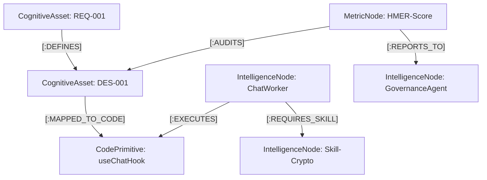

# 🧠 HiveMind Intelligence Swarm: 认知架构图谱 (ARCH-Graph)

> **Version**: 3.0 (Intelligence Swarm Edition)
> **定位**: 从“代码索引”升维为“智体认知中枢”，实现需求、代码、文档与度量指标的四维全量关联。

---

## 1. 认知本体论 (The Cognitive Ontology)

为了让 Agent Swarm 具备“全局架构直觉”，我们将图谱 Schema 规范化为以下四大核心域：

### 🟢 A. 智体域 (Intelligence Realm)
*   **Label**: `IntelligenceNode`
*   **Properties**: `name`, `type` (Supervisor/Worker/Skill), `status`, `version`
*   **Relation**: `[:OWNS]`, `[:EXECUTES]`, `[:REQUIRES_SKILL]`

### 🔵 B. 资源域 (Resource Realm)
*   **Label**: `CognitiveAsset`
*   **Properties**: `id` (REQ/DES/GOV), `title`, `type` (Doc/Spec/Rule), `priority`
*   **Relation**: `[:DEFINES]`, `[:MAPPED_TO_CODE]`, `[:SUPERSEDES]`

### 📜 C. 代码域 (Code Realm)
*   **Label**: `CodePrimitive`
*   **Properties**: `path`, `type` (Class/Method/Hook/Store), `hash`, `is_complex`
*   **Relation**: `[:IMPLEMENTS]`, `[:DEPENDS_ON]`, `[:TRIGGERS]`

### 📊 D. 度量域 (Metric Realm)
*   **Label**: `MetricNode`
*   **Properties**: `scope` (HMER/Performance/Security), `value`, `timestamp`
*   **Relation**: `[:AUDITS]`, `[:REPORTS_TO]`

---

## 2. 全景关联拓扑 (Global Linkage)



---

## 3. 核心创新特性 (Intelligence Swarm Features)

### ⚡ Programmatic Execution (编排脚本化)
不同于传统的 Agent 步进式执行，HiveMind 允许 Agent **“生成一段 Python 编排逻辑”**。
*   **价值**：将 10 次 LLM 网络往返压缩为 1 次，实现工业级的低延迟响应。

### 🧊 Tiered Retrieval Matrix: 冷热分层检索
1. **Tier-1 Radar** (Hot): 极速标签路由。
2. **Tier-2 Graph** (Relation): Neo4j 的影响力分析。
3. **Tier-3 Scalar** (Warm): SmartGrep (BM25) 提供的本地会话事实特征。
4. **Tier-4 Vector** (Semantic): ChromaDB 进行语义内容匹配。

---

## 4. 场景化应用：影响分析 (Impact Analysis)

借助 Arch-Graph 的关联能力，系统能够执行精准的“代码变更影响调查”：

### 4.1 代码实体关联 (Code Relationship)
*   **方法引用追踪**: `(CodePrimitive {type:'Method'})-[:CALLED_BY]->(Caller)`
*   **依赖图谱分析**: `(CodePrimitive)-[:DEPENDS_ON]->(Dependency)`

### 4.2 业务逻辑与认知对齐 (Logic & Alignment)
*   **需求覆盖度审计**: `(CognitiveAsset {type:'REQ'})-[:DEFINES]->(DES)-[:MAPPED_TO_CODE]->(CodePrimitive)`
*   **权限冲突扫描**: `(CognitiveAsset {type:'Rule'})-[:MAPPED_TO_CODE]->(CodePrimitive)<-[:ACCESSED_BY]-(Role)`

---

## 5. 智体自愈：图谱清洗与矫正 (Self-Healing)

为了保障“数字大脑”不产生幻觉，系统内置了以下 Cypher 矫正指令：

### 5.1 孤儿文档清理 (Orphaned Asset Clean)
```cypher
MATCH (a:CognitiveAsset) 
WHERE NOT (a)-[:DEFINES|MAPPED_TO_CODE|SUPERSEDES]-()
RETURN a.id, "Pending Archive"
```

### 5.2 影子代码检测 (Shadow Code Detection)
*识别那些在代码库中存在，但未在图谱中注册的“黑户”逻辑。*
```cypher
MATCH (c:CodePrimitive)
WHERE c.status = 'unregistered'
RETURN c.path, "Violation of GOV-001"
```

### 5.3 认知偏航审计 (Alignment Audit)
```cypher
MATCH (r:CognitiveAsset {type: 'REQ'})
WHERE NOT (r)-[:DEFINES]->(:CognitiveAsset {type: 'DES'})
RETURN r.id, "Missing Design Link"
```

---
*Generated by HiveMind Intelligence Swarm | 2026-03-25*
