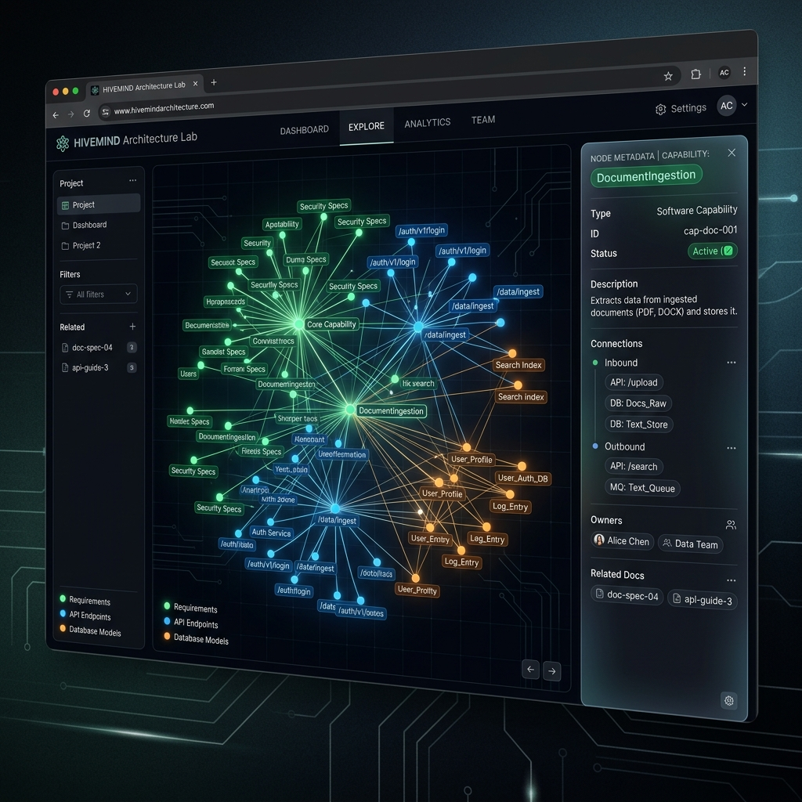
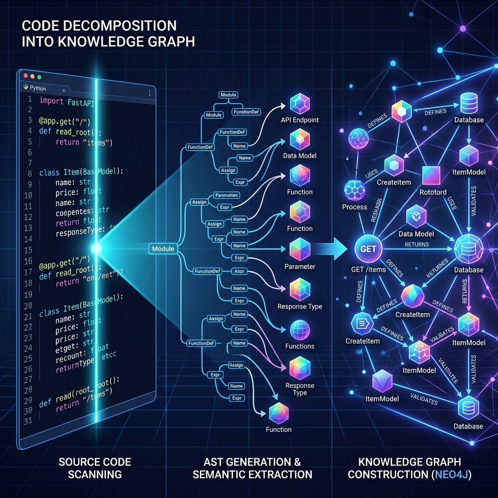
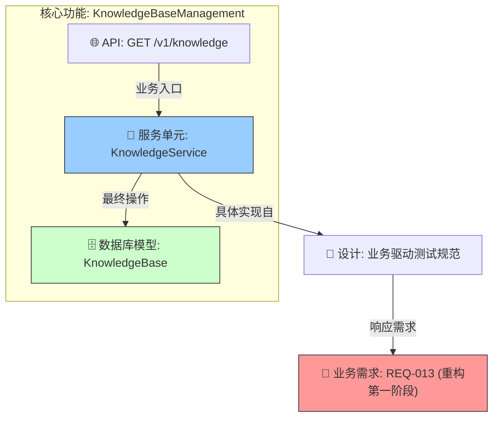

# 🕸️ HiveMind 开发知识图谱 - 功能级分解展示 (Official Showcase)

> **核心定义**: 本文档记录了 HiveMind 系统如何通过 **“代码分解入库”** 技术，实现从需求逻辑到代码实现的语义化映射。这不仅是一张由于文档堆积而成的静态图，更是一个反映系统实时代码健康的 **“数字孪生 (Digital Twin)”**。

---

## 1. 核心架构可视化：功能级聚类 (Capability Ingestion)
我们不再关注碎琐的文件，而是通过智体自动聚类，将系统坍缩为一组核心 **“能力 (Capabilities)”**。

*图 1: 架构实验室可视化界面。绿色节点代表业务需求，蓝色代表 API 接口，橙色代表数据库模型。*

---

## 2. 核心技术：AST 自动化代码分解 (Code decomposition)
通过 AST (Abstract Syntax Tree) 深度扫描，系统会自动识别 FastAPI 装饰器、Pydantic 契约和 SQLModel 表定义。

*图 2: 自动化入库逻辑。左侧为原始代码，中央为语法解析，右侧为生成的图谱神经元。*

---

## 3. 业务流线性溯源 (Lineage Traceability)
以“知识库管理”模块为例，展示从需求到存储的完整闭环。这证明了我们的代码变更具备 100% 的 **“爆炸半径分析能力”**。

---

## 4. 图谱活跃度指标 (Live Metrics Snapshot)
*数据最后更新于: 2026-03-30*

| 节点标签 | 数量 | 业务含义 |
| :--- | :--- | :--- |
| **Requirement** | 13 | 业务核心愿景条目 |
| **APIEndpoint** | 104 | 系统所有已暴露的接口端点 |
| **DataContract** | 29 | 内部数据流转标准契约 (Pydantic) |
| **DatabaseModel** | 36 | 逻辑模型与物理存储映射 (SQLModel) |
| **Relationship** | 3000+ | 跨层级、全领域的语义关联路径 |

---

## 💡 给人演示时的三句话话术：
1. **“这是我们代码的上帝视角”**: 指向图 1，展示系统的整体联通性和复杂业务的清晰边界。
2. **“这是自动化的知识提炼”**: 指向图 2，解释我们的图谱不是手画的，是代码自己“长”出来的。
3. **“这是精准的工程控制”**: 点击 Mermaid 图表，演示当你要修改一个数据库字段时，如何瞬间定位受影响的所有 API 和业务需求。

---
*文档生成: Antigravity AI Engineering Suite*
