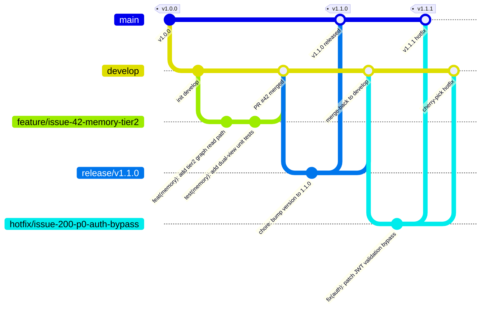

# 🌿 HiveMind RAG — 分支管理与 CI/CD 流水线设计

> 关联文档: [`.agent/rules/team-collaboration-standards.md`](../.agent/rules/team-collaboration-standards.md)
> 本规范定义了项目所有分支的命名规则、生命周期和各自触发的 Pipeline。

---

## 1. 分支层级总览 (Branch Hierarchy)

```
main (生产保护)
 ├── develop  (集成开发, 共享主干)
 │    ├── feature/issue-{ID}-{description}  (个人功能分支)
 │    ├── refactor/issue-{ID}-{description} (重构分支)
 │    └── experiment/{topic}               (探索验证分支, 不强制合入)
 └── release/v{x.y.z}  (发布候选分支)
      └── hotfix/issue-{ID}-{critical-bug} (紧急修复, 从 main 切出)
```

---

## 2. 各分支详细设计 (Branch Definitions)

### 🏛️ `main` — 生产主干（永久、受保护）

| 属性 | 设置 |
|------|------|
| **生命周期** | 永久存在 |
| **来源** | 仅接受 `release/*` 或 `hotfix/*` 的 PR 合并 |
| **合并规则** | 必须 PR + CI 全绿 + 至少 1 人 Approve |
| **合并策略** | `Merge commit`（保留完整发版历史） |
| **直接 push** | 🚫 严格禁止（Branch Protection Rule） |
| **触发 Pipeline** | `main-deploy.yml` — 构建容器镜像 → 推送到镜像仓库 |

**说明**: `main` 始终对应一个可以在生产环境直接跑的稳定版本，每次合并进来都打 Git Tag (`v1.0.0`)。

---

### 🔧 `develop` — 集成开发主干（永久、半受保护）

| 属性 | 设置 |
|------|------|
| **生命周期** | 永久存在 |
| **来源** | 所有 `feature/*` / `refactor/*` 分支合并进来 |
| **合并规则** | 必须 PR + CI 通过 (无需 Approve，除非对核心模块) |
| **合并策略** | `Squash and Merge`（保持 develop 历史线性整洁） |
| **直接 push** | ⚠️ 原则上禁止，紧急情况下允许小范围 |
| **触发 Pipeline** | `develop-ci.yml` — Lint + Tests + 构建预览镜像（Dev 环境） |

**说明**: 这是所有 feature 分支的汇聚点。所有人（包括 AI Agent）开出的 Feature 分支都以 `develop` 为基准切出，合并时也来这里。可以将 `develop` 对应一个内网开发服务器，每次合并后自动部署。

---

### ✨ `feature/issue-{ID}-{slug}` — 个人/AI 功能开发分支（短期）

| 属性 | 设置 |
|------|------|
| **命名示例** | `feature/issue-42-rag-rbac`, `feature/issue-108-memory-tier2` |
| **生命周期** | 短期（1-5 天，一个 Issue 的工作量） |
| **切自** | `develop` |
| **合入** | `develop`（通过 PR） |
| **合并策略** | `Squash and Merge` |
| **触发 Pipeline** | `feature-ci.yml` — 快速检查（Lint + Unit Test，跳过慢速集成测试） |

**规范**:
- 分支名必须包含 Issue ID，与对应 GitHub Issue 一一映射。
- PR 描述强制填写 `Closes #ID`，合并后 Issue 自动关闭。
- **AI Agent** 产出的代码分支也必须遵守此命名规范。

---

### 🐛 `fix/issue-{ID}-{slug}` — Bug 修复分支（短期）

| 属性 | 设置 |
|------|------|
| **命名示例** | `fix/issue-91-jwt-refresh-bug`, `fix/issue-55-chroma-crash` |
| **生命周期** | 短期（通常 < 1 天） |
| **切自** | `develop`（普通 Bug）或 `main`（P0 紧急 Bug） |
| **合入** | `develop` 或同时 cherry-pick 到 `main` |
| **触发 Pipeline** | `feature-ci.yml` — 同 feature 分支（Lint + Unit Test） |

---

### 🔥 `hotfix/issue-{ID}-{slug}` — 紧急生产热修复（短期）

| 属性 | 设置 |
|------|------|
| **命名示例** | `hotfix/issue-200-p0-auth-bypass` |
| **生命周期** | 极短（< 8 小时） |
| **切自** | `main`（直接从生产基线） |
| **合入** | **同时** 合入 `main` 和 `develop`（避免回归） |
| **合并规则** | 必须 1 人紧急 Review + CI 通过 |
| **触发 Pipeline** | `hotfix-ci.yml` — 最快速全量检查（快速 Lint + 核心 Unit Test） |
| **发布** | 合入 `main` 后自动打 Patch Tag 如 `v1.0.1` |

---

### 🚀 `release/v{x.y.z}` — 发布候选分支（中期）

| 属性 | 设置 |
|------|------|
| **命名示例** | `release/v1.2.0` |
| **生命周期** | 几天（发布窗口期） |
| **切自** | `develop`（当一个里程碑的所有 Feature 都合进来后）|
| **合入** | `main`（发布成功后），同时 merge-back 到 `develop` |
| **允许操作** | 仅接受修复 Bug 的小 PR（不接受新 Feature） |
| **触发 Pipeline** | `release-ci.yml` — 完整测试套件（Unit + Integration + E2E）+ 安全扫描 |

---

### 🔬 `experiment/{topic}` — 探索验证分支（随机、可选）

| 属性 | 设置 |
|------|------|
| **命名示例** | `experiment/graphrag-v2`, `experiment/llm-cot-routing` |
| **生命周期** | 随机，不强制合入 |
| **切自** | `develop` |
| **合入** | **可选**，视 PoC 结论决定。垃圾桶分支，可以随时丢弃 |
| **触发 Pipeline** | 无（不触发 CI，节省 Action 分钟数） |

---

## 3. Branch Protection Rules（GitHub 设置指南）

进入 GitHub → Settings → Branches → Add Protection Rule：

| 分支 | Require PR | Require CI | Require Reviews | Restrict Push |
|------|-----------|-----------|----------------|---------------|
| `main` | ✅ | ✅ All jobs passed | ✅ 1 Reviewer | ✅ 仅 Maintainer |
| `develop` | ✅ | ✅ Lint + Test | ❌ (可选) | ❌ 开放 |
| `release/*` | ✅ | ✅ Full Suite | ✅ 1 Reviewer | ✅ Release Manager |

---

## 4. CI Pipeline 对应矩阵 (Pipeline Map)

| 分支 | Workflow 文件 | Lint | Type | Unit Test | Integration | E2E | Build | Deploy |
|------|-------------|------|------|-----------|-------------|-----|-------|--------|
| `main` | `main-deploy.yml` | ✅ | ✅ | ✅ | ✅ | ✅ | ✅ 镜像 | ✅ 生产 |
| `develop` (push) | `develop-ci.yml` | ✅ | ✅ | ✅ | ✅ | - | ✅ 预览 | ✅ Dev环境 |
| `feature/*` (PR→develop) | `feature-ci.yml` | ✅ | ✅ | ✅ | - | - | - | - |
| `fix/*` (PR) | `feature-ci.yml` | ✅ | ✅ | ✅ | - | - | - | - |
| `release/*` (PR→main) | `release-ci.yml` | ✅ | ✅ | ✅ | ✅ | ✅ | ✅ RC镜像 | - |
| `hotfix/*` (PR) | `feature-ci.yml` | ✅ | ✅ | ✅ | - | - | - | - |
| `experiment/*` | 无 CI | - | - | - | - | - | - | - |

---

## 5. 典型开发周期 (Example Workflow)



---

## 6. 特别说明：AI Agent 分支行为约束

当 AI Agent (如本项目中的 AntiGravity) 受理 GitHub Issue 并自动生成代码时：

1. **必须先从 `develop` 切出** 一个兼容命名规范的 `feature/issue-{ID}-*` 分支。
2. **AI 生成的每一个 Commit** 必须携带 `Resolves #ID` 并符合 Conventional Commits 规范（由 `commit-msg` Hook 强制执行）。
3. **AI 完成代码后** 不会自动合并，会提一个 Draft PR 等待人类 Review 后 Approve 才能 Merge。
4. **遇到阻塞时** 按照 `ai_blocked_report.md` 模板发起 Issue，不强行合入。
