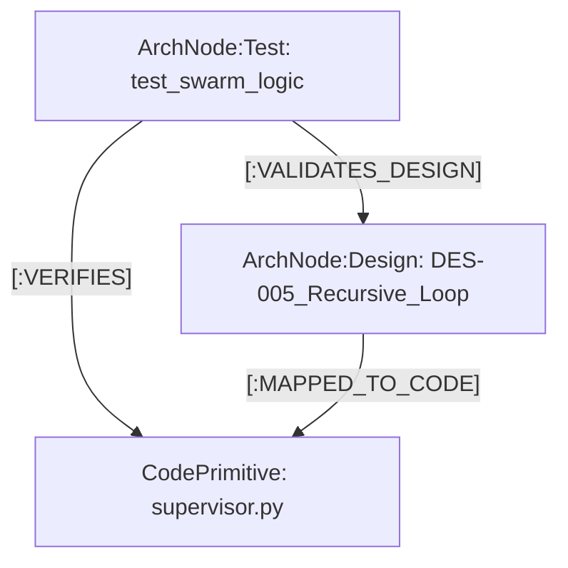

# 🧪 HiveMind 业务串联与全链路测试方案 (Business-Driven Linkage & E2E Testing)

> **核心理念**: 测试不仅是验证代码逻辑，更是验证“业务意图”是否在前后端流转中保持一致。通过将测试用例 (Test Cases) 挂载到 Neo4j 架构图谱上，实现“业务-代码-测试”的三位一体。

---

## 1. 业务串联观点：从用户到图谱的闭环

在 HiveMind 中，一个完整的业务用例 (Use Case) 遵循 **“意图 -> 编排 -> 副作用 -> 验证”** 的循环。

### 🔗 串联示例：知识库问答 (RAG Q&A)
| 阶段 | 动作 | 组件/API | Neo4j 联动 | 串联点 |
| :--- | :--- | :--- | :--- | :--- |
| **1. 意图** | 用户问“安全规范是什么？” | `ChatPanel.tsx` -> `useChatStore` | `(u:User)-[:ASKED]->(q:Query)` | 前端捕获上下文 |
| **2. 路由** | 后端判断需要 RAG 检索 | `POST /api/v1/chat/completions` | `(q)-[:ROUTED_TO]->(agent:RAG_Worker)` | 后端服务发现 |
| **3. 检索** | Agent 执行图谱与向量搜索 | `RAGGateway` -> `Neo4j` | `(agent)-[:FETCHED]->(doc:CognitiveAsset)` | 跨层知识调取 |
| **4. 渲染** | 将文档与代码关联后推回前端 | `WebSocket` -> `XProvider` | `(doc)-[:MAPPED_TO_CODE]->(code)` | 前后端数据流转 |

---

## 2. 基于业务观点的测试级别 (Test Taxonomy)

我们不只做单元测试，更强调 **“智体协同测试 (Swarm Tests)”** 和 **“业务链路测试 (System E2E)”**。

### 🛡️ A. 业务架构测试 (Architecture-Linked Tests)
*   **目标**: 确保代码实现没有背离设计文档 (DES) 模型。
*   **做法**: 测试脚本在运行时检查 Neo4j。如果 `DES-001` 要求 A 模块必须经过 B 模块审计，而测试发现 A 直接调用了 C，则测试失败。

### 🔄 B. 全链路串联测试 (Cognitive Loop Tests)
*   **目标**: 模拟前端发起复杂请求，观察后端多个 Agent 是否能像“人类团队”一样协作。
*   **现有资产**: `backend/tests/system/test_intelligence_swarm.py`
    *   **验证点**: `Recursive Swarm Loop`。模拟第一个 Agent 做错了，第二个审计 Agent 是否能发现错误并要求重做（Replanning）。

### 🎨 C. 前后端对比测试 (Dual-View Verification)
*   **目标**: 确保前端 UI 展现的“状态”与后端 Agent 的“内部认知”同步。
*   **联动工具**: Playwright + 后端 Trace。
    *   **用例**: 在前端上传一个文件。
    *   **验证**: 
        1. 前置验证：前端显示“上传中”。
        2. 后置验证：查询 Neo4j，确认 `(doc:CognitiveAsset)` 节点已生成并建立了正确关系。

---

## 3. 测试与 Neo4j 的深度联动

我们将测试用例本身作为 **`TestNode`** 存入 Neo4j，建立 **“测试 -> 设计 -> 代码”** 的溯源关系。

### 🕸️ 联动模型

*   **价值 (Why?)**: 
    - 当你想改动 `supervisor.py` 时，查一下 Neo4j 就能立刻知道：有哪些业务测试用例 (Test Cases) 会受影响。
---

## 4. 图谱驱动的全链路测试生成技能 (Graph-Driven E2E Test Generator)

为了将上述理论落地，我们已经开发并部署了专项 AI 技能：**`graph-driven-e2e-testing`**。它可以让测试编写从“黑盒猜测”彻底变成基于图谱事实的“白盒溯源”。

### 🚀 核心工作流：
1. **自动提取图谱路径 (`extract_business_path.py`)**: 给定一个 `REQ-NNN`（如 REQ-013），自动抓取它关联的 `Design`、`UI_Handler`、`APIEndpoint`、`DataContract`、`File` 等一整条有向无环图（DAG），并暴露出真实的**代码物理路径**和**URL路由**。
2. **强制穿透代码细节 (Deep Introspection)**: AI 被该技能的知识库限制，不允许凭空猜测 Payload 结构。必须通过图谱提供的物理路径（如查看 `schemas/knowledge.py`）精准提取 Pydantic/TS 接口。
3. **三维立体生成 (Three-Tier E2E Generation)**:
   - **API 契约层 (Backend - pytest)**：打通并断言 `/api/v1/...` 接口的边界及参数约束。
   - **后端核心层 (Backend - pytest)**：穿越 Orchestrator 或 Service 的业务核心组，并断言其落库副作用。
   - **前端交互层 (Frontend - Playwright)**：编写无头浏览器自动化逻辑，模拟用户点击，并配以 Request Interception 验证全链路时延与状态流转。
4. **极致可回溯注解 (Trace Anchors)**: 测试代码中强制添加挂钩注释（如：`# [Trace: APIEndpoint /api/v1/knowledge]`），实现用例每行代码对图谱的 1:1 响应。

---

## 5. 下一步行动：让测试自动化感知业务

1.  **自动化录入测试关系**: 修改 `index_architecture.py` 脚本，使其自动扫描测试代码中的 `@covers REQ-NNN` 装饰器，并自动在 Neo4j 中连线。
2.  **业务视角驱动 Case 生成**: 以后编写测试 case 时，优先从 `business_flow.md` 定义的链路出发，覆盖“用户点击 -> API 转发 -> Agent 决策 -> 图谱入库”的全周期。

**总结**: 
通过这种方式，测试不再是一个孤立的脚本，而是系统**“认知架构”**的一部分。我们能够以业务的视角，从 Neo4j 俯瞰整个系统的稳健性。
