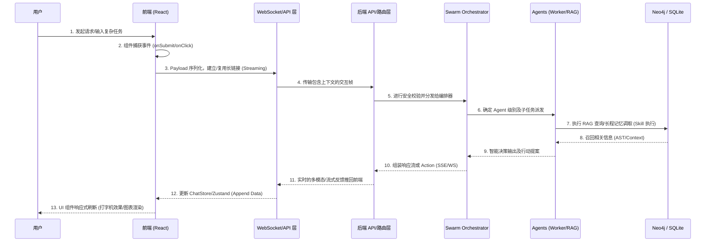

# 🔄 HiveMind 业务与数据流转全景图 (Business & Data Flow)

> **文档目的**: 此文档补充说明了系统的核心业务链路、数据流的方向（跨越前后端）、前端状态管理策略，以及关键的组件事件互动机制，解答“整个系统如何串联发力”的问题。

---

## 1. 核心业务流程图 (Core Business Flow)

下图展示了用户从前端界面发起请求，直到后端 Agent 群组完成复杂决策并返回结果的全生命周期链路：

---

## 2. 前后端数据隔离与分布 (Data Boundary)

本系统遵循 **“瘦前端，胖后端”** + **“前端流式展现”** 的架构原则。

### 📌 后端持久化数据 (Source of Truth)
后端（SQLite / PostgreSQL / Neo4j）是全局数据唯一真实的来源，掌控涉及持久和安全维度的所有数据：
*   **资产与架构数据**: AST 解析、数据库图谱、GitHub 同步的 Issue 等 (Neo4j 管理关系，SQLite 管理记录)。
*   **业务领域数据**: 用户设定、知识库档案、Agent 自定义配置、系统审计台账。
*   **长程记忆 (Long-term Memory)**: AI 历史会话深层存储与总结、学习回路数据（HVM-LAB 沉淀）、全局自省日志。

### 📌 前端缓存/瞬态数据 (Frontend State)
前端通过 Zustand 构建全局缓存，主要存在于浏览器内存中，关注的是体验及会话级的瞬变状态：
*   **ChatStore (会话上下文)**: 
    *   当前页面的高频上下文（如：在知识页面触发对话，携带知识空间 ID）。
    *   **临时消息队列**: 仅缓存当前活跃会话的对话记录（用于流式渲染），页面刷新后从后端重新拉取或恢复最近会话。
    *   **AI Action**: 当前挂起或待执行的 UI 副作用（如 `open_modal`, `navigate`）。
*   **AuthStore**: 用户登录 Token 与当前会话的 RBAC 许可配置。
*   **UI 瞬态**: 聊天面板宽度、主视图模式 (`ai` 切换到 `classic` 仪表盘视图) 等偏好设定。

> **刷新机制**: 前端缓存不是长期保存。前端仅保留最近、最活跃的数据副本；涉及资产和安全属性的更新操作，全部通过 API / WebSocket 发送给后端验证并入库后，后端再推送最新快照更新前端。

---

## 3. 前端数据刷新与更新回路

**哪些数据需从后端更新？**
*   **Agent 监控大盘数据**: 需通过后端每隔一定心跳轮询或者拉取实时进度。
*   **知识状态机 (Knowledge Status)**: 文件上传时的分词进度 (Chunking、Embedding)，依靠后端推送更新。
*   **历史长篇对话**: 分页拉取，不在前端长时间驻留（为防止 OOM 操作）。

**哪些数据是纯前端自理？**
*   用户正在编辑但未发送的内容暂存。
*   右侧悬浮面板的打开/收起状态。
*   系统交互的客户端埋点日志缓存在发送（`Client Events`）。

---

## 4. 页面组件事件流转详解 (Component Event Flow)

典型的功能性组件（以 `ChatPanel` 为例）在工作时的内部流转：

1.  **`onChange` / `onInput`**:
    *   用户在富文本或是输入框打字。受控组件 (Controlled Component) 更新本地临时 state。
2.  **`onSubmit` (点击发送)**:
    *   组件调用 Store 的 `addMessage` 压入用户消息至临时队列中，渲染至页面让用户看到成功发出。
    *   调用 Service 层的接口（如 `HiveMindWebSocket.send(payload)`）。
3.  **`onMessage` / `onStream` (后端推回)**:
    *   前端建立订阅 (Subscription)，监听后端下发 chunk。
    *   组件将更新委托给 Zustand: `updateLastMessage(chunk)` -> React 响应式渲染出字打效果。
    *   如检测到 `status` metadata，触发 `appendStatusToLastMessage` 渲染步骤标识（如：*“正在查询本地代码库...”*）。
4.  **`onAction` (智能体产生副作用)**:
    *   如果大模型返回内容不仅仅是文本，而包含架构行动指令（如：调出创建弹窗）。
    *   Store 截获 `Action` 并分发对应的全局事件：`executeAction({type: "open_modal", target: "create_kb"})`。
    *   对应的 `Modal` 组件的 visible 状态被置为 true，自动在 UI 上唤起交互。

## 5. 总结：系统串联枢纽

整体系统通过 **“意图捕获 (FE) → 上下文打包 (WS) → 智体规划与路由 (BE/Orchestrator) → 真实副作用与数据读写 (Graph/Action) → 动态页面渲染指令推送 (WS->FE)”** 以此闭环构成的“感知-行动系统”。
