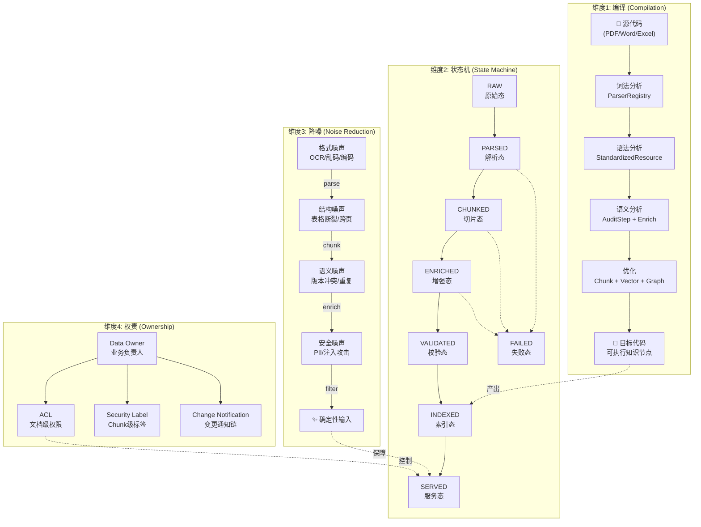

# 🧬 ARAG 数据治理：从"打扫卫生"到"编译运行时" — 四维架构哲学

> **核心命题：** 数据治理不是 ARAG 的辅助环节，它就是 ARAG 的 **编译器**。
> 没有编译过程的 Agent，就是在解释执行一堆充满 Bug 的源码——低效、不稳、容易崩溃。

---

## 总纲：四维理解模型

```
┌─────────────────────────────────────────────────────────────────┐
│              ARAG 数据治理：四维理解模型                          │
│                                                                 │
│  ┌──────────────┐  ┌──────────────┐  ┌──────────────┐          │
│  │  维度 1       │  │  维度 2       │  │  维度 3       │          │
│  │  本质视角     │  │  流程视角     │  │  功能视角     │          │
│  │              │  │              │  │              │          │
│  │  治理 =      │  │  治理 =      │  │  治理 =      │          │
│  │  编 译       │  │  状态流转    │  │  降噪消歧    │          │
│  │  Compilation │  │  State Trans │  │  Noise Reduc │          │
│  └──────┬───────┘  └──────┬───────┘  └──────┬───────┘          │
│         │                  │                  │                  │
│         └──────────────────┼──────────────────┘                  │
│                            │                                     │
│                   ┌────────▼───────┐                             │
│                   │  维度 4         │                             │
│                   │  组织视角       │                             │
│                   │                │                             │
│                   │  治理 =        │                             │
│                   │  权责确权      │                             │
│                   │  Ownership    │                             │
│                   └────────────────┘                             │
└─────────────────────────────────────────────────────────────────┘
```

---

## 维度 1：本质视角 — 治理即"编译" (Compilation)

### 1.1 从类比到映射

> 原始文档是人类阅读的"源代码"。Agent 无法直接执行 —— 必须经过编译。

```
┌────────────────────────────────────────────────────────────────┐
│              编译器类比 (Compiler Analogy)                       │
│                                                                │
│  传统编译器                    ARAG 数据治理编译器               │
│  ────────────                 ─────────────────               │
│                                                                │
│  源代码 (.c/.java)            原始文档 (PDF/Word/Excel)         │
│       │                            │                           │
│       ▼                            ▼                           │
│  ┌─────────────┐             ┌─────────────────────┐          │
│  │ 词法分析     │             │ 格式标准化           │          │
│  │ Lexer       │             │ OCR/去乱码/统一格式  │          │
│  └──────┬──────┘             └──────────┬──────────┘          │
│         │                               │                     │
│  ┌──────▼──────┐             ┌──────────▼──────────┐          │
│  │ 语法分析     │             │ 结构解析             │          │
│  │ Parser      │             │ 标题/段落/表格/图片   │          │
│  │ → AST       │             │ → StandardizedResource│          │
│  └──────┬──────┘             └──────────┬──────────┘          │
│         │                               │                     │
│  ┌──────▼──────┐             ┌──────────▼──────────┐          │
│  │ 语义分析     │             │ 语义增强             │          │
│  │ Type Check  │             │ Chunk/摘要/元数据/标签│          │
│  │ → Typed AST │             │ → EnrichedResource   │          │
│  └──────┬──────┘             └──────────┬──────────┘          │
│         │                               │                     │
│  ┌──────▼──────┐             ┌──────────▼──────────┐          │
│  │ 优化         │             │ 索引优化             │          │
│  │ Optimizer   │             │ Vector Embedding     │          │
│  └──────┬──────┘             │ Graph Linking        │          │
│         │                    │ Dedup / Versioning   │          │
│         ▼                    └──────────┬──────────┘          │
│  ┌─────────────┐             ┌──────────▼──────────┐          │
│  │ 目标代码     │             │ 可执行知识节点        │          │
│  │ Binary/     │             │ VectorDocument +     │          │
│  │ Bytecode    │             │ GraphNode +          │          │
│  └─────────────┘             │ SearchableChunk      │          │
│                              └─────────────────────┘          │
│                                                                │
│  两者产出的共同特征：                                           │
│  ✅ 结构化        ✅ 可寻址       ✅ 可被运行时高效执行          │
│  ✅ 去除了噪声    ✅ 语义等价于源码 ✅ 可被缓存和优化             │
└────────────────────────────────────────────────────────────────┘
```

### 1.2 HiveMind 当前实现的映射

| 编译阶段 | HiveMind 代码实现 | 位置 |
|---------|-------------------|------|
| **词法分析 (Lexer)** | `ParserRegistry` + `BaseParser.parse()` | `batch/ingestion/core.py` |
| **语法分析 (Parser → AST)** | `StandardizedResource` (sections/tables/codes/images) | `batch/ingestion/protocol.py` |
| **语义分析 (Type Check)** | `AuditStep` (质量打分) + `DesensitizationStep` (PII 扫描) | `batch/ingestion/steps.py` |
| **优化 (Optimizer)** | `ChunkingStep` (分块策略) + `VectorizeStep` (向量化) | `batch/ingestion/steps.py` |
| **链接 (Linker)** | `GraphExtractor` (实体-关系-实体三元组) | `services/knowledge/graph_extractor.py` |
| **目标代码 (Target)** | `VectorDocument` + `DocumentChunk` + Neo4j Node | 多处 |

### 1.3 "编译"视角带来的设计约束

```
┌─────────────────── 编译器设计约束 ──────────────────────────┐
│                                                              │
│  1. 源码保留 (Source Map)                                    │
│     ─ 编译后的产物必须能追溯回原始文档                         │
│     ─ 实现：chunk.metadata["document_id"] + ["page"]         │
│                                                              │
│  2. 编译错误报告 (Error Report)                               │
│     ─ 编译失败必须报告给"开发者"（Data Owner）               │
│     ─ 实现：AuditStep → review.status = "rejected"          │
│     ─ 实现：link.status = "failed" + error_message          │
│                                                              │
│  3. 增量编译 (Incremental Compilation)                       │
│     ─ 只重新编译变更的部分，而非全量重做                      │
│     ─ 当前状态：🔲 待实现 (M6.2.1)                           │
│     ─ 设计：基于 md5_checksum 检测变更段落                    │
│                                                              │
│  4. 编译优化级别 (Optimization Level)                         │
│     ─ -O0: 快速入库，不做图谱/摘要                            │
│     ─ -O1: 标准流程（当前默认）                               │
│     ─ -O2: 深度优化 (GraphRAG + 社区检测 + 摘要树)           │
│     ─ 实现：pipeline_type → "general" / "legal" / "table"    │
│                                                              │
│  5. 交叉编译 (Cross-Compilation)                              │
│     ─ 同一源文档可编译出不同"目标"                             │
│     ─ PDF → Vector (给 RAG Agent 用)                         │
│     ─ PDF → Graph (给 关系推理 Agent 用)                      │
│     ─ PDF → Summary (给 Supervisor 路由判断用)                │
└──────────────────────────────────────────────────────────────┘
```

---

## 维度 2：流程视角 — 治理即"状态流转" (State Transition)

### 2.1 文档生命周期状态机

> 每一个数据对象在治理过程中经历的不是"处理"，而是 **严格的状态流转**。

```
                   ┌──────────────────────────────────────────────────────────┐
                   │           文档数据对象状态机 (Document FSM)               │
                   └──────────────────────────────────────────────────────────┘

                                 ┌───────────┐
                    Upload/      │           │
                    Crawl    ───→│    RAW    │
                                 │  (原始态)  │
                                 └─────┬─────┘
                                       │ parse_content 触发
                                       │ Action: OCR / 格式检测 / 病毒扫描
                                       ▼
                    ┌─────────── ┌───────────┐
                    │ parse fail │           │
                    │  ┌────────→│  PARSED   │  产出: StandardizedResource
                    │  │ 回滚    │  (解析态)  │  (sections + tables + codes)
                    │  │         └─────┬─────┘
                    ▼  │               │ chunk_content 触发
              ┌────────┴──┐            │ Action: 按语义边界切分 + 重叠处理
              │  FAILED   │            ▼
              │  (失败态)  │◄──── ┌───────────┐
              │           │      │           │
              │  → 人工   │      │  CHUNKED  │  产出: List[DocumentChunk]
              │    介入   │      │  (切片态)  │  (语义完整的 Chunk 列表)
              │    队列   │      └─────┬─────┘
              └───────────┘            │ metadata extraction 触发
                    ▲                  │ Action: 时间/地点/人物抽取 + 摘要生成
                    │                  ▼
                    │            ┌───────────┐
                    │ enrich     │           │
                    │ fail       │ ENRICHED  │  产出: Chunk + Rich Metadata
                    └────────────│ (增强态)  │  (tags, summary, entities)
                                 └─────┬─────┘
                                       │ audit_content 触发
                                       │ Action: 查重 / 冲突检测 / PII 扫描
                                       ▼
                                 ┌───────────┐      ┌───────────┐
                          ┌─────→│           │      │           │
                   audit  │      │ VALIDATED │      │ REJECTED  │
                   pass   │      │ (校验态)  │─────→│ (驳回态)  │
                          │      └─────┬─────┘ fail └───────────┘
                          │            │                   │
                          │            │ vectorize 触发     │→ 人工审核 / 丢弃
                          │            │ Action: Embedding + Graph 写入
                          │            ▼
                          │      ┌───────────┐
                          │      │           │
                          │      │  INDEXED  │  产出: VectorDocument + GraphNode
                          │      │ (索引态)  │  (可检索的知识节点)
                          │      └─────┬─────┘
                          │            │ 查询请求触发
                          │            │ Action: 权限过滤 + 动态脱敏
                          │            ▼
                          │      ┌───────────┐
                          │      │           │
                          │      │  SERVED   │  产出: 安全的上下文片段
                          │      │ (服务态)  │  (返回给 Agent 的确定性输入)
                          │      └─────┬─────┘
                          │            │ 版本更新触发
                          │            │ Action: 标记旧版 Deprecated
                          │            ▼
                          │      ┌───────────┐
                          └──────│DEPRECATED │  → 可回收 / 可回溯
                                 │ (废弃态)  │
                                 └───────────┘
```

### 2.2 状态机与 HiveMind 代码的精确映射

| 状态 | 触发条件 | 执行 Step | 产出 Artifact | 当前代码 |
|------|---------|-----------|-------------|---------|
| **RAW → PARSED** | 文件上传 | `parse_content` | `StandardizedResource` | `batch/plugins/*.py` + `ParserRegistry` |
| **PARSED → CHUNKED** | 解析成功 | `chunk_content` | `List[DocumentChunk]` | `batch/ingestion/steps.py::ChunkingStep` |
| **CHUNKED → ENRICHED** | 切片完成 | *(元数据提取)* | Chunk + Metadata | 🔲 **缺失**: 应新增 `EnrichmentStep` |
| **ENRICHED → VALIDATED** | 增强完成 | `audit_content` | 合格/不合格标记 | `batch/ingestion/steps.py::AuditStep` |
| **VALIDATED → INDEXED** | 审核通过 | `vectorize` | `VectorDocument` | `batch/ingestion/steps.py::VectorizeStep` |
| **INDEXED → SERVED** | 查询请求 | `AclFilter` + `PromptInjectionFilter` | 安全上下文 | `services/retrieval/steps.py` |
| **SERVED → DEPRECATED** | 新版上传 | *(版本控制)* | 标记旧版 | 🔲 **缺失**: 应实现版本链 |
| **任意 → FAILED** | 任何异常 | *(错误处理)* | 错误报告 | `indexing.py: link.status = "failed"` |

### 2.3 状态机的工程约束

```
┌─────────────────── 状态机设计原则 ─────────────────────────┐
│                                                             │
│  1. 状态不可跳跃 (No State Skipping)                        │
│     RAW 不能直接跳到 INDEXED                                │
│     → Pipeline 的 required_inputs 机制保障了这一点            │
│                                                             │
│  2. 失败可回滚 (Fail → Rollback)                            │
│     任何阶段失败，状态回退到 FAILED + 错误日志                 │
│     → 当前实现：link.status = "failed" + error_message      │
│     → 增强：应支持重试从失败点恢复 (Checkpoint Resume)       │
│                                                             │
│  3. 状态可观测 (Observable)                                  │
│     每次状态变迁都必须发出事件                                │
│     → 当前实现：PipelineMonitor.on_stage_start/end          │
│     → 增强：应推送到前端 WebSocket                           │
│                                                             │
│  4. 终态不可逆 (Terminal States)                             │
│     DEPRECATED 和 REJECTED 是终态                            │
│     → 数据不会从 DEPRECATED 回到 INDEXED（只能新版重新入库） │
│                                                             │
│  5. 并发安全 (Concurrency Safety)                            │
│     同一文档的多次触发不会产生重复索引                        │
│     → 通过 md5_checksum + 乐观锁 保障幂等性                  │
└─────────────────────────────────────────────────────────────┘
```

---

## 维度 3：功能视角 — 治理即"降噪与消歧" (Noise Reduction)

> 幻觉的根源是数据的模糊性和冲突。治理的核心动作 = 消除不确定性 → 为 Agent 提供确定性输入。

### 3.1 三大降噪动作

```
┌──────────────────────────────────────────────────────────────┐
│                     降噪动作矩阵                               │
├──────────────┬─────────────────────┬────────────────────────┤
│  动作         │  消灭的不确定性      │  Agent 获得的确定性     │
├──────────────┼─────────────────────┼────────────────────────┤
│              │                     │                        │
│  去重与版本控制│  逻辑矛盾:           │  唯一真相:              │
│  Dedup &     │  2024版 vs 2026版   │  只查 Active 版本      │
│  Versioning  │  内容冲突            │  旧版自动标记 Deprecated│
│              │                     │                        │
├──────────────┼─────────────────────┼────────────────────────┤
│              │                     │                        │
│  结构化重组   │  格式混乱:           │  纯函数可处理参数:      │
│  Structural  │  表格是图片          │  JSON / 自然语言描述   │
│  Reorg       │  表头被切分          │  "A产品价格是B元"       │
│              │  代码跨页            │                        │
│              │                     │                        │
├──────────────┼─────────────────────┼────────────────────────┤
│              │                     │                        │
│  元数据注入   │  上下文缺失:         │  Agent 可做推理:        │
│  Metadata    │  "去年的规定"        │  valid_from: 2025-01   │
│  Injection   │  文档没写年份        │  valid_to: 2026-12     │
│              │  只有文件名日期      │  版本/作者/部门标签     │
│              │                     │                        │
└──────────────┴─────────────────────┴────────────────────────┘
```

### 3.2 降噪动作在 Pipeline 中的位置

```
原始文档
    │
    ▼
┌─────────────────────────────────────────────────────────────┐
│ parse_content                                               │
│                                                             │
│  ⊕ 格式标准化 (词法降噪)                                    │
│  ⊕ 结构识别 (语法降噪) → StandardizedResource               │
│  ⊕ 表格还原 (结构化重组) → TableData                        │
│                                                             │
│  降噪等级: ★★☆☆☆                                           │
└─────────────────────────┬───────────────────────────────────┘
                          │
                          ▼
┌─────────────────────────────────────────────────────────────┐
│ desensitization                                             │
│                                                             │
│  ⊕ PII 脱敏 (安全降噪) → 敏感信息替换为占位符               │
│                                                             │
│  降噪等级: ★★★☆☆                                           │
└─────────────────────────┬───────────────────────────────────┘
                          │
                          ▼
┌─────────────────────────────────────────────────────────────┐
│ 🔲 enrich_content (新增 — 当前缺失)                          │
│                                                             │
│  ⊕ 元数据注入 → valid_from / valid_to / author / dept       │
│  ⊕ 自动标签 → freestyle_tags                                │
│  ⊕ 摘要生成 → business_summary                              │
│  ⊕ 版本检测 → version + deprecation_check                   │
│                                                             │
│  降噪等级: ★★★★☆                                           │
│                                                             │
│  设计理念: 这一步是"语义编译"的核心。                         │
│  它让每个 Chunk 从"一段文字"变为"一个有上下文的知识单元"。     │
└─────────────────────────┬───────────────────────────────────┘
                          │
                          ▼
┌─────────────────────────────────────────────────────────────┐
│ chunk_content + vectorize                                   │
│                                                             │
│  ⊕ 语义切分 (消除信息丢失)                                   │
│  ⊕ 向量嵌入 (消除检索歧义)                                   │
│  ⊕ 图谱链接 (消除孤立知识)                                   │
│                                                             │
│  降噪等级: ★★★★★                                           │
└─────────────────────────────────────────────────────────────┘

最终产出：
    从"一坨可能有错的文字" 
    → "一个有标签、有版本、有关系、有安全标级的确定性知识节点"
```

### 3.3 关键缺失：EnrichmentStep 设计草案

```python
# 🔲 需要新增到 batch/ingestion/steps.py

@StepRegistry.register("enrich_content") 
class EnrichmentStep(BaseIngestionStep):
    """
    语义增强步骤 — 数据治理的核心"语义编译"环节。
    
    目标：将结构化文本从"一段字符串"提升为"有时空上下文的知识单元"。
    
    能力清单：
    1. 时间实体提取 → valid_from / valid_to / published_at
    2. 组织实体提取 → department / author / approver
    3. 版本检测 → version + is_superseded_by
    4. 自动标签 → 基于 LLM 的主题标签推断
    5. 摘要生成 → 50 字以内的业务摘要
    6. 去重检测 → 基于 md5 + embedding 相似度
    
    设计原则 (纯函数约束):
    - 输入: StandardizedResource
    - 输出: StandardizedResource + enriched metadata
    - 不直接写入任何存储（副作用由 Pipeline Executor 管理）
    """
    
    async def run(self, stage_input: StageInput) -> Artifact:
        # 1. 从上游获取 StandardizedResource
        # 2. LLM 提取时间/组织/版本元数据
        # 3. LLM 生成摘要和标签
        # 4. 向量相似度检查去重
        # 5. 返回增强后的 Artifact
        ...
```

---

## 维度 4：组织视角 — 治理即"权责确权" (Ownership)

> 数据不仅是比特流，它代表业务责任。

### 4.1 数据权责矩阵

```
┌────────────────────────────────────────────────────────────────┐
│                    数据权责确权体系                               │
│                                                                │
│  ┌──────────────────────────────────────────────────────────┐ │
│  │  1. 所有权 (Ownership)                                    │ │
│  │                                                          │ │
│  │  每个知识库 / 每份文档必须有 Data Owner                    │ │
│  │  ┌──────────────┬──────────────┬───────────────────────┐ │ │
│  │  │  文档类型      │  Data Owner  │  更新责任              │ │ │
│  │  ├──────────────┼──────────────┼───────────────────────┤ │ │
│  │  │ 《员工手册》   │ HR 总监      │ HR 修改后自动重编译    │ │ │
│  │  │ 《采购规范》   │ 供应链 VP    │ 年度审核 + 版本控制    │ │ │
│  │  │ 《技术架构》   │ CTO Office  │ 架构变更后触发重索引   │ │ │
│  │  │ 《客户合同》   │ 法务部       │ 合同到期自动过期       │ │ │
│  │  └──────────────┴──────────────┴───────────────────────┘ │ │
│  └──────────────────────────────────────────────────────────┘ │
│                                                                │
│  ┌──────────────────────────────────────────────────────────┐ │
│  │  2. 变更通知链 (Change Notification Chain)                 │ │
│  │                                                          │ │
│  │  Data Owner 修改文档                                      │ │
│  │       │                                                  │ │
│  │       ▼                                                  │ │
│  │  系统检测到变更 (md5_checksum 变化)                        │ │
│  │       │                                                  │ │
│  │       ├──→ 自动触发: 重新解析 → 重新切片 → 重新索引        │ │
│  │       │    (增量编译: 只重新处理变更的部分)                 │ │
│  │       │                                                  │ │
│  │       ├──→ 通知 Agent: "知识库已更新，缓存失效"            │ │
│  │       │    (Semantic Cache 自动淘汰相关条目)               │ │
│  │       │                                                  │ │
│  │       └──→ 通知相关用户: "您关注的文档有新版本"             │ │
│  │            (WebSocket 推送)                               │ │
│  └──────────────────────────────────────────────────────────┘ │
│                                                                │
│  ┌──────────────────────────────────────────────────────────┐ │
│  │  3. 权限控制层次 (Access Control Hierarchy)               │ │
│  │                                                          │ │
│  │  ┌────────────┐  ┌──────────────────────────────────┐   │ │
│  │  │ 文档级ACL   │  │  Chunk 级安全标签                 │   │ │
│  │  │            │  │                                  │   │ │
│  │  │ 谁能看到   │  │  某段薪酬数据:                    │   │ │
│  │  │ 这份文档？ │  │    security_level: CONFIDENTIAL  │   │ │
│  │  │            │  │    allowed_roles: [HR_MANAGER]    │   │ │
│  │  │ → ACL表    │  │    → AclFilterStep 运行时过滤     │   │ │
│  │  │ → 检索时   │  │                                  │   │ │
│  │  │   过滤     │  │  公开条款:                        │   │ │
│  │  │            │  │    security_level: PUBLIC         │   │ │
│  │  │            │  │    → 所有 Agent 可检索             │   │ │
│  │  └────────────┘  └──────────────────────────────────┘   │ │
│  │                                                          │ │
│  │  副作用函数关联:                                          │ │
│  │    权限检查本身是 Agent (副作用函数) 的职责                │ │
│  │    权限规则的定义是 Skill (纯函数) 可以处理的              │ │
│  │    权限的执行发生在 SERVED 状态的转换过程中                │ │
│  └──────────────────────────────────────────────────────────┘ │
└────────────────────────────────────────────────────────────────┘
```

---

## 综合视图：四维融合架构图



---

## 餐厅类比总结

```
┌────────────────────────────────────────────────────────────────┐
│                  ARAG = 米其林餐厅                               │
│                                                                │
│  ┌──────────────────────────────────────────────────────────┐ │
│  │  中央厨房 (数据治理)                                      │ │
│  │                                                          │ │
│  │  选材 ───→ 清洗 ───→ 切配 ───→ 分级 ───→ 冷链配送       │ │
│  │  (Parser)  (Dedup)  (Chunk)  (Audit)   (Vectorize)     │ │
│  │                                                          │ │
│  │  如果食材烂了（数据质量差）→ 再好的主厨也出不了好菜       │ │
│  │  如果食材标准化（数据治理好）→ 随便哪个厨师都能稳定出品   │ │
│  └──────┬─────────────────────────────────────────┬─────────┘ │
│         │                                         │           │
│  ┌──────▼──────┐                          ┌───────▼──────┐   │
│  │  主厨       │                          │  厨具         │   │
│  │  (Agent)    │                          │  (Skill)      │   │
│  │             │                          │               │   │
│  │  看菜单     │  调用                    │  刀: parse()  │   │
│  │  (Supervisor│ ────→                    │  锅: chunk()  │   │
│  │   路由)     │                          │  烤箱: embed()│   │
│  │             │                          │               │   │
│  │  调味       │                          │  纯函数:      │   │
│  │  (Prompt    │                          │  给它黄瓜     │   │
│  │   Engine)   │                          │  它就切黄瓜   │   │
│  │             │                          │  绝不会自己   │   │
│  │  火候       │                          │  去买菜       │   │
│  │  (LLM       │                          │  (无副作用)   │   │
│  │   Router)   │                          │               │   │
│  └─────────────┘                          └───────────────┘   │
│                                                                │
│  ════════════════════════════════════════════════════════════  │
│                                                                │
│  分水岭洞察:                                                    │
│                                                                │
│  食材质量（数据治理）决定了餐厅是：                               │
│  • 路边摊（原始数据直喂 LLM → 幻觉频出 → 玩具）                 │
│  • 米其林（编译后的确定性知识 → 稳定出品 → 生产力工具）           │
│                                                                │
└────────────────────────────────────────────────────────────────┘
```

---

## 行动指南：当前系统的治理增强路线图

### 🔴 Priority 1 — 立即补缺

| 缺失 | 对应维度 | 建议 |
|------|---------|-----|
| **EnrichmentStep** | 维度3 降噪 | 新增 Pipeline Step：时间实体+版本+标签+摘要 |
| **文档版本链** | 维度2 状态机 + 维度3 去重 | `Document` 模型增加 `supersedes_id` + `is_active` 字段 |

### 🟡 Priority 2 — 近期增强

| 缺失 | 对应维度 | 建议 |
|------|---------|-----|
| **增量编译** | 维度1 编译 | 基于 md5_checksum 仅重新处理变更段落 |
| **Chunk 级安全标签** | 维度4 权责 | metadata 中增加 `security_level` 字段 |
| **变更通知链** | 维度4 权责 | 文档更新时通过 WebSocket 通知 Agent 缓存失效 |

### 🟢 Priority 3 — 长期目标

| 缺失 | 对应维度 | 建议 |
|------|---------|-----|
| **编译优化级别** | 维度1 编译 | Pipeline 支持 `-O0`/`-O1`/`-O2` 模式 |
| **交叉编译** | 维度1 编译 | 同一源文档输出 Vector + Graph + Summary 多目标 |
| **Data Owner 体系** | 维度4 权责 | KB/Document 模型增加 `owner_id` + 审批流 |

---

> **最终结论：** 数据治理的动作，本质上是将"混乱的现实世界信息"通过标准化的工业流水线，加工成"确定性的数字资产"的过程。它是 ARAG 系统能否从"玩具"走向"生产力工具"的 **分水岭**。
>
> 在 HiveMind 的架构中，这个分水岭的代码实现就是 `batch/ingestion/` 目录 — 它不是"后台任务"，它是整个 Agent 智能体系的 **编译器内核**。
