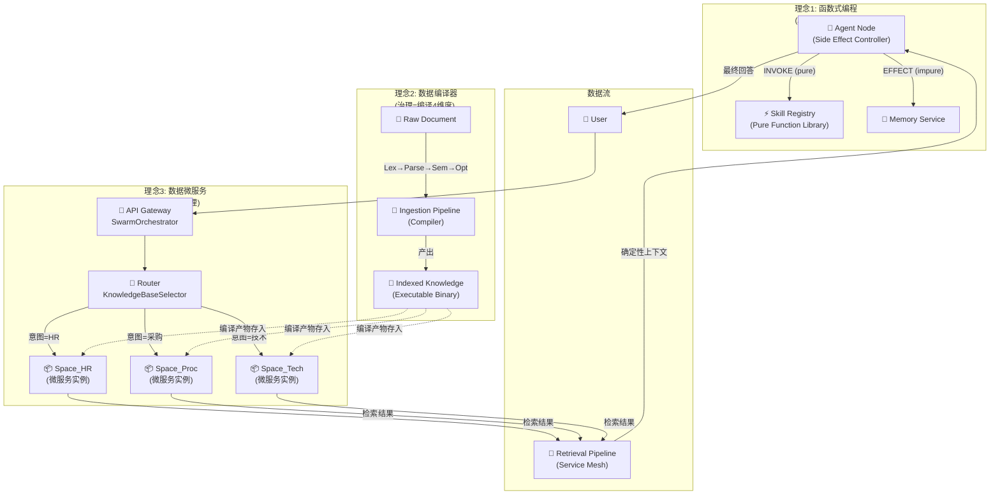

# 🏛️ HiveMind ARAG 终极架构蓝图：数据微服务化

> **核心命题：** 未来的 ARAG 架构师，本质上就是 **数据微服务架构师**。
>
> 本文档融合三轮架构哲学对话，建立统一理论框架：
> - **第一轮**：Agent = 副作用函数，Skill = 纯函数
> - **第二轮**：数据治理 = 编译器 (四维视角)
> - **第三轮**：数据治理 ≈ 微服务治理 (同构性)

---

## 一、同构性全景图

> 数据治理与微服务治理在核心哲学、架构模式甚至面临的挑战上，有着惊人的同构性（Isomorphism）。

```
┌──────────────────────────────────────────────────────────────────────┐
│                      同构性全景 (Isomorphism Map)                     │
│                                                                      │
│  ┌──────────────────────────┐      ┌──────────────────────────┐     │
│  │    微服务治理              │      │    ARAG 数据治理          │     │
│  │    Microservice Gov.     │ ≅    │    Data Gov.             │     │
│  │                          │      │                          │     │
│  │  单体应用                │      │  数据沼泽                │     │
│  │  → DDD 领域拆分          │      │  → 场景分区              │     │
│  │  → 独立服务              │      │  → 独立知识库            │     │
│  │  → API 契约              │      │  → Schema/元数据契约     │     │
│  │  → 服务注册中心          │      │  → KB 注册中心           │     │
│  │  → API Gateway           │      │  → Query Router          │     │
│  │  → 熔断/限流             │      │  → 降级/Token预算        │     │
│  │  → 链路追踪              │      │  → RAG Trace             │     │
│  │  → CI/CD                 │      │  → 增量编译              │     │
│  └──────────────────────────┘      └──────────────────────────┘     │
│                                                                      │
│        ┌──────────────────────────────────────────┐                  │
│        │            共同的根本目标                    │                  │
│        │                                          │                  │
│        │    敏捷迭代 │ 独立扩展 │ 故障隔离          │                  │
│        │    精准调用 │ 动态更新 │ 副作用控制        │                  │
│        └──────────────────────────────────────────┘                  │
└──────────────────────────────────────────────────────────────────────┘
```

---

## 二、三维分区策略

### 2.1 垂直分区 (Vertical Partitioning) — 按业务域拆分

> **微服务做法**：把单体拆成用户服务、订单服务、支付服务。
> **ARAG 做法**：把数据沼泽拆成独立的知识空间 (Knowledge Space)。

```
┌──────────────────────────────────────────────────────────────────┐
│              垂直分区：每个 KnowledgeBase = 一个微服务              │
│                                                                  │
│  ┌──────────────┐ ┌──────────────┐ ┌──────────────┐             │
│  │ Space_HR     │ │ Space_Proc   │ │ Space_Tech   │             │
│  │              │ │              │ │              │             │
│  │ 员工手册     │ │ 供应商名单   │ │ API 文档     │             │
│  │ 薪酬制度     │ │ 采购流程     │ │ 架构图       │             │
│  │ 考勤规则     │ │ 合同模板     │ │ 运维手册     │             │
│  │              │ │              │ │              │             │
│  │ pipeline:    │ │ pipeline:    │ │ pipeline:    │             │
│  │  "legal"     │ │  "general"   │ │  "technical" │             │
│  │              │ │              │ │              │             │
│  │ collection:  │ │ collection:  │ │ collection:  │             │
│  │  "hr_policies"│ │  "proc_docs" │ │  "tech_docs" │             │
│  └──────────────┘ └──────────────┘ └──────────────┘             │
│         │                │                │                      │
│         └────────────────┼────────────────┘                      │
│                          │                                       │
│                 物理隔离噪声 (Noise Isolation)                    │
│                                                                  │
│  用户问"怎么报销？" → 路由到 Space_HR                             │
│  → 绝对不会检索到"服务器 CPU 配置参数"                            │
│  → 从根源上消灭幻觉                                              │
└──────────────────────────────────────────────────────────────────┘
```

**HiveMind 现有实现映射：**

| 微服务概念 | HiveMind 代码 | 位置 |
|-----------|--------------|------|
| 独立服务实例 | `KnowledgeBase` 模型 | `models/knowledge.py` |
| 服务配置 | `pipeline_type`, `chunking_strategy`, `embedding_model` | `KnowledgeBase` 字段 |
| 独立数据库 | `vector_collection` (每个 KB 独立的 ChromaDB collection) | `KnowledgeBase.vector_collection` |
| 服务描述 | `description` (用于 LLM 路由决策) | `KnowledgeBase.description` |
| 服务版本 | `version` (每次文档变更自增) | `KnowledgeBase.version` |
| 所有权 | `owner_id` (KB 所有者) | `KnowledgeBase.owner_id` |

### 2.2 水平分区 (Horizontal Partitioning) — 按生命周期/权限拆分

> **微服务做法**：冷热数据分离，按租户隔离。
> **ARAG 做法**：按版本/时间分区，按权限分级。

```
┌──────────────────────────────────────────────────────────────────┐
│                 水平分区：时间 × 权限 矩阵                        │
│                                                                  │
│              时间维度 (Temporal)                                  │
│         ┌──────────┬──────────┬──────────┐                      │
│         │ 2024版   │ 2025版   │ 2026版   │                      │
│         │ (DEPRECATED)│ (DEPRECATED)│(ACTIVE) │                      │
│         │ 不再检索 │ 仅历史查询│ 默认命中 │                      │
│         └──────────┴──────────┴──────────┘                      │
│                                                                  │
│              权限维度 (Permission)                                │
│         ┌──────────────────┬──────────────┐                      │
│         │ Public Zone      │ Confidential │                      │
│         │ (is_public=True) │ Zone         │                      │
│         │                  │              │                      │
│         │ 全员可查          │ 仅特定角色   │                      │
│         │ 通用制度          │ 薪酬/合同    │                      │
│         │ 技术文档          │ 战略规划     │                      │
│         └──────────────────┴──────────────┘                      │
│                                                                  │
│  实现：AclFilterStep 在 SERVED 状态为每个请求做实时权限过滤       │
│  类比：微服务中不同角色有不同的 Access Token                     │
└──────────────────────────────────────────────────────────────────┘
```

**HiveMind 现有实现映射：**

| 分区维度 | 当前实现 | 状态 |
|---------|---------|------|
| 权限过滤 | `AclFilterStep` - 文档级 ACL + 角色检查 | ✅ 已实现 |
| 公开/私有 | `KnowledgeBase.is_public` | ✅ 已实现 |
| 时间分区 | — | 🔲 **缺失**: Document 缺少 `valid_from/valid_to` |
| 版本废弃 | — | 🔲 **缺失**: Document 缺少 `is_active/supersedes_id` |
| Chunk 级安全标签 | — | 🔲 **缺失**: metadata 中缺少 `security_level` |

### 2.3 联邦治理 (Federation) — 统一网关与路由

> **微服务做法**：API Gateway → 根据请求路径路由到不同服务。
> **ARAG 做法**：KnowledgeBaseSelector → 根据查询意图路由到不同知识库。

```
┌──────────────────────────────────────────────────────────────────┐
│              联邦治理：统一入口 + 智能路由                         │
│                                                                  │
│  用户提问                                                         │
│     │                                                            │
│     ▼                                                            │
│  ┌─────────────────────────────────────────┐                    │
│  │  API Gateway = SwarmOrchestrator         │                    │
│  │  (统一入口，所有请求先到这里)              │                    │
│  └───────────────┬─────────────────────────┘                    │
│                  │                                               │
│                  ▼                                               │
│  ┌─────────────────────────────────────────┐                    │
│  │  Router = Supervisor + KnowledgeBaseSelector                 │
│  │                                                              │
│  │  1. Supervisor 判断意图类型                                   │
│  │     "这是采购问题" / "这是人事问题"                            │
│  │                                                              │
│  │  2. KnowledgeBaseSelector 路由到 KB                           │
│  │     根据 query ↔ KB.description 的语义匹配                    │
│  │     选择 top-K 个最相关 KB                                    │
│  │                                                              │
│  │  3. 将 kb_ids 传递给 RetrievalPipeline                       │
│  └───────────┬─────────────────┬───────────┘                    │
│              │                 │                                 │
│       ┌──────▼─────┐    ┌─────▼──────┐                         │
│       │ Space_HR   │    │ Space_Proc │ ... (可无限扩展)          │
│       │ pipeline   │    │ pipeline   │                          │
│       └────────────┘    └────────────┘                          │
│                                                                  │
│  扩展性保障:                                                     │
│  新增"法务知识库" → 只需：                                        │
│  1. CREATE KB (name="法务", description="合同/法规/判例")         │
│  2. 上传文档 → Pipeline 自动编译                                 │
│  3. Router 自动发现新 KB (无需改代码)                             │
│  → 完美符合微服务的可扩展性原则                                   │
└──────────────────────────────────────────────────────────────────┘
```

**HiveMind 现有实现映射：**

```
 API Gateway        = SwarmOrchestrator.invoke_stream()
 Service Registry   = PostgreSQL (select(KnowledgeBase))  
 Router             = KnowledgeBaseSelector.select_kbs()
 Service Mesh       = RetrievalPipeline (7-step chain)
 Load Balancer      = 多 KB 并行查询 (HybridRetrievalStep for q in kb_ids)
```

---

## 三、微服务治理模式完整对标

```
┌──────────────────────────────────────────────────────────────────────┐
│                   微服务治理 ↔ RAG 数据治理 全量对标                   │
├─────────────────┬──────────────────────┬─────────────────────────────┤
│  治理模式         │  微服务实现            │  HiveMind ARAG 实现          │
├─────────────────┼──────────────────────┼─────────────────────────────┤
│                 │                      │                             │
│  服务注册       │  Consul / Eureka     │  ✅ KnowledgeBase 模型        │
│  Service        │  → 记录服务地址/端口  │  → 记录 KB 名称/描述/配置      │
│  Registry       │                      │                             │
│                 │                      │                             │
├─────────────────┼──────────────────────┼─────────────────────────────┤
│                 │                      │                             │
│  服务发现       │  DNS 查询 / SRV      │  ✅ KnowledgeBaseSelector     │
│  Service        │  → 找到可用实例      │  → LLM 意图匹配 KB.description│
│  Discovery      │                      │  → 返回相关 kb_ids           │
│                 │                      │                             │
├─────────────────┼──────────────────────┼─────────────────────────────┤
│                 │                      │                             │
│  API 网关       │  Kong / Nginx        │  ✅ RetrievalPipeline        │
│  API Gateway    │  → 统一入口           │  → 统一检索入口              │
│                 │  → 请求路由           │  → 步骤链路由                │
│                 │                      │                             │
├─────────────────┼──────────────────────┼─────────────────────────────┤
│                 │                      │                             │
│  负载均衡       │  Round-Robin /       │  ✅ 多 KB 并行检索            │
│  Load           │  Weighted            │  → HybridRetrievalStep       │
│  Balancing      │                      │     for kb in kb_ids         │
│                 │                      │                             │
├─────────────────┼──────────────────────┼─────────────────────────────┤
│                 │                      │                             │
│  熔断器         │  Hystrix / Resilience│  ⚠️ 部分实现                  │
│  Circuit        │  → 服务挂了自动降级  │  → try/except 在每个 Step     │
│  Breaker        │  → 隔离故障         │  → Memory 三层级联降级        │
│                 │                      │  🔲 缺: KB 级熔断器          │
│                 │                      │                             │
├─────────────────┼──────────────────────┼─────────────────────────────┤
│                 │                      │                             │
│  限流           │  Rate Limiter        │  ✅ LLMRouter 三级模型        │
│  Rate           │  → QPS 控制          │  → FAST/BALANCED/REASONING   │
│  Limiting       │                      │  → Token 预算控制             │
│                 │                      │                             │
├─────────────────┼──────────────────────┼─────────────────────────────┤
│                 │                      │                             │
│  链路追踪       │  Jaeger / Zipkin     │  ✅ 多层追踪已有              │
│  Distributed    │  → 跨服务请求追踪    │  → RetrievalContext.trace_log│
│  Tracing        │                      │  → PipelineMonitor           │
│                 │                      │  → SharedMemoryManager.trace │
│                 │                      │  → LangFuse 规划中           │
│                 │                      │                             │
├─────────────────┼──────────────────────┼─────────────────────────────┤
│                 │                      │                             │
│  数据契约       │  Protobuf / OpenAPI  │  ✅ Pydantic Schema          │
│  Data           │  → 服务间通信协议    │  → RetrievalContext          │
│  Contract       │                      │  → SwarmState                │
│                 │                      │  → StandardizedResource      │
│                 │                      │  → VectorDocument            │
│                 │                      │                             │
├─────────────────┼──────────────────────┼─────────────────────────────┤
│                 │                      │                             │
│  灰度发布       │  Canary / Blue-Green │  ✅ PipelineFactory          │
│  Canary         │  → 渐进式上线       │  → general/technical/legal    │
│  Deploy         │                      │  → 不同 KB 不同 Pipeline     │
│                 │                      │                             │
├─────────────────┼──────────────────────┼─────────────────────────────┤
│                 │                      │                             │
│  健康检查       │  `/health` endpoint  │  🔲 缺失                     │
│  Health         │  → 定期检测可用性    │  → 应有: KB 质量评分          │
│  Check          │                      │  → 检索精度 + 用户反馈        │
│                 │                      │                             │
├─────────────────┼──────────────────────┼─────────────────────────────┤
│                 │                      │                             │
│  配置中心       │  Apollo / Nacos      │  ⚠️ 部分实现                  │
│  Config         │  → 集中管理配置      │  → KB 本身携带部分配置        │
│  Center         │                      │  🔲 缺: 域级配置集            │
│                 │                      │                             │
├─────────────────┼──────────────────────┼─────────────────────────────┤
│                 │                      │                             │
│  事件总线       │  Kafka / RabbitMQ    │  🔲 缺失                     │
│  Event Bus      │  → 事件驱动          │  → 应有: 文档变更事件         │
│                 │  → 服务解耦          │  → KB 更新 → Cache 失效       │
│                 │                      │  → 通知 Agent 知识库已刷新    │
│                 │                      │                             │
└─────────────────┴──────────────────────┴─────────────────────────────┘
```

---

## 四、三大陷阱警示

### 陷阱 1：分布式单体 (Distributed Monolith)

```
┌──────────────────────────────────────────────────────────────┐
│  ❌ 反模式：把单体代码拆成多个服务，但数据库还是共享的          │
│                                                              │
│  微服务版本：                                                 │
│    用户服务 ─┐                                               │
│    订单服务 ─┼──→ 共享 MySQL ──→ 耦合依旧                    │
│    支付服务 ─┘                                               │
│                                                              │
│  ARAG 版本：                                                 │
│    HR 知识库 ────┐                                           │
│    采购知识库 ───┼──→ 同一个 ChromaDB collection               │
│    技术知识库 ───┘    → 元数据标准不统一                       │
│                       → 切分策略混乱                          │
│                       → Agent 依然无法区分                    │
│                                                              │
│  ✅ HiveMind 对策：                                          │
│    KnowledgeBase.vector_collection — 每个 KB 独立 collection   │
│    KnowledgeBase.pipeline_type — 每个 KB 独立编译策略          │
│    KnowledgeBase.embedding_model — 每个 KB 可用不同嵌入模型    │
│                                                              │
│  ⚠️ 未完成的对策：                                            │
│    🔲 元数据标准 (Schema Registry) 尚未统一强制                │
│    🔲 KB 间引用/关联机制尚未建立                               │
└──────────────────────────────────────────────────────────────┘
```

### 陷阱 2：缺少容错机制

```
┌──────────────────────────────────────────────────────────────┐
│  ❌ 反模式：某个知识库挂了，整个系统失败                       │
│                                                              │
│  微服务解法：Circuit Breaker                                  │
│    → 服务 A 挂了 → 自动降级 → 返回缓存/默认值                 │
│                                                              │
│  ARAG 需要的：                                                │
│    → 某个 KB 数据质量突然下降（如外部爬虫源不可用）             │
│    → Agent 应能自动降级                                       │
│    → 只依赖内部高质量库，而非输出错误信息                      │
│                                                              │
│  ✅ HiveMind 现有容错：                                      │
│    → Pipeline Step: try/except + 继续下一步                   │
│    → Memory: 三层级联 (Tier-1 失败 → Tier-2 → Tier-3)        │
│    → KnowledgeBaseSelector: 路由失败 → fallback to all        │
│                                                              │
│  🔲 应增强的容错：                                            │
│    → KB 级熔断器：连续 3 次检索失败 → 自动标记为 UNHEALTHY    │
│    → 降级路由：UNHEALTHY KB 被排除出 Router 候选池              │
│    → 质量驱动熔断：检索结果 rerank 分数持续低于阈值 → 报警      │
└──────────────────────────────────────────────────────────────┘
```

### 陷阱 3：缺少自治性

```
┌──────────────────────────────────────────────────────────────┐
│  ❌ 反模式：所有数据清洗由中央团队事必躬亲                     │
│                                                              │
│  微服务原则：每个服务有自己的数据库，独立演进                   │
│                                                              │
│  ARAG 自治性设计：                                            │
│    → 不同部门（HR / IT / 法务）独立维护自己的知识库分区        │
│    → 只要遵循统一的元数据标准和接入协议                       │
│    → 不需要中央团队清洗每一行数据                             │
│                                                              │
│  ✅ HiveMind 自治性基础：                                    │
│    → KnowledgeBase.owner_id — 明确的所有权                   │
│    → KnowledgeService.list_kbs(owner_id) — 按所有者查询       │
│    → PipelineFactory 支持不同 KB 选择不同 Pipeline 模板        │
│                                                              │
│  🔲 应增强的自治性：                                          │
│    → 部门级管控台：HR 部门自助上传/更新/审核自己的知识库       │
│    → 自助 Pipeline 配置：KB 管理员可调整切分策略/审核规则      │
│    → 域级指标监控：每个 KB 有自己的质量仪表盘                  │
└──────────────────────────────────────────────────────────────┘
```

---

## 五、融合架构：三轮理念的统一视图



### 统一公式

```
ARAG 系统可靠性
    = Skill 的确定性 (纯函数)
    × Pipeline 的可观测性 (编译器追踪)  
    × KB 的隔离性 (微服务分区)
    ÷ Agent 的不确定性 (LLM 推理)
    ÷ 数据的模糊性 (噪声/冲突/缺失)
```

> **优化方向**：分子做大（Skill 更纯、Pipeline 更透明、KB 更独立）、分母做小（Agent 约束更强、数据治理更彻底）

---

## 六、现有代码诊断：同构性实现评分

```
┌────────────────────────────────────────────────────────────────┐
│                 HiveMind 同构性实现成熟度评分                    │
├─────────────────┬──────┬───────────────────────────────────────┤
│  治理能力         │ 评分 │  现状                                │
├─────────────────┼──────┼───────────────────────────────────────┤
│ 垂直分区         │ ★★★★☆│ KB 各自独立 collection + pipeline     │
│ API 网关         │ ★★★★☆│ SwarmOrchestrator 统一入口             │
│ 服务发现/路由    │ ★★★☆☆│ KnowledgeBaseSelector (LLM-based)     │
│ 数据契约         │ ★★★★☆│ Pydantic Schema 体系完善              │
│ 链路追踪         │ ★★★☆☆│ trace_log + Monitor，缺 LangFuse     │
│ 编译器 (Ingestion)│ ★★★★☆│ 5 步 Pipeline (Parse→Audit→...→Vec)  │
│ 负载均衡         │ ★★★☆☆│ 多 KB 并行查询                        │
│ 灰度发布         │ ★★★☆☆│ PipelineFactory 多模板                │
│ 限流             │ ★★★★☆│ LLMRouter 三级模型                    │
│ 水平分区 (权限)  │ ★★★☆☆│ AclFilterStep 文档级                  │
├─────────────────┼──────┼───────────────────────────────────────┤
│ 熔断器           │ ★☆☆☆☆│ 仅 try/except，无 KB 级熔断           │
│ 健康检查         │ ☆☆☆☆☆│ 完全缺失                              │
│ 事件总线         │ ☆☆☆☆☆│ 完全缺失                              │
│ 配置中心         │ ★☆☆☆☆│ KB 自带配置，缺域级配置集             │
│ 自治性管控       │ ★☆☆☆☆│ owner_id 存在，缺自助管理             │
│ 增量编译         │ ☆☆☆☆☆│ 完全缺失                              │
│ 版本链           │ ☆☆☆☆☆│ content_hash 存在，缺版本关联         │
│ 语义增强 (Enrich)│ ☆☆☆☆☆│ Pipeline 中缺失 EnrichmentStep        │
├─────────────────┼──────┼───────────────────────────────────────┤
│  总体成熟度       │ 55%  │  基础框架优秀，治理能力有系统性缺口   │
└─────────────────┴──────┴───────────────────────────────────────┘
```

---

## 七、终极行动路线图

### Phase 1: 补全编译器 (M3 对齐)

| 任务 | 理念映射 | 预估 |
|------|---------|------|
| 新增 `EnrichmentStep` | 编译器: 语义分析 | 2d |
| Document 版本链 (`supersedes_id` + `is_active`) | 编译器: 源码版本 + 降噪: 去重 | 1d |
| Chunk 级安全标签 (`security_level` in metadata) | 权责确权 + 水平分区 | 1d |

### Phase 2: 建立治理控制面 (M4-M5 对齐)

| 任务 | 理念映射 | 预估 |
|------|---------|------|
| KB 级熔断器 (`HealthStatus` + 自动降级) | 微服务: 熔断器 | 2d |
| KB 健康检查 (检索精度 + 用户反馈评分) | 微服务: 健康检查 | 2d |
| 文档变更事件总线 (Redis Pub/Sub) | 微服务: 事件总线 | 2d |
| 增量编译 (基于 `content_hash` 差分) | 编译器: 增量编译 | 3d |

### Phase 3: 实现自治性 (M6 对齐)

| 任务 | 理念映射 | 预估 |
|------|---------|------|
| 部门自助管控台 | 微服务: 自治性 | 5d |
| 域级配置中心 (per-KB Pipeline 配置 UI) | 微服务: 配置中心 | 3d |
| KB 级质量仪表盘 | 微服务: 监控 | 3d |

---

## 附录：三份架构文档交叉索引

| 文档 | 核心主题 | 理念范围 |
|------|---------|---------|
| [Agent×Skill×RAG 架构](../../.gemini/antigravity/brain/86f5a95c-ba4c-4a7d-a8ba-20c745eafea9/agent_skill_rag_architecture.md) | 函数式 + 六层架构 | 理念 1 + 3 |
| [数据治理四维哲学](../../.gemini/antigravity/brain/86f5a95c-ba4c-4a7d-a8ba-20c745eafea9/data_governance_as_compilation.md) | 编译器 + 状态机 + 降噪 + 权责 | 理念 2 完整展开 |
| **本文档** | 微服务同构性 + 分区策略 + 陷阱警示 | 理念 3 + 全融合 |

> **三份文档共同构成一个三角支撑**：
> - 第一份定义了 **"谁做什么"** (Agent/Skill/RAG 的职责边界)
> - 第二份定义了 **"怎么做"** (数据如何从混乱走向确定性)
> - 第三份定义了 **"怎么管"** (如何用治理手段保障系统可靠性)

---

> **终极洞察：**
>
> *微服务治理保证了 **代码执行流** 的状态正确；数据治理保证了 **知识输入流** 的状态正确。两者结合，才能诞生真正可靠的 Agentic AI 系统。*
>
> HiveMind 的代码已经走在了正确的道路上 —— `KnowledgeBase` 就是你的微服务实例，`KnowledgeBaseSelector` 就是你的 API Gateway，`RetrievalPipeline` 就是你的 Service Mesh。现在需要做的，是把 **治理控制面** （熔断器、健康检查、事件总线）补齐，让它从"能跑"进化为"跑得稳"。
