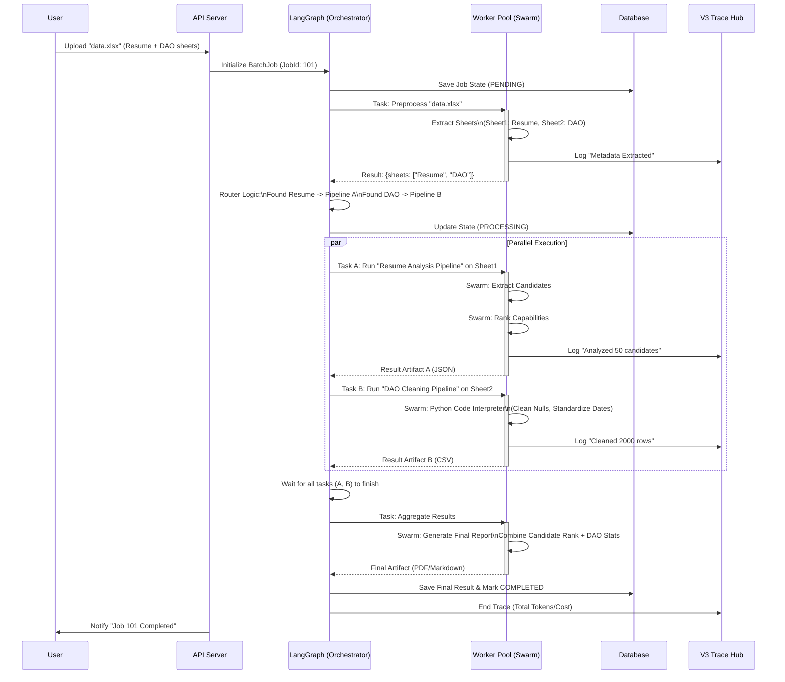

# System Architecture: Dynamic Batch Processing Pipeline

本文档展示了基于 LangGraph 和 Swarm 的动态批处理架构图。

## 1. 宏观逻辑架构图 (High-Level Architecture)

```mermaid
graph TD
    %% --- 入口层 ---
    User((User)) -->|Upload Files| API[API Endpoint\n/batch/create]
    API -->|Create Job| BatchController[Batch Controller\n(LangGraph Orchestrator)]

    %% --- 编排层 (LangGraph) ---
    subgraph "Orchestration Layer (LangGraph)"
        direction TB
        State[Global State\nChecking & Checkpointing]
        
        Node_Pre[NODE: Preprocessor\n1. Analyze File Structure\n2. Split into Chunks]
        Node_Route{ROUTER: Dynamic Branching\nIs it Resume? DAO? Mixed?}
        
        Node_Resume[NODE: Resume Analyzer]
        Node_DAO[NODE: DAO Data Cleaner]
        Node_Generic[NODE: Generic Processor]
        
        Node_Map[NODE: Map-Reduce\nFan-out Subtasks]
        Node_Agg[NODE: Aggregator\nCombine Results]
        
        State --> Node_Pre
        Node_Pre --> Node_Route
        
        Node_Route -- "Resume Sheet" --> Node_Resume
        Node_Route -- "DAO Data" --> Node_DAO
        Node_Route -- "Text/PDF" --> Node_Generic
        
        Node_Resume --> Node_Map
        Node_DAO --> Node_Map
        Node_Generic --> Node_Map
        
        Node_Map --> Node_Agg
    end

    %% --- 执行层 (Swarm Workers) ---
    subgraph "Execution Layer (Swarm Workers)"
        direction LR
        Worker1[Worker 1\nRun Resume Pipeline]
        Worker2[Worker 2\nRun DAO Pipeline]
        Worker3[Worker 3\nRun Generic Pipeline]
        
        Node_Resume -.->|Dispatch| Worker1
        Node_DAO -.->|Dispatch| Worker2
        Node_Generic -.->|Dispatch| Worker3
    end

    %% --- 基础设施层 ---
    subgraph "Infrastructure Layer"
        DB[(Postgres DB\nJob State & Results)]
        TraceHub[V3 Trace Hub\nObservability & Tracing]
        
        BatchController -->|Persist State| DB
        BatchController -->|Log Trace| TraceHub
        Worker1 -->|Log Steps| TraceHub
    end

    Node_Agg -->|Update Job Status| DB
    Node_Agg -->|Notify| User
```

## 2. 详细执行流程图 (Detailed Execution Flow)

此图展示了一个 Excel 文件从上传到最终生成报告的完整生命周期。



## 核心设计理解

1.  **LangGraph = 总指挥官**:
    *   它**不是**死板的 `if/else`，而是一个**有状态的图**。
    *   它知道：“现在刚跑完预处理，下一步该把 Sheet 1 发给简历组，Sheet 2 发给数据组。”
    *   它**持久化**：如果服务器挂了，重启后它知道：“简历组跑完了，等数据组跑完就能聚合了。”

2.  **Dynamic Routing (动态路由)**:
    *   关键在于 **Preprocessor** 节点。它像一个分诊台，把大文件拆开，按内容决定后续去哪个科室（Pipeline）。
    *   这就是您说的“大流程套小流程”——Preprocessor 是第一层，具体 Pipeline 是第二层。

3.  **V3 Trace Hub = 黑匣子**:
    *   不管流程多复杂，每一层（Job -> Task -> Step -> LLM Call）都会生成 Trace。
    *   您可以随时点进去看：“为什么那个 DAO 数据清洗失败了？哦，原来是 Python 代码除了 ZeroDivisionError。”

4.  **Swarm = 具体干活的工人**:
    *   LangGraph 只负责**发号施令** (“去处理这个Sheet”)。
    *   具体怎么处理（Step 1提取 -> Step 2分析），是 **Swarm** 内部的事情（Micro-Orchestration）。
    *   Swarm 内部即使吵了100句，LangGraph 只要最后的一个 Result Artifact。这就是边界清晰。
