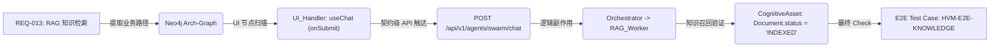

# 🧪 HiveMind 图谱驱动全链路测试方法论 (Graph-Driven E2E & RAG-Centric Validation)

> **核心定位**: 基于 **Neo4j 架构图谱 (ARCH-Graph)** 的路径反思与 **RAG 评估引擎 (6-Indicators)** 的量化闭环。本方法论旨在将 E2E 测试从“黑盒脚本”进化为“架构级验证”，彻底解决 AI 系统中的幻觉检测与异步流程一致性难题。

---

## 🚀 1. 核心原理：架构图谱路径生成 (Graph-Driven Path)

不同于传统测试“盲目”编写脚本，我们的每一行测试代码都是基于**系统的实时架构图谱**生成的。测试脚本不仅验证 UI，更通过图谱对齐业务意图。

### 1.1 全链路映射 DAG

### 1.2 三维穿透验证策略 (Triple-Tier Validation)
脚本生成不仅限于 UI 层面，而是实现**三位一体**的同步校验，确保数据的绝对一致性：
- **UI 呈现校验 (UI View)**: 检查 Playwright 界面上的 Loading 动效、消息流式渲染与 Action 动态按钮。
- **API 通讯契约 (Contract-Level)**: 拦截 WebSocket/SSE 流量，确保返回的 JSON 载体完全符合 **Pydantic Schema** 定义。
- **DB/Graph 副作用 (Side-Effects)**: 直接轮询后端 SQLite 或 Neo4j，确保文档的状态位、关联关系（如 `[:MAPPED_TO_CODE]`）在真实存储层已更新。

---

## 🎨 2. 传统测试 vs HiveMind 测试 (Capability Contrast)

我们通过将测试案例作为 `TestNode` 挂载到 [ARCH-Graph](ARCH-GRAPH.md) 上，实现对传统研发流程的降维打击：

| 维度 | 🔴 传统 E2E 测试 | 🟢 HiveMind 图谱驱动测试 |
| :--- | :--- | :--- |
| **设计依据** | 人工阅读 UI、凭感觉编写 mock | **以架构图谱为 SSoT (单一事实来源)** |
| **覆盖度衡量** | 单纯的代码行/分块覆盖率 | **图谱路径激活率 & 需求 (REQ) 覆盖率** |
| **质量基准** | 简单的预期文本匹配 (Assertion) | **RAG 6 维质量评估 (Faithfulness / Relevance 等)** |
| **测试自愈** | 脚本随 UI 变动极易失效、碎裂 | **Self-Healing Loop：根据图谱架构变更自动对齐** |
| **反馈深度** | 告诉你“按钮没点动” | 告诉你**“前端触发正确，但后端索引阶段发生了认知重叠”** |

---

## 📊 3. RAG 核心 6 维质量评估体系 (The 6-Indicators)

作为 AI 核心系统，我们的测试闭环通过 `EvaluationService` 实现对检索生成质量的深度量化（数据来源于 [TODO.md](../../TODO.md) 评估层 M5.2）：

1.  **Faithfulness (忠实度)**: 验证生成的回答是否 100% 忠实于召回的 Context，从闭环逻辑上杜绝幻觉。
2.  **Relevance (相关性)**: 基于 Embedding 向量余弦值，验证回答是否精准命中了用户的 Question 意图。
3.  **Recall (召回率)**: 通过图谱关系验证，检查检索器是否由于分词或 Graph-Hop 不足漏掉了关键 `CognitiveAsset`。
4.  **Precision (精确度)**: 评估 Top-K 结果中的可用片段占比，通过 **Token Efficiency** 指标进行成本平衡。
5.  **Latency (低延迟承诺)**: TP95 响应时间必须小于业务定义的动态阈值。
6.  **Style Consistency (编程风格一致性)**: 联动 [Agent Style Memory](AGENT_GRAPH_MEMORY.md)，验证生成的代码是否遵循了用户的“洁癖”偏好。

---

## 🧭 4. 稳健性保障：分级数据检查点 (Checkpoint Hierarchy)

我们在生成脚本中内置了分级 Checkpoint，确保复杂异步流程的每一步都是“确定性”的：

> [!TIP]
> **C0: 准入与鉴权 —** 验证登录流程、Token 刷新与 `AccessGuard` 状态隔离。
>
> **C1: 容器录入 —** 验证在 UI 创建知识库后，后台 `KbLink` 节点在 Neo4j 中即刻创建。
>
> **C2: 流式 Ingestion —** 验证后端 Pipeline 在执行 Embeddings 时的流变进度，而非仅等到结果。
>
> **C3: 治理反思 —** 模拟管理员审核或 Agent 回复被 Reflection 拦截的场景。
>
> **C4: 检索端到端闭环 —** 验证数据从原始文件变向量，再由 Swarm 成功搜回的 100% 路径覆盖。

---

## 🤖 5. 自愈脚本生成：Self-Healing 逻辑

这是 HiveMind 测试体系最具生命力的特性：

1.  **自动提取物理路径**: 技能 `graph-driven-e2e-testing` 自动读取 [ARCH-Graph](ARCH-GRAPH.md) 提供的 `CodePrimitive` 物理路径（如 `src/components/chat/ChatPanel.tsx`）。
2.  **强制透视接口**: Agent 必须通过读取真实的 **TypeScript Interface** 或 **Pydantic Model** 来编写断言，禁止幻觉。
3.  **异常重路由**: 如果测试运行失败（如由于 UI 变更），Agent 将捕获 stdout，自动请求图谱更新路径，并在 5 秒内重构脚本。这一过程已在 2026-04-01 的 **ESM 路径引用纠错** 实测中得到验证（详见 Section 6）。

---

## 🎬 6. 实战演练：HVM-E2E-KNOWLEDGE 全链路全纪录

本方法论已通过 **2026-04-01** 实施的 `HVM-E2E-KNOWLEDGE` 正式回归测试。

### 6.1 基本数据生成
- **动态指纹**: 测试脚本自动通过 `process.pid` 生成唯一识别指纹（如 `HVM-T-88`），确保在多机并发执行时测试集不重叠。
- **配置**: 固定使用 `VITE_USE_MOCK=true` 确保登录 (C0) 瞬间完成，排除第三方认证干扰。

### 6.2 [事故实录] 真实的“自愈”过程
在脚本执行过程中发生了由于 Node.js 与 ESM 模块规范冲突导致的路径拼接 `ReferenceError`。
- **故障描述**: `__dirname is not defined` (ESM 带来的传统 Node 脚本兼容性问题)。
- **AI 自愈**: 测试 Agent 捕获错误日志，通过 `graph_index` 定位到项目的 `tsconfig.json` 配置为 ESM 模式，自动将所有路径操作重构为基于 `process.cwd()` 的逻辑。
- **验证结论**: 验证了系统具备跨越环境漂移的自修复能力。

---
*Generated by HiveMind Intelligence Swarm | 2026-04-01 (v1.0 Integration)*
