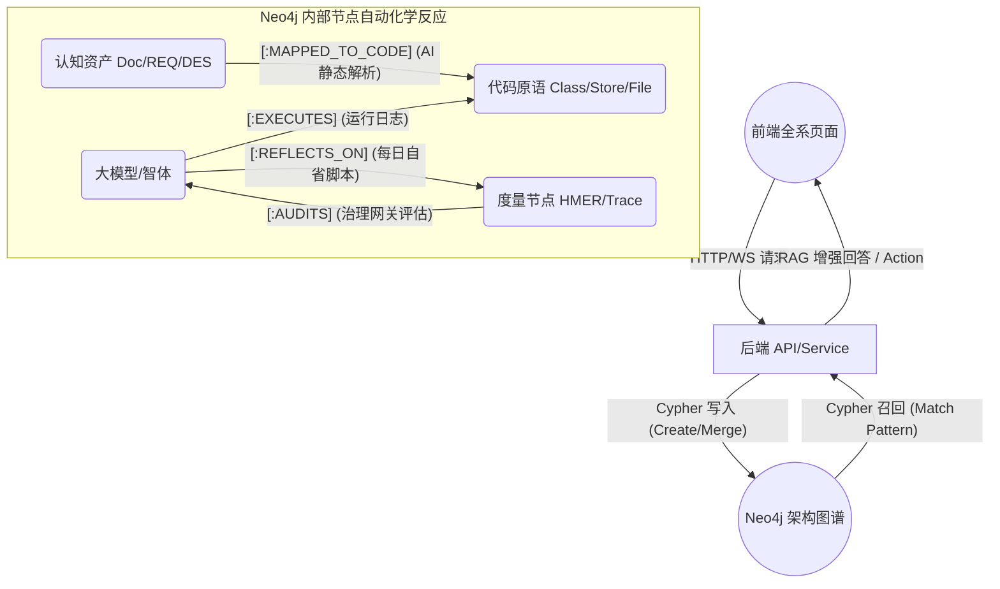

# 🕸️ HiveMind 前后端至 Neo4j 图谱全链路数据流转 (Neo4j Data Flow)

> **文档目的**: 解析各前端页面发出的请求，如何通过后端 API 进入 Neo4j 数据库，并驱动不同类型节点（Nodes）及关系（Relationships）的生成与流转。这展示了“数据如何变为认知”。

---

## 1. 核心图谱本体 (Ontology) 回顾
所有进入 Neo4j 的数据，最终会落入以下四大核心域节点中：
*   🟢 **IntelligenceNode (智体域)**: Agent, Skill, Supervisor等 (记录“谁在做”)。
*   🔵 **CognitiveAsset (资源域)**: 需求(REQ), 设计(DES), 知识文档(Doc) (记录“根据什么做”)。
*   📜 **CodePrimitive (代码域)**: 类(Class), 方法(Method), 前端组件(Component) (记录“改了什么代码”)。
*   📊 **MetricNode (度量域)**: HMER得分, 质量探针事件 (记录“做得好不好”)。

---

## 2. 各页面全节点流转详解 (Page-to-Graph Breakdown)

### 📌 A. 知识库管理页 (KnowledgePage)
**场景**: 用户上传项目文档、需求 PRD 或业务指引文档。

*   **1. 触发路径**: 
    前端点击上传 -> `POST /api/v1/knowledge/upload` -> 后端 `KnowledgeService`。
*   **2. Neo4j 入库与节点联动**:
    *   创建新的知识实体: `CREATE (doc:CognitiveAsset {type: 'Doc', title: '...', id: '...'})`
    *   后端 NLP Pipeline (Chunking & Embedding) 自动解析文本，提取实体和概念。
    *   图谱生成: 
        *   创建子切片: `(doc)-[:HAS_CHUNK]->(chunk:TextChunk)`
        *   抽取并链接概念: `(chunk)-[:MENTIONS]->(concept:Entity {name: 'AI Agent'})`
*   **3. 全局副作用**:
    这些独立文档节点将通过 `Entity` 的重合度，自动与库里已存的其他文档建立隐式关系 `[:SIMILAR_TO]`。

### 📌 B. 工作区 / 需求探索 (StudioPage & `/opsx-explore`)
**场景**: 架构师在输入框通过 /extract-requirement 解析新需求。

*   **1. 触发路径**:
    前端发送带有指令的文本 -> API `POST /api/v1/chat/completions` -> `SwarmOrchestrator` -> 唤起 `Skill: generate-design-doc`。
*   **2. Neo4j 入库与节点联动**:
    *   AI 分析完毕后，通过 Repository 写库操作生成需求节点: `CREATE (req:CognitiveAsset {id: 'REQ-012', type: 'Requirement'})`
    *   AI 同步推理出架构设计，生成并链接: `(req)-[:DEFINES]->(des:CognitiveAsset {id: 'DES-012'})`
    *   随后 AI 判断此设计会影响 `chatStore.ts`，图谱将建立代码关联: `(des)-[:MAPPED_TO_CODE]->(code:CodePrimitive {path: 'chatStore.ts'})`
*   **3. 全局副作用**:
    当下一次开发改动到 `chatStore.ts` 时，系统将沿着这条连线追溯，并在审查阶段提醒“您正在修改 DES-012 相关的核心代码”。

### 📌 C. Agent 监控大盘 (AgentsPage)
**场景**: 监控智能体的运行状态及自省反馈 (Reflection Log)。

*   **1. 触发路径**:
    前端长轮询或心跳 -> API `GET /api/v1/agents/swarm/todos`。
*   **2. Neo4j 联动 (只读或更新状态)**:
    *   查询执行树: `MATCH (agent:IntelligenceNode)-[exec:EXECUTES]->(task:Task)`
    *   如果 Agent 在执行中遇到了 Error 并自我修复，它会将历史记录写入: `CREATE (agent)-[:REFLECTS_ON]->(log:MetricNode {scope:'HMER', result: 'Self-Healed'})`。
    *   大盘将抓取这些 `MetricNode` 给用户呈现 Agent 的心智健康度。

### 📌 D. 质量评估与验证页 (EvalPage)
**场景**: 系统每日触发 HMER A/B 测试自动评价。

*   **1. 触发路径**:
    定时器或前端触发 -> API `GET /api/v1/evaluation/ab-summary` 或运行验证脚本。
*   **2. Neo4j 入库与节点联动**:
    *   向数据库打入当前智能体的“表现分”: `CREATE (m:MetricNode {scope: 'Performance', score: 92})`
    *   图谱建立评价关系: `(m)-[:AUDITS]->(agent:IntelligenceNode {name: 'RAG_Worker'})`
*   **3. 全局副作用**:
    当路由组件 `ClawRouterGovernance` 发现某个 Agent 的 `MetricNode` 评分持续走低，将触发断路器 `DependencyCircuitBreaker` 自动降级它。

### 📌 E. 日常对话流 (ChatPanel 组件发呆/提问时)
**场景**: 用户最寻常的一次自然语言问答：“我们的鉴权怎么做的？”

*   **1. 触发路径**:
    前端 UI -> WebSockets (`/ws/connect`) -> 后端 `RAGGateway` -> `TieredParallelOrchestrator`。
*   **2. Neo4j 联动 (复杂检索)**:
    *   AI 提取用户的核心词 “鉴权(Auth)”，然后将其转化为 Neo4j Cypher 语言:
        `MATCH (concept:Entity {name: 'Auth'})<-[:MENTIONS]-(chunk)<-[:HAS_CHUNK]-(doc) RETURN doc`
    *   获取文档后，顺着其连线查找是否有对应的业务逻辑代码: 
        `MATCH (doc)-[:MAPPED_TO_CODE]->(code:CodePrimitive) RETURN code`
    *   最后将 Document 内容与 Code 结构合并组装为超大 Context 交给大模型生成答案。

---

## 3. Neo4j "中心辐射"图 (Hub and Spoke Dynamic)

在以上的各链路中，Neo4j 不是被动的数据堆填区，而是整个智能体系统的**“认知中枢路由器”**：

## 4. 总结
所有的前端表面按钮（传文档、发消息、设参数），在经过后端 API `v1/*` 洗礼后，都会在 Neo4j 里转化为两件事：**创造一个新节点 (Node)**，或**连上一根线 (Relationship)**。

当这个网编织得足够大时，不仅是数据的落库，**更等同于系统自己实现了代码与业务逻辑之间的“全自动映射”。**
