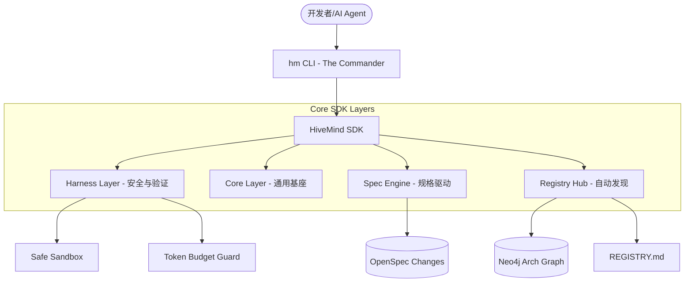

# 📐 DES-004: HiveMind 统一整合架构设计说明书 (Consolidation Internal Design)

> **状态**: 草案 (Draft)
> **关联计划**: [unified_system_consolidation_plan.md](./unified_system_consolidation_plan.md)
> **目标**: 定义 HiveMind 统一 SDK 与 CLI 体系的技术规范，实现 AI-Native 的工程化管理。

---

## 1. 软件架构全景 (System Topology)

---

## 2. 核心 SDK 定义 (app/sdk/)

SDK 将作为所有业务模块（Agents, RAG, API）的通用基座：

### 2.1 包结构
- `app/sdk/base/`: 包含统一的配置管理、日志（UnifiedLog）和追踪。
- `app/sdk/harness/`: **AI 护栏引擎**。
    - `validator.py`: 执行变更前的静态与动态校验。
    - `policy.py`: 定义存储与计算配额。
- `app/sdk/bridge/`: 与外部 MCP Servers 和 Tooling 的标准化接口。
- `app/sdk/discovery/`: 实现 `@register_service` 装饰器逻辑。

---

## 3. 统一 CLI 规格 (hm CLI)

CLI 将整合 `backend/scripts/` 中的 80+ 个脚本，采用 `typer` 开发：

### 核心命令树
- `hm spec apply <change_id>`: 核心 AI Coding 触发命令，解析 OpenSpec 并执行。
- `hm doctor`: 环境自检，验证 DB, Redis, Neo4j, ES 连接与版本。
- `hm registry sync`: 强行同步代码装饰器与 `REGISTRY.md` / 图谱。
- `hm eval <matrix_id>`: 触发 Swarm 评估矩阵。
- `hm harness check <path>`: 对指定目录或文件运行 AI 安全护栏检查。

---

## 4. OpenSpec 与图谱的深度映射

我们将 `OpenSpec` 视为“代码的契约”：
1. **Change Ingestion**: 每次创建 `openspec/changes/XXX`，由 `SpecEngine` 在 Neo4j 中创建 `:SpecChange` 节点。
2. **Traceability**: 在生成的代码文件 Header 中注入 `[Spec: change_id]`，建立代码与规格的不可篡改链接。

---

## 5. 实施路线图 (Detailed Phase 1)

1. **[T1] 物理结构重组**: 迁移 `app/core` -> `app/sdk/core`。
2. **[T2] 护栏原型**: 实现第一个基于 AST 的 `Harness` 拦截器，禁止非授权的 `rm -rf` 等危险操作。
3. **[T3] CLI 框架启动**: 建立 `backend/app/cli/main.py` 作为 `hm` 命令的入口。

---
> _“从混沌走向有序：统一的 SDK 是 HiveMind 进化的生命线。”_
