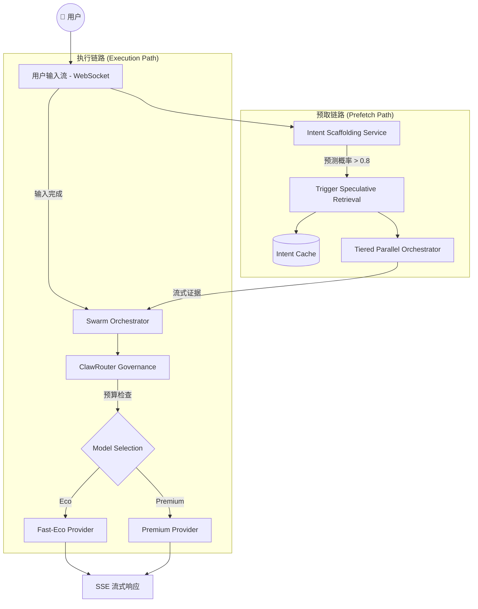
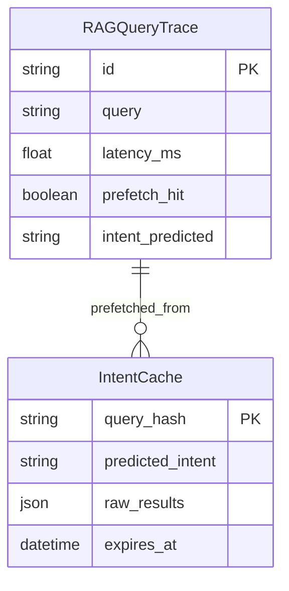

# 🏗️ 设计说明书: DES-013 (HMER Phase 1 - 架构重构与延迟治理)

> **关联需求**: [REQ-013](../requirements/REQ-013-phase1-reconstruction.md)
> **作者**: HiveMind Arch-Agent
> **状态**: 草案 / 评审中

---

## 1. 架构概览 (Architecture Overview)

### 1.1 设计目标
针对 Phase 0 基线暴露的 **745ms TTFT 瓶颈** 与 **P95 延时突刺**，通过“意图前置”与“流式并发”重构核心 RAG 链路，将平均响应时间挑战至 **300ms** 以下。

### 1.2 核心流程图 (Mermaid)



---

## 2. 数据层设计 (Data Persistence)

### 2.1 实体变更清单

| 模型名称 | 操作 | 关键字段变更 |
| :--- | :--- | :--- |
| `RAGQueryTrace` | 修改 | `prefetch_hit` (Boolean), `intent_predicted` (String), `time_budget_used` (Integer) |
| `IntentCache` | 新增 | `query_hash` (PK), `predicted_intent` (String), `raw_content_cache` (JSON), `ttl` (DateTime) |

### 2.2 ER 关系图



---

## 3. 后端服务逻辑 (Backend Services)

### 3.1 `IntentScaffoldingService` 逻辑
- **职责**: 在用户全量输入完成前，基于局部文本流预测意图，并主动触发关联资源的预热。
- **核心方法**:
  - `predict_intent_stream(partial_query: str) -> IntentProposal`: 结合历史上下文对部分输入进行语义补全与意图分类。
  - `trigger_speculative_retrieval(proposal: IntentProposal)`: 初始化异步检索任务，将结果缓存至 `IntentCache` 以供 `SwarmOrchestrator` 消费。

### 3.2 `TieredParallelOrchestrator` 逻辑
- **职责**: 将原有的串行检索链路改为多路并发，实现 Vector, Graph, Grep 的“赛马模式”。
- **核心逻辑**:
  - 启动 3 个异步 Task：`VectorSearch`, `GraphWalk`, `SmartGrep`。
  - 设置 **First-Fragment Timeout**: 一旦任一路径返回满足阈值的“高分片段 (Snippet)”，立即将该片段流转给 LLM 启动生成。

### 3.3 `ClawRouterGovernance` (预算增广版)
- **职责**: 引入动态时间预算因子。如果预取失败且当前网络 RTT 较高，则强制降级到 `Fast-Eco` 模型以保住 300ms 准出指标。

### 3.4 异常处理
- `PrefetchConflictError`: 当预取意图与最终真实意图发生显著偏离导致缓存失效时触发，需记录并上报至自省循环。

---

## 4. API 端点设计 (API Endpoints)

### 4.1 `/api/v1/observability/phase-gate/1`
- **方法**: `GET`
- **鉴权**: `Permission.SYSTEM_CONFIG`
- **请求负载 (Request Body)**: 无
- **响应**: 返回包含 `ready_to_exit: boolean`, `report_summary: string` 的审计数据，判断 Phase 1 准出合规性。

---

## 5. 前端组件设计 (Frontend Components)

### 5.1 组件树
```
ArchitectureLabPage (实验控制台)
  ├── LatencyFlameGraph (全链路时延火焰图)
  ├── IntentPredictorView (意图预测实时看板)
  ├── ReconstructionSimulator (重构效果回归模拟器)
  └── PhaseGateAuditor (HMER 准出自动审计)
```

### 5.2 复用组件清单
使用了以下 `components/common` 中的组件:
- `HiveCard` (容器封装)
- `StatusTag` (生命周期展示)
- `BaseChart` (时延波动图)

---

## 6. 评审检查点 (Review Checkpoints)
- [ ] 是否满足 4-Tier 架构模型？ (是)
- [ ] 是否定义了专有异常？ (是: PrefetchConflictError)
- [ ] 前端组件是否做到了逻辑与表现分离？ (是: 使用 useMonitor 自定义 Hook)
- [ ] 数据库索引是否已经考虑到读写平衡？ (是: 对 IntentCache 的 query_hash 使用哈希索引优化高频写)
