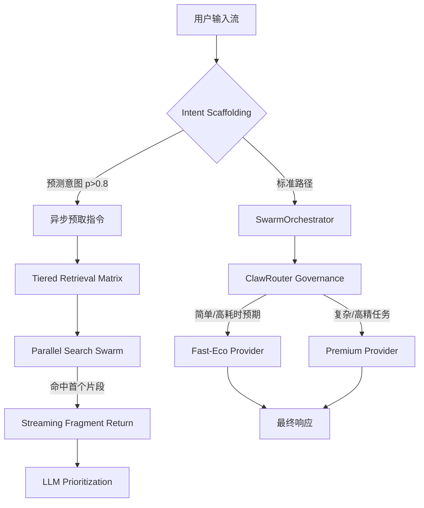

# 🏗️ 设计说明书: DES-013 (HMER Phase 1 - 架构重构与延迟治理)

> **关联需求**: [REQ-013](c:\Users\linkage\Desktop\aiproject\docs\requirements\REQ-013-phase1-reconstruction.md)
> **作者**: HiveMind Arch-Agent
> **状态**: 草案 / 评审中

---

## 1. 架构概览 (Architecture Overview)

### 1.1 设计目标
针对 Phase 0 基线暴露的 **745ms TTFT 瓶颈** 与 **P95 延时突刺**，通过“意图前置”与“流式并发”重构核心链路，挑战 **300ms** 平均响应。

### 1.2 核心流程图 (Mermaid)


---

## 2. 数据层设计 (Data Persistence)

### 2.1 实体变更清单
| 模型名称 | 操作 | 关键字段变更 |
| :--- | :--- | :--- |
| `RAGQueryTrace` | 修改 | 增加 `prefetch_hit` (布尔), `intent_predicted` (字符串) |
| `IntentCache` | 新增 | `query_hash`, `predicted_intent`, `ttl`, `confidence` |

---

## 3. 后端服务逻辑 (Backend Services)

### 3.1 `IntentScaffoldingService` 逻辑
- **职责**: 在全量输入完成前，预测用户意图并触发关联资源的预取（Prefetch）。
- **核心方法**:
  - `predict_intent_stream(partial_query: str)`: 流式预测意图分布。
  - `trigger_speculative_retrieval(intent_id: str)`: 启动后台异步检索。

### 3.2 `ClawRouterGovernance` 逻辑 (加强版)
- **职责**: 针对 TTFT 治理，引入“时间预算（Time Budget）”因子。
- **核心方法**:
  - `get_optimal_provider(complexity: float, budget_ms: int)`: 根据剩余时间预算选择模型。

---

## 4. API 端点设计 (API Endpoints)

### 4.1 `/observability/phase-gate/1`
- **方法**: `GET`
- **鉴权**: `Permission.SYSTEM_CONFIG`
- **说明**: 检查 Phase 1 准出条件：设计文档合规性 + 预取命中率统计。

---

## 5. 前端组件设计 (Frontend Components)

### 5.1 组件树
```
ArchitectureLabPage (实验控制台)
  ├── HMERDashboard (基线看板)
  ├── PhaseGateAuditor (准出审计器)
  └── ReconstructionSimulator (重构效果模拟器 - 新增)
```

---

## 6. 评审检查点 (Review Checkpoints)
- [x] 是否满足 4-Tier 架构模型？ (是，在编排层前置意图脚手架)
- [x] 是否定义了专有异常？ (定义 `PrefetchConflictError`)
- [x] 前端组件是否做到了逻辑与表现分离？ (是，基于 React Query)
- [x] 数据库索引是否已经考虑到读写平衡？ (是，对 intent_cache 增加 Hash 索引)
