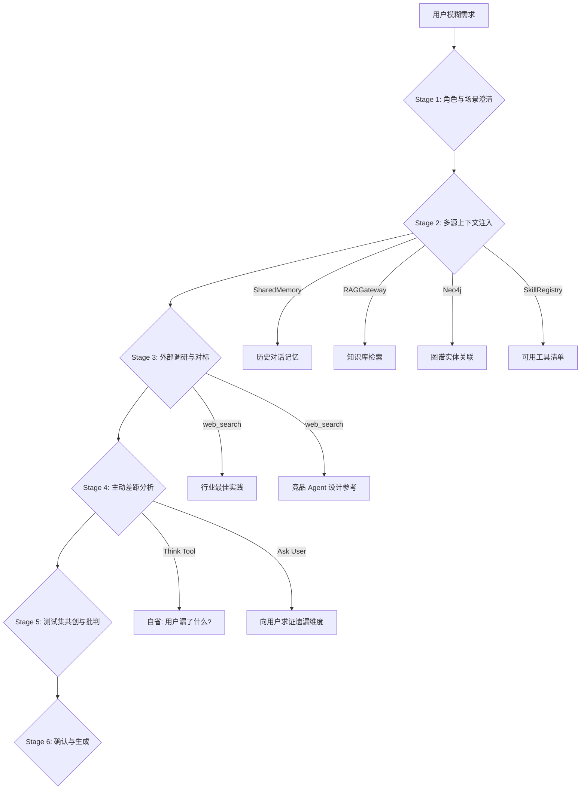
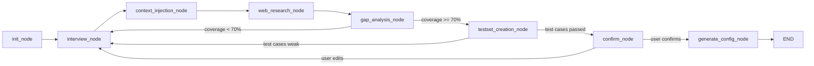
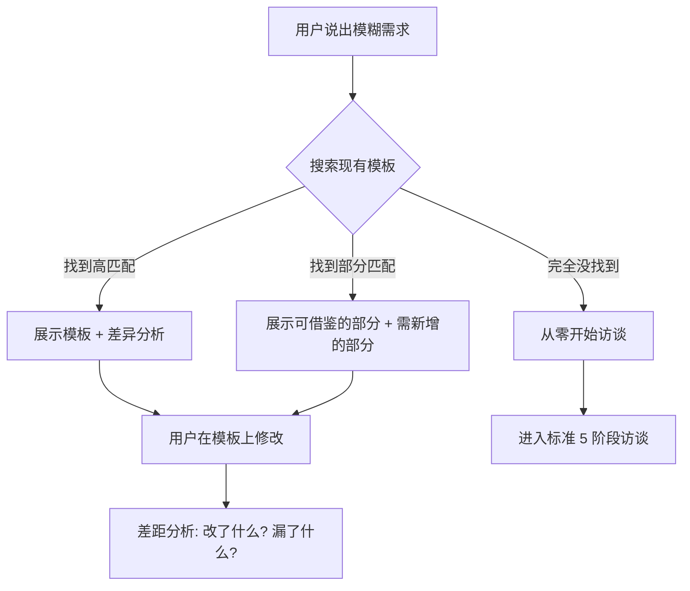
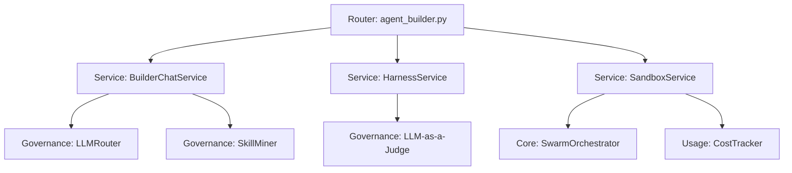
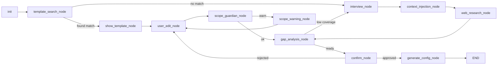
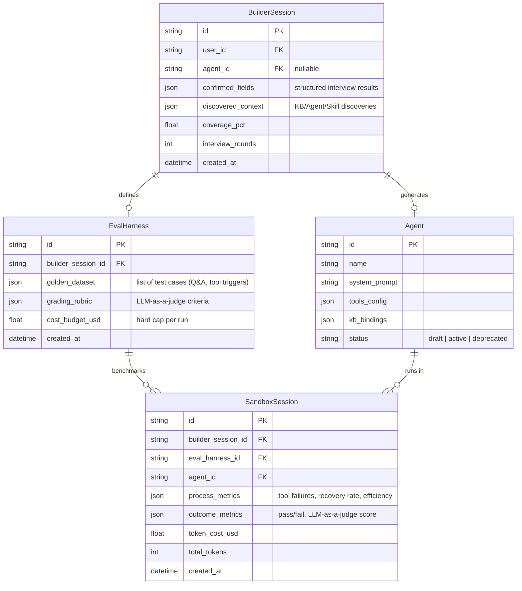

# DES-014: Agent Builder Assistant 设计说明书

> **关联需求**: [REQ-014](../requirements/REQ-014-agent-builder-assistant.md)  
> **设计状态**: 🟡 架构设计中

## 0. 需求发现引擎 (Requirements Discovery Engine) ⭐ 核心

> 这是整个 Agent Builder 的**灵魂阶段** — 助手不是一个简单的表单生成器，而是一个**主动思考、调研、求证**的 Agent 架构师。

### 0.1 总体流程



### 0.2 六阶段结构化访谈协议

Builder 助手内部运行一个基于 LangGraph 的**有状态访谈流程图**，每个阶段对应一个 Graph 节点，只有完成当前阶段的信息采集后才推进至下一阶段。

#### Stage 1: 角色与场景澄清 (Role & Scenario Clarification)
- **助手行为**: 通过 2-3 轮对话提炼 Agent 的核心定位。
- **必须明确的维度**:
  - 🎯 **核心职能**: 这个 Agent 主要解决什么问题？（如：客服、数据分析、代码助手）
  - 👤 **目标用户**: 谁在跟它对话？（如：内部运营、终端客户、开发者）
  - 🚧 **职责边界**: 它**不应该**做什么？（如：不能修改数据库、不能回答与业务无关的问题）
  - 🗣️ **语言与人格**: 应该用什么语气和风格？（如：专业严谨 / 活泼亲切 / 简洁高效）
- **内部实现**: 使用 `think` 工具在每轮用户回复后做结构化抽取:
  ```
  think("用户说想做一个客服机器人，目标用户是电商买家。
         已明确: 核心职能=售后客服, 目标用户=电商买家
         待确认: 职责边界(能否退款?)、语言风格、是否需要多语言")
  ```

#### Stage 2: 多源上下文注入 (Multi-Source Context Injection)
- **助手行为**: 在用户不知情的情况下，**自动**从系统各维度收集信息来丰富理解。
- **信息源矩阵**:

| 信息源 | 调用方式 | 注入内容 |
|--------|----------|----------|
| 对话历史 / 记忆 | `SharedMemoryManager.recall_episodes(query)` | 用户过去是否创建过类似 Agent？之前的偏好是什么？ |
| 知识库 | `RAGGateway.retrieve(query, strategy="hybrid")` | 系统中已有哪些相关知识库？文档主题是什么？ |
| 知识图谱 | Neo4j `GraphRetrievalStep` | 相关实体关系（如：该业务领域有哪些上下游概念？） |
| 技能注册表 | `SkillRegistry.catalog(query)` | 系统已有哪些可用 Tool？（如 `search_knowledge_base`、`python_interpreter`） |
| 已有 Agent 列表 | `SwarmOrchestrator.list_agents()` | 是否已有功能重叠的 Agent？避免重复造轮子 |

- **关键设计**: 这些调用在后台**并行执行** (`asyncio.gather`)，用户只会看到助手在"思考中…"，然后助手会将发现转化为**自然语言建议**呈现：
  > "我发现系统中已经有 `rag_agent` 处理知识检索任务，同时知识库 `售后FAQ` 包含 328 条退换货相关文档。建议我们直接让新 Agent 挂载这个知识库，您觉得呢？"

#### Stage 3: 外部调研与对标 (External Research & Benchmarking)
- **助手行为**: 使用 `web_search` 工具主动搜索行业最佳实践和类似 Agent 的设计模式。
- **搜索策略**:
  1. 根据 Stage 1 提取的核心职能生成搜索词（如 `"e-commerce customer service agent best practices guardrails 2026"`）
  2. 检索 2-3 个结果，提取关键 Insight
  3. 将发现整合到建议中呈现给用户
- **示例对话**:
  > "我调研了一下，业界优秀的电商客服 Agent 通常具备以下特征：
  > 1. **输入防护**: 过滤 Prompt 注入和不相关请求
  > 2. **HITL 闸门**: 退款超过 500 元需要人工审核
  > 3. **情绪感知**: 检测到客户愤怒时自动升级到人工坐席
  > 
  > 您觉得这些能力需要加入到您的 Agent 中吗？"

#### Stage 4: 主动差距分析 (Proactive Gap Analysis) — **核心差异化**
- **助手行为**: 在用户认为"差不多了"的时候，助手**主动思考并追问**用户可能遗漏的维度。
- **检查清单** (内置 Prompt 模板驱动):

| 维度 | 如果用户未提及，助手应追问 |
|------|---------------------------|
| 🛡️ **安全护栏** | "您的 Agent 在面对恶意输入（如 Prompt 注入）时应该如何表现？需要配置输入/输出过滤吗？" |
| 🔄 **异常回退** | "如果 Agent 不知道答案，应该怎么处理？转人工？还是说'我不确定'？" |
| 📊 **成功指标** | "您期望这个 Agent 的表现用什么衡量？解决率？用户满意度？平均响应时间？" |
| 🧪 **测试场景** | "能否给我 3-5 个这个 Agent 必须能正确回答的典型问题？这将用于自动化评估。" |
| 🔗 **工具权限** | "它需要调用外部系统吗？（如数据库查询、发送邮件、调用第三方 API）哪些操作需要人工确认？" |
| 🌍 **多语言/多租户** | "这个 Agent 需要支持多种语言吗？是否需要区分不同租户的数据隔离？" |
| 📈 **扩展性** | "未来这个 Agent 的职责可能扩大吗？是否需要预留扩展接口？" |

- **实现方式**: Builder Agent 在每轮对话后运行一个 `gap_analysis` 节点，检查当前已确认的配置字段覆盖率。当覆盖率 < 70% 时，挑选最关键的未覆盖维度向用户提问。

```python
# 伪代码: gap_analysis_node
async def _gap_analysis_node(state: BuilderState) -> dict:
    confirmed_fields = state.get("confirmed_fields", set())
    REQUIRED_DIMENSIONS = {
        "core_role", "target_user", "boundary", "tone",
        "guardrails", "fallback_strategy", "success_metrics",
        "test_cases", "tool_permissions", "locale"
    }
    missing = REQUIRED_DIMENSIONS - confirmed_fields
    coverage = len(confirmed_fields) / len(REQUIRED_DIMENSIONS)
    
    if coverage >= 0.7 and not missing & {"guardrails", "fallback_strategy"}:
        return {"next_step": "generate_config"}
    
    # Pick the most critical missing dimension
    priority_order = ["guardrails", "fallback_strategy", "test_cases", ...]
    next_question = pick_first_missing(priority_order, missing)
    
    # Use think tool to formulate a natural question
    question = await llm.ainvoke(
        f"用户正在创建一个{state['core_role']}类型的Agent。"
        f"他还没有说明'{next_question}'方面的要求。"
        f"请用友好的方式追问他。"
    )
    return {"next_step": "ask_user", "pending_question": question}
```

#### Stage 5: 测试集共创与批判 (Testset Co-Creation & Eval Critic) ⭐ 新增
- **助手行为**: 既然测试集决定了 Agent 的上限，助手必须兼职做 `eval_architect`（评估架构师），手把手教用户写测试。
- **批判与诊断逻辑**:
  1. **拦截弱测试**: 如果用户给出 "介绍一下你们的产品" 这种空泛问题，助手会指出缺陷："这个问题缺乏可验证性（Verifiability），请提供一个有明确正确答案的具体场景，例如 '退货包装破损能否退款？'"。
  2. **自动反向生成**: 很多用户不知如何写测试。助手会根据前 4 个阶段确认的职责边界，**主动生成 3-5 个推荐的测试用例（包括正向测试和负向攻击）**，让用户做选择题或微调。
  3. **边缘场景扩充 (Edge-case Injection)**: 当用户只给出常规问题时，助手会补充："您的 Agent 配置了退款限额护栏。为了验证护栏有效，我们需要补充一个测试用例：'客户要求退款 1000 元（超出限额），Agent 是否正确拒绝并转人工？'"
- **阶段产出**: 一个包含至少 3 个高质量、有明确预期行为的 Golden Dataset（黄金测试集），将被送入后续的 `HarnessService`。

#### Stage 6: 确认与配置生成 (Confirm & Generate)
- 当所有关键维度覆盖率 ≥ 70% 后，助手：
  1. 生成一份**需求摘要卡片**（前端渲染为可编辑的结构化卡片）
  2. 用户确认后，调用 Meta-Prompt 生成最终的 `system_prompt`
  3. 根据需求自动绑定 KB、Tool、Guardrail 配置
  4. 输出完整的 `AgentConfig` 草稿，进入下一阶段（沙箱测试）

### 0.3 后端 Graph 设计 (BuilderGraph)

Builder 助手本身就是一个 LangGraph StateGraph，复用 Swarm 的基础设施但拥有**独立的图结构**：



**关键状态 (BuilderState)**:
```python
class BuilderState(TypedDict):
    messages: Annotated[list[BaseMessage], add_messages]
    # 已确认的结构化字段
    confirmed_fields: dict[str, Any]  # {"core_role": "...", "boundary": "...", ...}
    # 信息源发现（Stage 2 的结果）
    discovered_context: dict          # {"existing_kbs": [...], "existing_agents": [...], "related_skills": [...]}
    # 外部调研结果（Stage 3）
    research_insights: list[str]
    # 差距分析状态
    coverage_pct: float
    missing_dimensions: list[str]
    # 最终输出
    generated_config: dict | None
    # 访谈轮次控制
    interview_round: int
```

### 0.4 模板与实例引擎 (Template & Example Engine) ⭐ 新增

> **核心原则**: 用户很可能不懂 Agent，"看一个活的例子"比"听一堆抽象描述"有效 100 倍。

#### 设计思路

在 Stage 1（角色澄清）的**第一轮对话后**，助手不应该继续追问抽象问题，而是**立刻去搜索现有模板**，用实例来锚定对话：

```
用户: "我想做一个帮客服回答退换货问题的机器人"

助手内部行为:
  1. SkillRegistry.discover("客服 退换货") → 匹配到 quote_intelligence 技能
  2. SwarmOrchestrator.list_agents() → 发现已有 rag_agent
  3. 读取 prompts/agents/rag_agent.yaml → 拿到完整的 role/constraints/workflow 模板
  4. 判断: rag_agent 有 70% 结构可复用，但缺少客服专用的"情绪升级"和"退款审批"能力

助手回复:
  "好消息！系统中已经有一个知识检索 Agent (rag_agent)，它的职责是从知识库中
   精准查找答案并附带引用。我建议我们**以它为基础**来改造：

   ✅ 可以直接复用的部分:
   - 知识库检索 + 引用溯源 (rag_agent 已有)
   - 回答格式: 分段 + 脚注 (rag_agent 的 formatting 规则)
   - 数据脱敏: 不泄露敏感信息 (rag_agent 的 desensitization 约束)

   🔧 需要新增/调整的部分:
   - 退换货政策的判断逻辑 (需要绑定你们的退换货 FAQ 知识库)
   - 当客户情绪激动时自动升级到人工 (原版没有)
   - 退款金额超过阈值时需要人工审批 (HITL 闸门)

   要不要我先把 rag_agent 的配置给你看一下，然后我们在它基础上改？"
```

#### 模板搜索优先级

| 优先级 | 搜索源 | 搜索方式 | 匹配后的行为 |
|--------|--------|----------|-------------|
| **P0** | 已有 Agent 配置 | `PromptEngine.list_available_agents()` → 逐个读 YAML 的 `role` 和 `description` | **直接展示完整配置**，让用户说"在这个基础上改" |
| **P1** | Skill 注册表 | `SkillRegistry.discover(query)` | 展示 Skill 的 `SKILL.md` 摘要和工具列表，建议挂载 |
| **P2** | 自挖掘草稿 | `skills/_drafts/` (SkillMiner 输出) | 展示社区/历史中涌现的工具组合模式 |
| **P3** | Web 调研 | `web_search("agent template {domain}")` | 展示外部最佳实践，仅作参考不直接复用 |

#### 实例驱动的对话流程



### 0.5 对话纪律 — 反顺从 / 反膨胀 (Anti-Sycophancy Protocol) ⭐⭐ 核心

> **这是本工具的灵魂之二。** LLM 天生有三大致命倾向，如果不在 Prompt 和逻辑层面硬性压制，Builder 产出的 Agent 将毫无价值。

#### 三大 LLM 缺陷与对策

| 缺陷 | 表现 | 对策 (System Prompt 硬规则) |
|------|------|---------------------------|
| **🤝 顺从性 (Sycophancy)** | 用户说什么都说"好的"，从不质疑需求的合理性 | **强制反驳义务**: "当用户的要求与系统能力矛盾、或在工程上不合理时，你**必须**直说并解释为什么，而不是顺着说。" |
| **📈 需求膨胀 (Scope Creep)** | 用户说"顺便也加个XX"，助手欣然接受，最后 Agent 什么都想做什么都做不好 | **范围锁定**: 每次用户追加需求时，必须评估对核心职能的影响，超过 3 个追加则触发"范围确认"节点 |

    BuilderSession {
        string id PK
        string user_id FK
        string agent_id FK "nullable - set after generate"
        json confirmed_fields "structured interview results"
        json discovered_context "KB/Agent/Skill discoveries"
        json research_insights "web search findings"
        float coverage_pct "0.0-1.0"
        int interview_rounds
        string phase "interview | sandbox | published"
        datetime created_at
        datetime updated_at
    }

    EvalHarness {
        string id PK
        string builder_session_id FK
        json golden_dataset "list of test cases (Q&A, tool triggers)"
        json grading_rubric "LLM-as-a-judge criteria"
        float cost_budget_usd "hard cap per run"
        datetime created_at
    }

    SandboxSession {
        string id PK
        string builder_session_id FK
        string eval_harness_id FK
        string agent_id FK
        string user_id FK
        json input_payload
        json execution_dag
        json process_metrics "tool failures, recovery rate, efficiency"
        json outcome_metrics "pass/fail, LLM-as-a-judge score"
        float token_cost_usd
        int total_tokens
        datetime created_at
    }

    BuilderSession ||--o| Agent : "generates"
    BuilderSession ||--o| EvalHarness : "defines"
    BuilderSession ||--o{ SandboxSession : "tests in"
    EvalHarness ||--o{ SandboxSession : "benchmarks"
    Agent ||--o{ SandboxSession : "runs in"

## 2. 后端逻辑设计 (Backend Logic)

为了实现该助手，将在 `backend/app/services/` 中增加三个核心服务类，借鉴 Claude Code 与主流 Eval Harness 的最佳实践。

### 依赖关系图



### 核心服务说明
- **`BuilderChatService`**:
  - **职责**: 负责执行 Phase 0 的 5 阶段访谈。除了抽取常规的 System Prompt，**强制要求用户定义 "Golden Dataset"（至少 3 个必过测试用例）**。
- **`HarnessService` (灵感来自 SWE-agent & Claude Code)**:
  - **职责**: 评估驱动开发 (EDD)。根据收集到的测试用例，生成一个自动化的评测脚手架 (`EvalHarness`)，定义验证规则（如："结果必须包含 JSON" 或 "必须调用了 X 工具"）。
- **`SandboxService`**:
  - **职责**: 运行沙箱。与普通的对话不同，沙箱运行是**确定性 (Deterministic)** 的。它加载 `EvalHarness`，注入隔离的环境上下文，并使用 Sentinel Pattern (哨兵模式，如 `<<AGENT_SUBMISSION>>`) 精确捕捉 Agent 的输出。同时接入 `CostTracker` (灵感来自 Claude Code)，执行硬性的成本熔断（Cost Budget）。发或集成第三方服务。"

#### 逻辑层面的范围控制 (Scope Guardian Node)

除了 Prompt 层面的约束，我们还需要在 LangGraph 中增加一个**硬逻辑守门节点**：

```python
# 伪代码: scope_guardian_node
async def _scope_guardian_node(state: BuilderState) -> dict:
    """
    在每轮用户输入后运行。
    检测用户是否在追加需求，并在膨胀时刹车。
    """
    core_role = state["confirmed_fields"].get("core_role", "")
    new_request = extract_new_capability_from_message(state["messages"][-1])
    
    if not new_request:
        return {"next_step": "continue"}  # 正常对话，不是追加需求
    
    # 检查新需求与核心职能的相关性
    relevance = await llm.ainvoke(
        f"核心职能: {core_role}\n"
        f"新追加需求: {new_request}\n"
        f"请评估: 这个新需求与核心职能的相关度 (0-1)? "
        f"超过 0.7 为相关，低于 0.3 为完全无关。只返回数字。"
    )
    relevance_score = float(relevance.content.strip())
    
    added_features = state.get("added_features_count", 0) + 1
    
    if relevance_score < 0.3:
        # 完全无关 → 直接建议拆分
        return {
            "next_step": "warn_scope",
            "scope_warning": f"'{new_request}' 与核心职能 '{core_role}' 关联度很低。"
                             f"建议创建一个独立的 Agent 来处理这个需求。"
        }
    elif added_features >= 3:
        # 累计追加 3 个以上 → 强制范围确认
        return {
            "next_step": "force_scope_review",
            "scope_warning": f"您已经追加了 {added_features} 个额外能力。"
                             f"一个 Agent 做太多事情会导致每件事都做不好。"
                             f"建议我们回顾一下核心职能，确认哪些是必须的。"
        }
    else:
        return {
            "next_step": "continue",
            "added_features_count": added_features
        }
```

#### 更新后的 Builder Graph (含反膨胀节点)



### 0.6 与现有系统的集成点 (更新)

| 集成项 | 调用的现有服务 | 说明 |
|--------|---------------|------|
| **Agent 模板库** | `PromptEngine.list_available_agents()` + 逐个读 YAML | 展示 `rag_agent`/`code_agent`/`eval_architect` 等完整配置作为起点 |
| **Skill 发现** | `SkillRegistry.discover(query)` / `.catalog()` | 搜索可挂载的 Skill（如 `quote_intelligence`） |
| **Skill 草稿** | `skills/_drafts/` (SkillMiner 产物) | 展示社区中涌现的工具组合模式 |
| 对话记忆 | `SharedMemoryManager` (`agents/memory.py`) | 读取 Episodic Memory 判断用户历史偏好 |
| 知识库发现 | `RAGGateway` (`services/rag_gateway.py`) | 自动检索相关 KB 并建议挂载 |
| 图谱探索 | `GraphRetrievalStep` | 通过图谱发现与目标领域相关的实体和关系网络 |
| Agent 查重 | `SwarmOrchestrator.list_agents()` | 检查是否已存在功能重叠的 Agent |
| 网络调研 | `web_search` Tool (`agents/tools.py`) | 搜索行业最佳实践，仅作参考 |
| 成本预估 | `model_cost_table.py` | 根据预期 Prompt 长度预估 Token 消耗 |
| Prompt 生成 | `PromptEngine.build_custom_prompt()` | 使用 Jinja2 模板渲染最终 System Prompt |

---

## 1. 数据库设计 (Entity-Relationship)

在 Phase 0 的 Requirements Discovery 完成后，系统需要持久化访谈过程和生成的草稿配置。借鉴 `SWE-agent` 的思路，我们引入 `EvalHarness`（评测脚手架），使得沙箱不再是简单的聊天框，而是严格的测试环境。



## 2. 后端逻辑设计 (Backend Logic)

为了实现该助手，将在 `backend/app/services/` 中增加三个核心服务类，特别是引入 `HarnessService` 来落实 Eval-Driven Development (EDD)。

### 依赖关系图


### 核心服务说明

- **`BuilderChatService`**:
  - **职责**: 负责执行 Phase 0 的访谈。除了抽取常规配置外，**强制要求用户定义 "Golden Dataset"（至少 3 个必过测试用例）**。
- **`HarnessService` (灵感: SWE-agent)**:
  - **职责**: 评估驱动开发 (EDD)。根据收集的测试用例生成自动化的评测脚手架 (`EvalHarness`)。
- **`SandboxService`**:
  - **职责**: 运行确定性沙箱。加载 `EvalHarness`，使用 Sentinel Pattern (`<<AGENT_SUBMISSION>>`) 捕捉输出，并接入 `CostTracker` (灵感: Claude Code) 执行硬性成本熔断。

## 3. API 接口设计 (RESTful & SSE)

### 3.1 助手对话端点 (生成配置)
- **Route**: `POST /api/v1/agent-builder/chat`
- **Request**: `{ "messages": [...], "current_draft_config": {...} }`
- **Response** (SSE Stream): 流式返回助手的回复文本，并在最终生成完毕时下发自定义 Event (如 `event: config_ready` + `data: { "system_prompt": "...", "tools": [...] }`)。

### 3.2 沙箱运行与 A/B 测试端点
- **Route**: `POST /api/v1/agent-builder/sandbox/run`
- **Request**: 
  ```json
  {
    "agent_config_a": { ... },
    "agent_config_b": { ... }, // 选填，用于 A/B 对比
    "test_prompt": "请帮我查一下昨天用户的投诉订单"
  }
  ```
- **Response Schema** (`ApiResponse[SandboxResult]`):
  ```json
  {
    "code": 200,
    "data": {
      "run_a": {
        "output": "...",
        "dag_trace": { ... },
        "metrics": { "total_tokens": 1250, "cost_usd": 0.0025, "latency_ms": 3200 }
      },
      "run_b": { ... }
    }
  }
  ```

## 4. 前端组件树 (Frontend Component Hierarchy)

前端将以一个侧边栏与主工作区结合的模式嵌入到现有的 Agent 管理体系中。

### 组件层级图

- **`AgentStudioPage`** (Smart Container - 负责协调左右联动)
  - ┣ **`BuilderChatPanel`** (Smart - 侧边栏，与 AI 对话，复用 `useChat` hook)
  - ┣ **`AgentWorkspace`** (Dumb - 右侧主工作区)
    - ┣ **`AgentConfigForm`** (Dumb - 展示并允许手动修改生成的 Prompt/Tools)
    - ┗ **`SandboxABPanel`** (Smart - 触发沙箱执行并展示结果)
      - ┣ **`ExecutionDAGVisualizer`** (Dumb - 复用底层 DAG 渲染图表)
      - ┗ **`MetricsBar`** (Dumb - 复用标准组件展示数据)
        - ┣ `<StatCard title="Tokens" value="1250" />`
        - ┗ `<StatCard title="预估成本" value="$0.0025" />`

### 规范遵循
- **状态管理**: 助手生成的临时配置存储在 `AgentStudioPage` 的局部 React State 中，直到用户点击"保存"才调用标准 Agent 创建接口。
- **UI 标准组件**: 
  - Token 和 成本展示必须使用 `frontend/src/components/common/StatCard.tsx`。
  - 沙箱执行中的失败和异常捕获必须使用 `ErrorDisplay` 和 `ErrorBoundary`。
  - 所有保存、发布行为需要通过 `ConfirmAction` 进行确认。

## 5. 多视角审查 (Multi-Perspective Review) 检查清单
- **Performance**: Builder Chat 采用 SSE 确保流畅。沙箱运行 A/B 测试时采用并行调用。
- **Security**: 沙箱环境必须对危险的 Tool (`SafeToAutoRun=false`) 进行拦截，避免提权或修改系统真实数据。
- **Observability**: `TokenAccountant` 和 DAG 会完整记录并暴露到前端，保证用户能够"看见" Agent 为什么花钱、钱花在哪。
