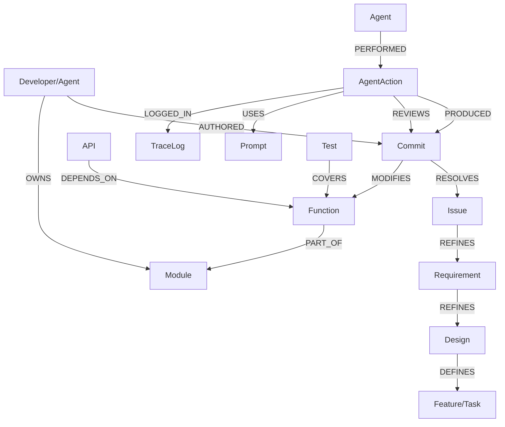

# DES-015: HiveMind Universal Governance Graph (UGG) Specification

> **Status**: Draft | **Version**: 1.0.0
> **Role**: Senior Project Manager / Architect
> **Objective**: Define a multi-dimensional graph schema to manage the full lifecycle of AI-native development, ensuring "everything is traceable."

---

## 1. 核心目标 (Core Objectives)

1. **全血缘追踪 (Full Lineage)**: 从需求到代码，从代码到测试，每一行变更都有据可查。
2. **权属明晰 (Ownership)**: 明确人类开发者与 AI Agent 在模块和提交上的权属。
3. **AI 归因 (Agentic Provenance)**: 记录 AI 动作（生成、评审、测试）的输入提示词、模型版本和执行结果。
4. **动态完整性 (Dynamic Integrity)**: 在 CI/CD 中通过图谱查询验证研发流程的合规性。

---

## 2. 图谱模型定义 (Schema Definition)

### 2.1 维度空间 (Domains)

#### A. 静态资产域 (Static Assets)
| 节点 Label | 属性 | 描述 |
| :--- | :--- | :--- |
| `:Requirement` | `id`, `title`, `priority`, `status` | 需求文档 (REQ-NNN) |
| `:Design` | `id`, `title`, `spec_url` | 设计说明书 (DES-NNN) |
| `:Module` | `path`, `type`, `is_core` | 文件或文件夹 |
| `:Function` | `name`, `signature`, `docstring` | 代码函数/方法 |
| `:API` | `path`, `method`, `version` | 后端 API 端点 |

#### B. 研发演进域 (Evolution)
| 节点 Label | 属性 | 描述 |
| :--- | :--- | :--- |
| `:Commit` | `hash`, `message`, `date` | Git 提交记录 |
| `:Issue` | `number`, `title`, `status`, `url` | GitHub Issue / 任务 |
| `:Review` | `id`, `verdict`, `comments`, `url` | PR 评审记录 |
| `:Developer` | `name`, `email`, `role`, `type` | 人类开发者 (type=human) |

#### C. AI 行为域 (Agentic)
| 节点 Label | 属性 | 描述 |
| :--- | :--- | :--- |
| `:Agent` | `name`, `version`, `model`, `system_prompt` | 执行任务的 Agent 实例 |
| `:Prompt` | `name`, `hash`, `path` | 提示词模板 |
| `:AgentAction` | `id`, `type`, `timestamp`, `result` | 一次具体的 Agent 执行动作 |
| `:TraceLog` | `id`, `content`, `trace_id` | 原始执行日志或上下文 |

---

### 2.2 关键关系 (Key Relationships)

---

## 3. 治理门禁规则 (Governance Gates)

在 CI/CD 中通过 Cypher 查询执行以下逻辑校验：

1. **[G-01] 来源合规**: `MATCH (c:Commit) WHERE NOT (c)-[:RESOLVES]->(:Issue) RETURN c` 
   - *规则*: 所有 Commit 必须关联 Issue。
2. **[G-02] 测试覆盖**: `MATCH (f:Function) WHERE NOT (:Test)-[:COVERS]->(f) RETURN f` 
   - *规则*: 新增函数必须有对应的测试节点。
3. **[G-03] AI 归因**: `MATCH (c:Commit {type: 'ai'}) WHERE NOT (:AgentAction)-[:PRODUCED]->(c) RETURN c`
   - *规则*: AI 生成的代码必须有 Action 记录。
4. **[G-04] 评审闭环**: `MATCH (c:Commit) WHERE NOT (:Review {verdict: 'APPROVED'})-[:FOR]->(c) RETURN c`
   - *规则*: 核心变更必须有通过的评审。

---

## 4. 数据摄取路径 (Ingestion Paths)

1. **Git Sync**: 每日/每 PR 扫描 Git Log。
2. **GitHub Hook**: 实时/定期同步 Issue、PR 和 Review 状态。
3. **AST Parser**: 静态扫描代码库提取 Function 和 API 节点。
4. **Agent Sidecar**: Agent 执行时主动向 Graph 发送 `AgentAction` 记录。

---

## 5. 展望 (Future)

通过 UGG，HiveMind 将具备 **“自我审计”** 能力。当系统出现 Bug 时，可以通过图谱瞬间定位到：
> “该 Bug 出现在由 **Antigravity-v1.1** 使用 **refactor-prompt-v2** 生成的代码中，当时由于 **ReviewAgent** 的阈值设得过低而通过了评审。”

---
**Approver**: `Antigravity (Architect Agent)`
**Date**: 2026-05-04
