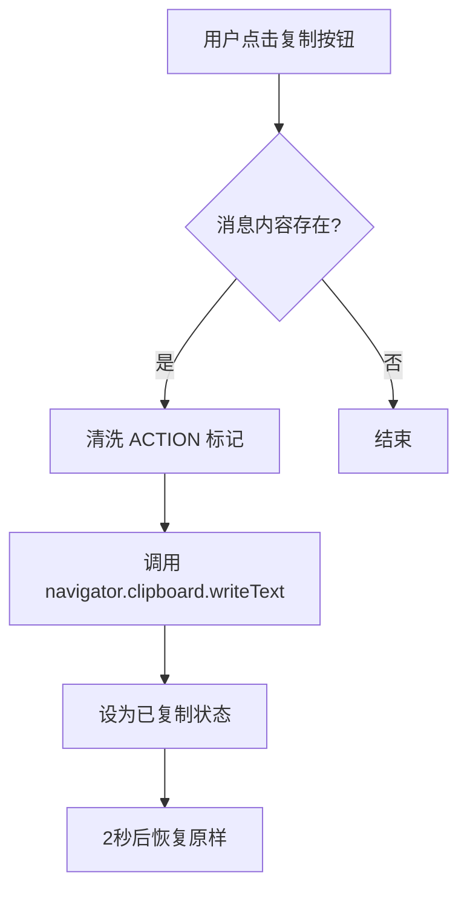

# 🏗️ 设计说明书: DES-026 (ChatBubble 一键复制消息)

> **关联需求**: [REQ-026](file:///c:/Users/linkage/Desktop/aiproject/docs/requirements/REQ-026-copy-to-clipboard.md)
> **作者**: HiveMind Antigravity
> **状态**: 草案 / 评审中

---

## 1. 架构概览 (Architecture Overview)

### 1.1 设计目标
在 ChatBubble 组件中加入一键复制按钮，将消息文本复制到剪贴板，并提供成功反馈。

### 1.2 核心流程图 (Mermaid)


---

## 2. 数据层设计 (Data Persistence)

### 2.1 实体变更清单
无。此功能为前端纯 UI 交互。

### 2.2 ER 关系图
无。

---

## 3. 后端服务逻辑 (Backend Services)

无。

---

## 4. API 端点设计 (API Endpoints)

无。

---

## 5. 前端组件设计 (Frontend Components)

### 5.1 组件树
```
ChatPanel
 └── ChatBubble (Modify: 添加 copyButton)
```

### 5.2 复用组件清单
使用了以下 `antd` 组件:
- `Typography` (Text, Paragraph)
- `Tooltip`
- `Button`
- `CheckOutlined` (Icon)
- `CopyOutlined` (Icon)

---

## 6. 评审检查点 (Review Checkpoints)
- [x] 是否满足 4-Tier 架构模型？ (UI 层增强)
- [ ] 是否定义了专有异常？ (n/a)
- [x] 前端组件是否做到了逻辑与表现分离？ (使用 `styles.module.css`)
- [ ] 数据库索引是否已经考虑到读写平衡？ (n/a)
