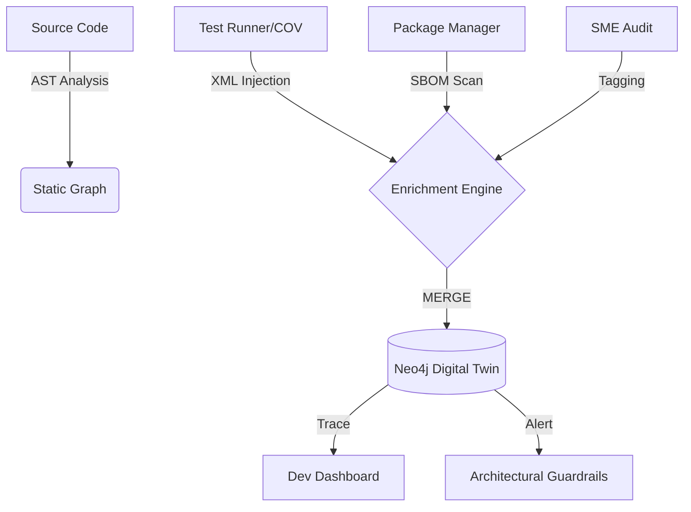
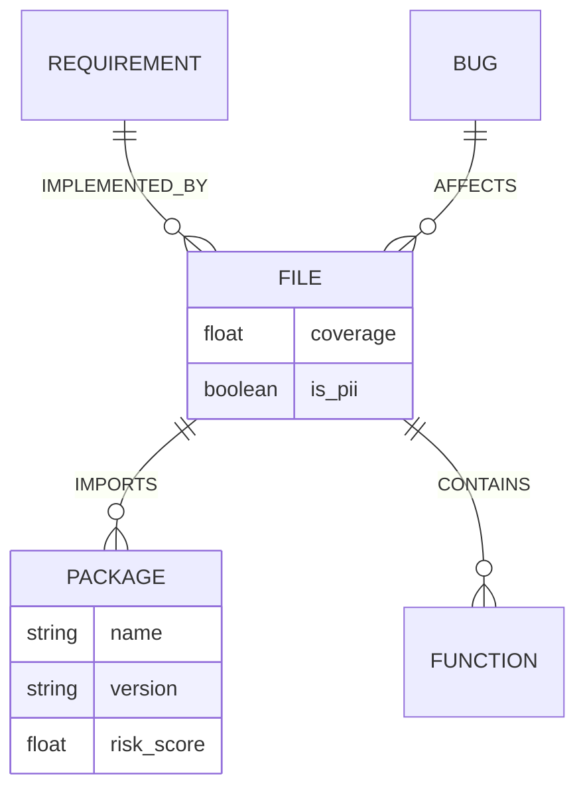

# 🏗️ 设计说明书: DES-027 (Project Digital Twin Evolution)

> **关联需求**: [REQ-027](file:///c:/Users/linkage/Desktop/aiproject/docs/requirements/REQ-027-digital-twin-evolution.md)
> **作者**: HiveMind Antigravity
> **状态**: 草案 / 评审中

---

## 1. 架构概览 (Architecture Overview)

### 1.1 设计目标
将 HiveMind 的静态架构图谱升级为动态的“数字孪生”系统。通过集成运行时遥测（APM）、代码覆盖率（Coverage）、第三方包依赖（Supply Chain）以及安全敏感标识（PII Audit），实现架构资产的 360 度全方位观测与智能预警。

### 1.2 核心流程图 (Mermaid)


---

## 2. 数据层设计 (Data Persistence)

### 2.1 实体变更清单
| 模型名称 | 操作 | 关键字段变更 |
| :--- | :--- | :--- |
| `Package` | 新增 (Neo4j) | `name`, `version`, `license`, `vulnerability_score` |
| `File` | 修改 (Neo4j) | 增加 `coverage_percent`, `hotspot_score`, `is_pii_exposed` |
| `Function` | 修改 (Neo4j) | 增加 `complexity`, `call_frequency_pm` |

### 2.2 ER 关系图


---

## 3. 后端服务逻辑 (Backend Services)

### 3.1 `GraphEvolutionService` 逻辑
- **职责**: 负责将外部异构数据（Coverage XML, Dependency JSON, APM Metrics）聚合处理并同步至 Neo4j 数字孪生图谱。
- **核心方法**:
  - `inject_coverage_metrics(cov_report_path: str)`: 遍历 coverage XML，定位具体文件与行号，更新 Node 属性。
  - `scan_supply_chain(root_dir: str)`: 扫描 pyproject.toml / package.json，建立包依赖链路。
  - `audit_pii_surface(pattern: str)`: 基于模式匹配和语义识别，自动标记潜在 PII 节点。

### 3.2 异常处理
- `GraphInconsistencyError`: 当注入的数据在现有图谱中找不到对应节点（如文件已删除但 report 仍旧存在）时触发。
- `SourceFormatError`: 提供的外部指标文件格式非法（如损坏的 XML）。

---

## 4. API 端点设计 (API Endpoints)

### 4.1 `/architecture/enrich/coverage`
- **方法**: `POST`
- **鉴权**: `ADMIN`
- **请求负载 (Request Body)**:
```typescript
{
  "source": "pytest-cov",
  "format": "xml",
  "content": string // XML content or S3 URL
}
```

---

## 5. 前端组件设计 (Frontend Components)

### 5.1 组件树
```
ArchitectureLabPage
├── TwinStateOverview (Smart)
│   ├── CoverageHeatmap (Dumb)
│   └── DependencyRadar (Dumb)
└── HotspotList (Smart)
    └── HotspotItem (Dumb)
```

### 5.2 复用组件清单
使用了以下 `components/common` 中的组件:
- `StatCard`
- `ConfirmAction`
- `StatusTag`

---

## 6. 评审检查点 (Review Checkpoints)
- [x] 是否满足 4-Tier 架构模型？
- [x] 是否定义了专有异常？
- [x] 前端组件是否做到了逻辑与表现分离？
- [ ] 数据库索引是否已经考虑到读写平衡？ (待进一步性能压测)

---
*Generated by HiveMind Living Docs Engine*
