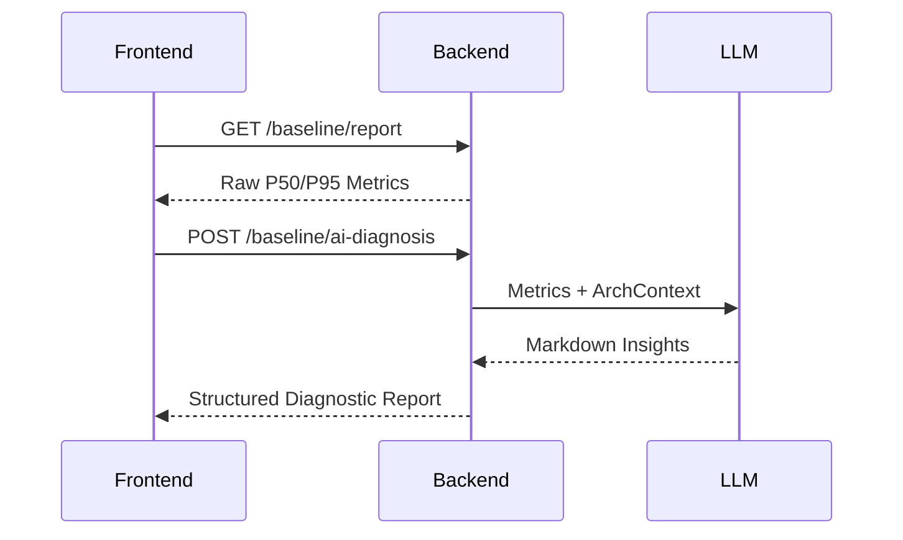

# Feature: AI 架构实验室与自动化诊断面板 (DES-OBS-001)

> **"数据只是证据，AI 给出判决。"** - HMER 验证体系的最后一环：Reflect (反思)。

## 1. 目标与价值
将原本冷冰冰的基线数据 (Phase 0) 转变为可理解、可执行的架构决策建议。通过 LLM 的常识库对比实际生产指标，自动识别性能瓶颈。

## 2. 后端细节 (Backend Implementation)

### 2.1 `GET /api/v1/observability/baseline/ai-diagnosis`
- **逻辑流程**: 批量查询 `obs_baseline_metrics` -> 计算 P50/P95 摘要 -> 构造 Prompt -> 调用 LLM (Arch-Reviewer 模型) -> 返回诊断建议。
- **Prompt 策略 (Arch-Reviewer)**:
  - **角色**: 资深前端架构师。
  - **知识渊博**: 精通 Web Vitals, LLM 推理延迟模型, 流式传输稳定性。
  - **任务**: 分析 TTFT 和 List Fetch 延时，根据行业标准给出重构建议。

## 3. 前端细节 (Frontend Implementation)

### 3.1 页面: `ArchitectureLabPage.tsx`
- **入口**: `/admin/architecture-lab`
- **核心组件**:
  1. `PerformanceChart`: 分组展示当前基线 (Baseline) 与目标 SLO (Service Level Objectives) 的差距。
  2. `AIDiagnosticReport`: 用 Markdown 渲染 LLM 生成的诊断报告，直指卡顿根源。
  3. `ReconstructionChecklist`: 由 AI 生成的待办事项，点击可直接跳转到对应的 TODO.md。

## 4. 数据流图

## 5. 验收标准
- [ ] 页面能实时拉取最新的基线统计。
- [ ] 能一键触发 AI 诊断，且诊断报告包含至少 3 个具体的改造点。
- [ ] 能够区分不同类型的指标（生成延迟 vs 加载延迟）。
