# Frontend Architecture & AI Workflow

## 1. 页面跳转与布局结构 (Page Transition & Layout)

我们的前端采用 **"Shell + Content"** 架构。`AppLayout` 作为外壳 (Shell)，承载了持久化的导航和 AI 面板；`Outlet` 作为内容区，根据路由动态渲染页面。

```mermaid
graph TD
    User([User]) -->|Visit App| Shell[App Shell (AppLayout)]
    
    subgraph "Persistent Layer (Global)"
        Shell --> Header[Header / TopBar]
        Shell --> SideNav[Side Navigation]
        Shell --> ChatPanel[🤖 Chat Panel (AI Copilot)]
        Shell --> WebSocket[WebSocket Client]
    end
    
    subgraph "Content Layer (Routed)"
        Shell --> Outlet[React Router Outlet]
        Outlet -->|Route: /| Dashboard[Dashboard Page]
        Outlet -->|Route: /knowledge| Knowledge[Knowledge Page]
        Outlet -->|Route: /agents| Agents[Agents Monitor]
        Outlet -->|Route: /learning| Learning[Learning Page]
        Outlet -->|Route: /settings| Settings[Settings Page]
    end

    %% Context Awareness Flow
    Dashboard -.->|1. Mount| Context[Page Context]
    Context -.->|2. Update| ChatPanel
    ChatPanel -.->|3. Suggest| User
```

---

## 2. AI-First 工作流 (AI-First Workflow)

区别于传统 Web 应用，我们的核心交互是 **双向** 的。

### 🔄 交互循环 (The Loop)

```mermaid
sequenceDiagram
    autonumber
    participant User
    participant UI as Frontend UI
    participant Chat as Chat Copilot
    participant Server as Backend API
    participant Agent as Swarm Agent

    %% Scneario 1: User Initiated
    rect rgb(30, 40, 50)
        note right of User: 场景 1: 用户主动提问
        User->>Chat: "帮我在当前知识库里找关于架构的文档"
        Chat->>Chat: 附带 Context: { page: '/knowledge', kb_id: '123' }
        Chat->>Server: POST /chat/completions
        Server->>Agent: 路由到 RAG Agent
        Agent->>Server: 执行检索工具
        Server-->>Chat: 返回流式答案
        Chat-->>User: 显示结果
    end

    %% Scenario 2: AI Action
    rect rgb(40, 30, 30)
        note right of User: 场景 2: AI 执行操作 (Action)
        User->>Chat: "带我去设置页"
        Chat->>Server: 意图识别
        Server-->>Chat: 返回 Action: { type: 'navigate', payload: '/settings' }
        Chat->>UI: 执行 navigate('/settings')
        UI-->>User: 页面跳转完成
    end

    %% Scenario 3: Proactive Push
    rect rgb(30, 50, 40)
        note right of User: 场景 3: 后端主动推送
        Agent->>Server: 任务完成 (如长文档解析)
        Server->>Chat: WebSocket Event: { type: 'notification', msg: '解析完成' }
        Chat->>UI: 弹出 Toast / 更新状态图标
        User->>Chat: 点击查看详情
    end
```



---

## 3. 状态管理策略 (State Strategy)

为了支撑复杂的 AI 交互，我们采用了分层状态管理：

| 类型 | 库 | 用途 | 例子 |
|------|----|------|------|
| **Server State** | `TanStack Query` | 异步数据缓存、自动重发、SWR | 知识库列表、Agent 状态 |
| **Global UI State** | `Zustand` | 跨组件 UI 状态、AI 会话状态 | `isChatOpen`, `messages`, `pageContext` |
| **Local State** | `React.useState` | 组件内部交互 | 输入框内容、折叠面板展开 |
| **Form State** | `Ant Design Form` | 表单数据收集与校验 | 登录表单、创建知识库表单 |

## 4. 目录结构映射

```bash
frontend/src/
├── components/
│   ├── common/         # AppLayout, PageContainer
│   ├── chat/           # ChatPanel, ChatBubble (AI 核心组件)
│   └── agents/         # AgentCard, MonitorGraph
├── pages/              # 路由页面 (Dashboard, Knowledge...)
├── stores/             # Zustand Stores (chatStore, wsStore)
├── services/           # API SDK (chatApi, knowledgeApi)
└── App.tsx             # 路由配置
```
