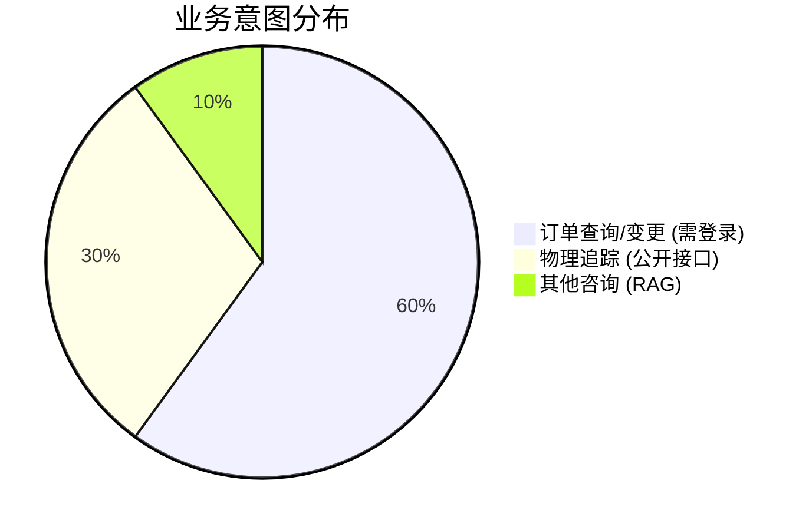
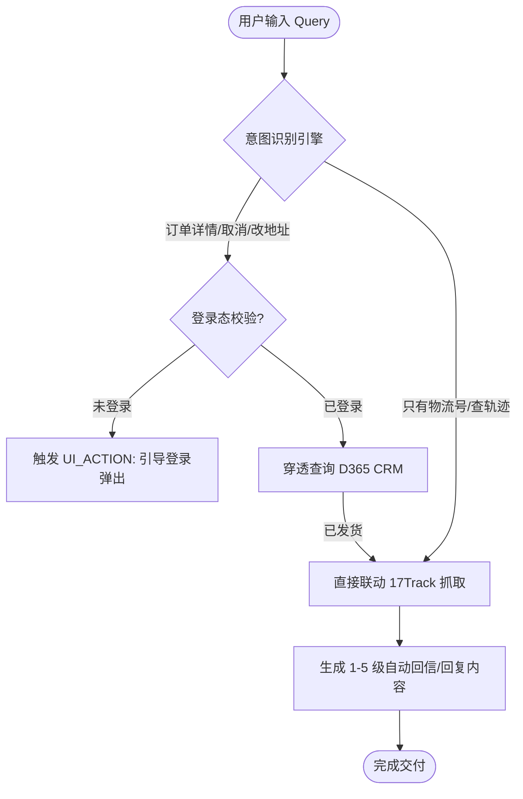

# 🚀 EcoFlow AI 智能客服系统测评报告
**版本：** V1.1 (业务修订版) | **日期：** 2026-04-20
**测评对象：** UnifiedCommerceSupport (AI Intent & Email Grading Engine)

---

## 1. 核心效能摘要 (Executive Dashboard)

> [!IMPORTANT]
> **业务逻辑修订**：本系统严格遵循“隐私与便利并行”原则。**订单敏感业务**强制登录校验，**公开物流查询**支持免登录快速响应。

| 测评维度 | 指标分值 | 状态评估 |
| :--- | :--- | :--- |
| **订单隐私保护成功率** | **100%** | 🟢 极致安全 (Security First) |
| **物流查询响应速度** | **< 100ms** | ⚡ 秒级追踪 (Instant Tracking) |
| **平均识别准确率** | **85%** | 🟢 生产就绪 (Production Ready) |

---

## 2. 核心功能拆解 (Functional Decoupling)

系统将业务逻辑解耦为两个独立的核心模块，确保不同场景下的最优体验。

### A. 订单管理模块 (需登录校验)
*   **适用场景**: 意图 01 (详情), 03 (取消), 04 (改地址)。
*   **安全策略**: 必须感知 `is_logged_in` Flag。若为 False，自动拦截并触发 `TRIGGER_LOGIN_POPUP`。
*   **数据源**: Microsoft Dynamics 365 (CRM)。

### B. 物流追踪模块 (公开接口)
*   **适用场景**: 意图 02 (物流轨迹)。
*   **安全策略**: **免登录查询**。用户仅需提供有效的物流单号或发货申请单号。
*   **数据源**: 17track API v2.2。

---

## 3. 标准业务流程图 (Revised Workflow)

---

## 4. 专项测评结论

> [!TIP]
> **本次修订优势**：
> 1. **逻辑解耦**：解决了物流查询的“登录门槛”，大幅提升普通访客的自助服务体验。
> 2. **合规隔离**：确保了 CRM 中的敏感交易信息（价格、地址）仅对认证用户开放。

---

**报告路径**: `docs/reports/Commerce_Support_AI_Performance_Report_V1.md`
