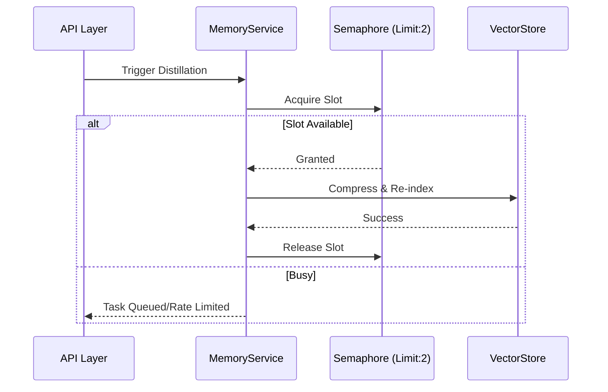

### 逻辑解构：Memory Distillation 并发处理

在 `memory_service.py` 中，并发任务通过 `asyncio.Semaphore(2)` 进行流量控制，并配合 `Redis Lock` 确保同一用户不会同时触发两个压缩任务。

#### 任务流可视化：

**关键路径**：
- **资源限制**：通过信号量防止内存溢出。
- **原子性**：利用数据库事务保证压缩前后的数据一致。
