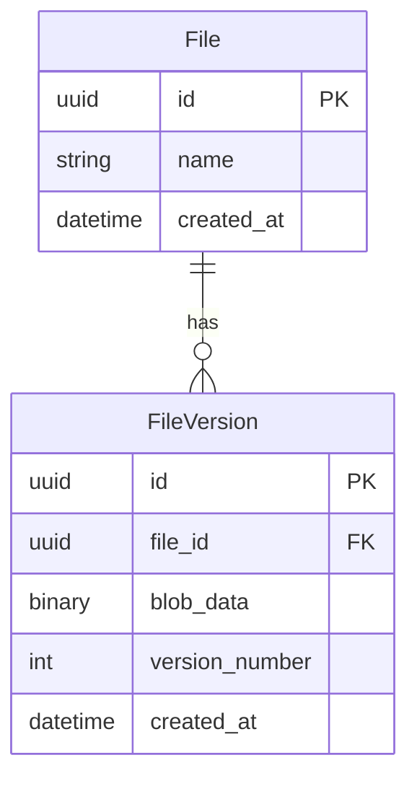

# DES-042: File Versioning System Design

## 1. Database Design (Tier 1)

## 2. Backend Logic (Tier 2)

### Services
- **`backend/app/services/versioning_service.py`**: Handles logic for snapshotting and rollbacks.

### Exceptions
- `VersionNotFoundError`
- `StorageLimitExceededError`
- `UnauthorizedVersionAccessError`

## 3. Frontend Design (Tier 4)

- **Reusable Components**:
    - `ConfirmAction`: Used for the "Revert to this version" button.
    - `DataTable`: Used to list version history.
